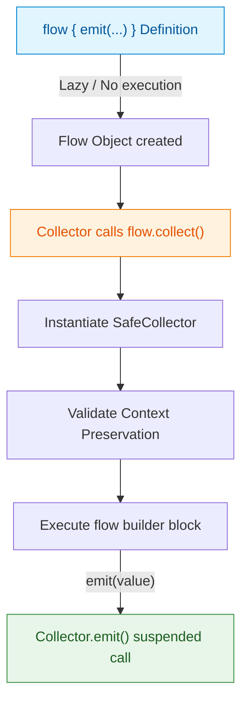

## Cold Flow는 collect될 때 비로소 실행된다

### 개념 (What)
`Cold Flow`는 종단 연산자(Terminal Operator, 예: `collect()`)가 호출되기 전까지는 내부 블록 코드를 전혀 실행하지 않으며, **새로운 수집자(Collector)가 붙을 때마다 독립적인 스트림 실행 세션을 매번 처음부터 새로 시작하는 지연(Lazy) 데이터 스트림 API**다.

### 왜 필요한가 (Why)
1. **자원 효율성**: UI 화면이 켜지기 전이나 데이터 수집자가 없을 때는 소켓을 열거나 DB 쿼리를 수행하지 않아 불필요한 백그라운드 리소스 및 배터리 소모를 방지한다.
2. **독립적 수집 세션**: 복수의 화면에서 동일한 Cold Flow를 각각 `collect()` 하면, 서로 상태를 오염시키지 않고 각 수집자 전용의 스트림이 동작한다.

### 내부 메커니즘 (How)
1. **`SafeCollector`와 실행 시점**:
   - `flow { emit(...) }` 빌더는 `AbstractFlow` 인스턴스를 반환할 뿐 내부 람다를 즉시 실행하지 않는다.
   - `collect(Collector)`를 호출하는 순간 `SafeCollector` 인스턴스가 생성되고, 수집자의 `CoroutineContext`와 `flow { ... }` 실행 컨텍스트의 불변성(Context Preservation)을 검사한 뒤 람다 블록이 호출된다.
2. **Context Preservation (컨텍스트 보존 규칙)**:
   - Flow 내부에서는 `withContext(Dispatchers.IO)`를 사용하여 직접 `emit()` 할 수 없다 (체이닝된 수집자의 스레드 맥락을 임의로 파괴하는 것을 차단).
   - 대신 컨텍스트 변경이 필요할 경우 반드시 `flowOn(Dispatchers.IO)` 연산자를 통해 업스트림과 다운스트림 사이에 `ChannelFlow` 버퍼를 생성해야 한다.



### 현대 표준 vs 레거시 비교

| 비교 항목 | 레거시 (RxJava Observable / LiveData) | 현대 표준 (Kotlin Cold Flow) |
| :--- | :--- | :--- |
| **수집 전 실행 여부** | `Observable.create()` 수집 필요 (Cold) / LiveData는 즉시 활성 | `collect()` 전까지 백그라운드 코드 완전 중단 (Cold) |
| **컨텍스트 이탈** | `subscribeOn`과 `observeOn` 무분별 오버라이딩 가능 | `SafeCollector`에 의해 `flow` 내 직접 스레드 변경 엄격 금지 |
| **백프레셔** | `Flowable` 백프레셔 전용 객체 별도 분리 | Coroutine 자체 중단(Suspension)으로 백프레셔 자동 처리 |

### Idiomatic Kotlin 코드 예시

```kotlin
class StockRepository(
    private val stockApi: StockApi
) {
    // Cold Flow: collect() 되기 전에는 네트워크 폴링 루프가 동작하지 않음
    fun getStockPriceStream(symbol: String): Flow<BigDecimal> = flow {
        while (currentCoroutineContext().isActive) {
            val price = stockApi.fetchCurrentPrice(symbol)
            emit(price) // 수집자가 준비될 때만 데이터 발행
            delay(5_000) // 5초 간격 폴링
        }
    }.flowOn(Dispatchers.IO) // SafeCollector 규칙 준수를 위한 flowOn 적용
}
```

공식 문서: [Asynchronous Flow](https://kotlinlang.org/docs/flow.html)
