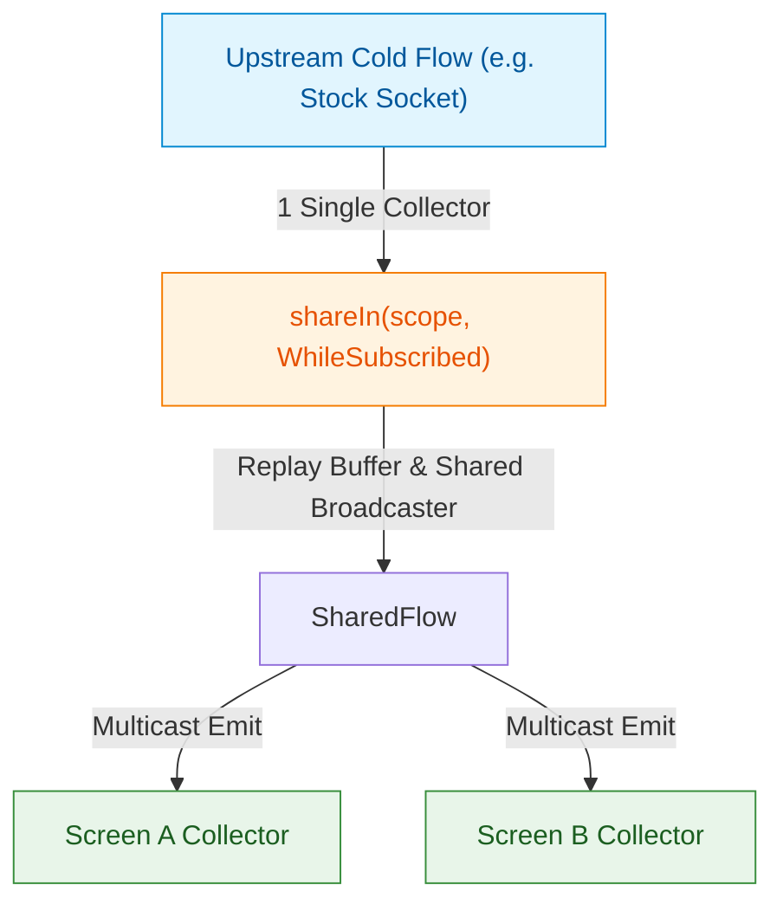

## shareIn은 공유 스트림 수명과 replay 정책을 정의한다

### 개념 (What)
`shareIn`은 **Cold Flow를 Hot Stream인 `SharedFlow`로 변환**하는 연산자다. 단일 업스트림(Upstream) 실행을 여러 수집자가 공유(Multicast)하게 만들며, 수집자 수와 상관없이 지정된 `CoroutineScope` 내에서 업스트림을 오직 1번만 실행하도록 관리한다.

### 왜 필요한가 (Why)
1. **중복 연산 및 네트워크 요청 제거**: Cold Flow를 화면 3개에서 동시 수집하면 동일한 네트워크 API 요청이나 파일 읽기가 3번 독립 실행된다. `shareIn`을 적용하면 1번의 네트워크 요청 결과를 여러 수집자에게 브로드캐스트한다.
2. **Replay Cache 제공**: 신규 수집자가 뒤늦게 구독을 시작하더라도, 과거에 발행되었던 데이터 중 설정된 `replay` 개수만큼의 최신 데이터를 즉시 전달받을 수 있다.

### 내부 메커니즘 (How)
1. **`SharingStarted` 전략**:
   - `SharingStarted.Eagerly`: `shareIn` 호출 즉시 수집자 존재 여부와 무관하게 업스트림 수집을 즉시 시작한다.
   - `SharingStarted.Lazily`: 첫 번째 수집자가 나타나는 순간 업스트림 수집을 시작하고, 이후 수집자가 0개가 되어도 업스트림을 취소하지 않는다.
   - `SharingStarted.WhileSubscribed(stopTimeoutMillis)`: 활성 수집자가 1개 이상일 때 실행되고, 수집자가 0개가 되면 `stopTimeoutMillis` 동안 대기 후 업스트림 수집 코루틴을 자동 취소한다. (화면 회전 시 유용)
2. **Replay Buffer 관리**:
   - 업스트림이 발행한 아이템은 링 버퍼 형태의 Replay Buffer에 저장되며, 새로운 다운스트림 수집자가 `collect`를 부르면 Replay Buffer 항목을 먼저 방출한 뒤 실시간 스트림으로 연결된다.



### 현대 표준 vs 레거시 비교

| 비교 항목 | 레거시 (RxJava ConnectableObservable / publish) | 현대 표준 (Kotlin shareIn) |
| :--- | :--- | :--- |
| **공유 제어** | `publish().refCount()` / `replay(1).autoConnect()` | `shareIn(scope, started, replay)` 선언적 제어 |
| **수명주기 중단** | 화면 회전 시 구독자 0 될 때 수동 중단 로직 구현 복잡 | `SharingStarted.WhileSubscribed(5000)`으로 자동 유예 후 정지 |
| **메모리 버퍼** | ReplaySubject의 메모리 누수 위험 높음 | Replay 개수 strict 제한 및 Scope 해제 시 자동 소멸 |

### Idiomatic Kotlin 코드 예시

```kotlin
class TickerRepository(
    private val tickerApi: TickerApi,
    private val externalScope: CoroutineScope
) {
    // Cold Flow 소스를 Hot SharedFlow로 변환하여 멀티캐스트 전송
    val globalTickerStream: SharedFlow<TickerPrice> = tickerApi.getRawTickerFlow()
        .shareIn(
            scope = externalScope, // 앱 수명 또는 싱글톤 저장소 수명 Scope
            started = SharingStarted.WhileSubscribed(stopTimeoutMillis = 5_000), // 수집자 없을 시 5초 후 업스트림 취소
            replay = 1 // 신규 구독자에게 최신 가격 1개 즉시 전달
        )
}
```

공식 문서: [SharedFlow and StateFlow](https://kotlinlang.org/docs/sharedflow-and-stateflow.html)
