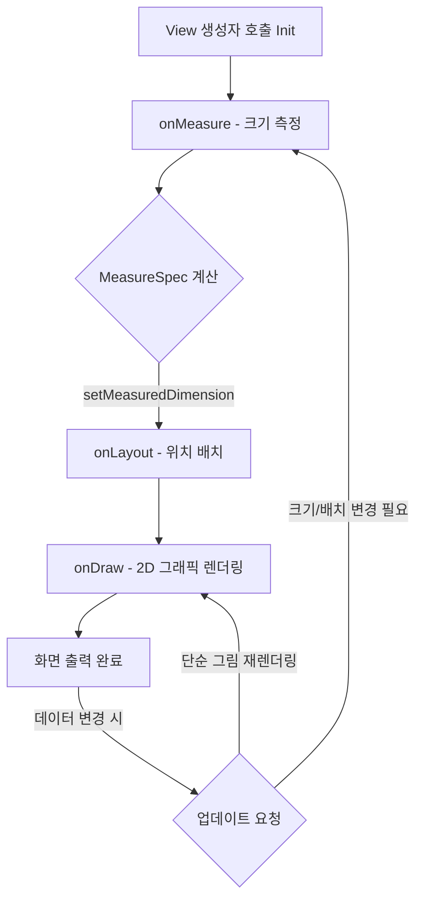

# Custom View: 맞춤형 2D 캔버스 렌더링 파이프라인

`Custom View`는 안드로이드 기본 제공 위젯(TextView, Button, ImageView 등)으로 구현하기 어려운 독자적인 디자인, 파이 차트, 복잡한 커스텀 애니메이션 또는 인터랙션을 **2D 그래픽 렌더링 파이프라인(`onMeasure` -> `onLayout` -> `onDraw`)**을 통해 직접 조각하고 그려내는 기법입니다.

---

## 1단계: 개념 소개 & 비유 (Core Concept & Analogy)

### 비유로 이해하기: 맞춤 양복 재단 & 캔버스 유화 그리기 🎨

Custom View를 만드는 과정은 **맞춤 양복 제작 후 캔버스에 유화를 그리는 작업**과 완전히 동일합니다.

1. **치수 재기 (`onMeasure`)**: 재단사가 고객의 체형에 맞게 가로/세로 길이를 측정하듯, 부모 뷰가 준 제약 조건(MeasureSpec) 내에서 뷰가 차지할 정확한 크기를 결정합니다.
2. **배치하기 (`onLayout`)**: 스튜디오 내에서 캔버스나 가구들의 좌표(Top, Left, Right, Bottom) 위치를 잡아 굳힙니다.
3. **그림 그리기 (`onDraw`)**: 화가가 **Canvas(화폭)**에 **Paint(붓과 물감)**로 실제로 도형, 선, 텍스트, 이미지를 그립니다.

```text
[부모 제약 조건 전달] 
    ↓
1. onMeasure()  ──> "얼마나 크게 만들 것인가?" (크기 측정)
    ↓
2. onLayout()   ──> "어느 위치에 둘 것인가?" (좌표 배치)
    ↓
3. onDraw()     ──> "무엇을 그릴 것인가?" (Canvas & Paint 렌더링)
```

---

## 2단계: 렌더링 파이프라인 & 생명주기 (Pipeline & Lifecycle)

Android View의 렌더링 시스템은 뷰 트리를 순회하면서 세 가지 핵심 단계를 순차적으로 실행합니다.



### `invalidate()` vs `requestLayout()`
* **`invalidate()`**: 크기나 위치는 그대로 두고 뷰의 모양/색상만 바뀐 경우 호출합니다. `onMeasure`와 `onLayout`을 건너뛰고 **`onDraw()`만 다시 실행**됩니다. (빠름)
* **`requestLayout()`**: 뷰의 크기나 위치가 변경되어 다시 측정해야 할 때 호출합니다. **`onMeasure()`부터 전체 파이프라인을 재수행**합니다. (상대적으로 비쌈)

---

## 3단계: 핵심 API (`onMeasure`, `onLayout`, `onDraw`, Canvas & Paint)

### 1. `onMeasure(widthMeasureSpec: Int, heightMeasureSpec: Int)`
부모가 전달한 `MeasureSpec`을 해독하여 자신의 크기를 정한 후 반드시 `setMeasuredDimension(width, height)`를 호출해야 합니다.

`MeasureSpec` 모드 3가지:
* **`EXACTLY`**: 부모가 정확한 크기(예: `100dp`, `match_parent`)를 지시함.
* **`AT_MOST`**: 부모가 허용하는 최대 크기(예: `wrap_content`) 이내에서 결정해야 함.
* **`UNSPECIFIED`**: 제약이 없음 (ScrollView 내부 등).

### 2. `onLayout(changed: Boolean, left: Int, top: Int, right: Int, bottom: Int)`
뷰 자체의 위치를 확정하거나, `ViewGroup`을 직접 구현할 경우 자식 뷰들의 위치(`child.layout()`)를 지정합니다.

### 3. `Canvas` & `Paint` API
* **`Canvas` (화폭)**: 무대이자 종이 역할을 합니다.
  * `drawRect()`, `drawCircle()`, `drawArc()`, `drawPath()`, `drawText()`, `drawBitmap()`
* **`Paint` (붓과 물감)**: 색상, 두께, 스타일, 안티앨리어싱을 결정합니다.
  * `color`, `strokeWidth`, `style` (`FILL`, `STROKE`, `FILL_AND_STROKE`), `isAntiAlias`, `shader` (그라데이션)

---

## 4단계: 실전 활용 코드 예시 (Practical Code Examples)

원형 프로그레스 바(Circular Progress Bar) Custom View 전체 구현 예시입니다.

```kotlin
package com.example.customview

import android.content.Context
import android.graphics.Canvas
import android.graphics.Color
import android.graphics.Paint
import android.graphics.RectF
import android.util.AttributeSet
import android.view.View
import kotlin.math.min

class CircularProgressView @JvmOverloads constructor(
    context: Context,
    attrs: AttributeSet? = null,
    defStyleAttr: Int = 0
) : View(context, attrs, defStyleAttr) {

    // 1. Paint 객체는 렌더링 성능을 위해 미리 생성 (onDraw 내 생성 금지)
    private val backgroundPaint = Paint(Paint.ANTI_ALIAS_FLAG).apply {
        color = Color.LTGRAY
        style = Paint.Style.STROKE
        strokeWidth = 20f
    }

    private val progressPaint = Paint(Paint.ANTI_ALIAS_FLAG).apply {
        color = Color.BLUE
        style = Paint.Style.STROKE
        strokeWidth = 20f
        strokeCap = Paint.Cap.ROUND
    }

    private val ovalRect = RectF()
    
    var progress: Float = 70f
        set(value) {
            field = value.coerceIn(0f, 100f)
            // 2. 값 변경 시 화면 재그리기 요청
            invalidate()
        }

    // 3. 크기 측정 단계
    override fun onMeasure(widthMeasureSpec: Int, heightMeasureSpec: Int) {
        val desiredSize = 300 // 기본 권장 크기 (px)
        
        val width = resolveSize(desiredSize, widthMeasureSpec)
        val height = resolveSize(desiredSize, heightMeasureSpec)
        
        // 측정 결과 저장 필수!
        setMeasuredDimension(width, height)
    }

    // 4. 크기가 확정되거나 변경되었을 때 좌표 영역 계산
    override fun onSizeChanged(w: Int, h: Int, oldw: Int, oldh: Int) {
        super.onSizeChanged(w, h, oldw, oldh)
        val padding = 30f
        ovalRect.set(padding, padding, w - padding, h - padding)
    }

    // 5. 캔버스에 그리기 단계
    override fun onDraw(canvas: Canvas) {
        super.onDraw(canvas)

        // (1) 배경 원 그리기
        canvas.drawOval(ovalRect, backgroundPaint)

        // (2) 프로그레스 호(Arc) 그리기 (12시 방향부터 시작: -90도)
        val sweepAngle = (progress / 100f) * 360f
        canvas.drawArc(ovalRect, -90f, sweepAngle, false, progressPaint)
    }
}
```

---

## 5단계: 주의사항 & 꿀팁 (Pitfalls & Best Practices)

> [!CAUTION]
> **1. `onDraw()` 내부에서 객체 할당(Allocation) 금지!**
> `onDraw()`는 초당 60~120회 이상 계속 호출될 수 있습니다. `Paint()`, `Path()`, `RectF()` 객체를 `onDraw()` 내부에서 `new`/생성하면 대량의 메모리 쓰레기가 발생하여 **Garbage Collection (GC) 지연으로 인한 화면 끊김(Jank)**이 발생합니다. 모든 붓/도형 객체는 클래스 멤버 변수로 미리 선언하세요.

> [!IMPORTANT]
> **2. `ViewGroup` 확장 시 `setWillNotDraw(false)` 설정**
> `LinearLayout`이나 `FrameLayout` 등 `ViewGroup`을 상속받아 그리기 기능을 추가할 경우, 안드로이드는 기본적으로 최적화를 위해 `onDraw()`를 호출하지 않도록 설정되어 있습니다. 생성자에서 `setWillNotDraw(false)`를 호출해야 `onDraw()`가 상속 실행됩니다.

### 핵심 요약 체크리스트 💡
- [x] `onDraw()` 내부에 `Paint()`나 `Path()` 생성이 포함되어 있지는 않나요?
- [x] `onMeasure()` 마지막에 `setMeasuredDimension()`을 꼭 호출했나요?
- [x] 뷰 상태 변화 시 `invalidate()` (그림 변경)와 `requestLayout()` (크기 변경)을 적절히 구분해서 사용했나요?

---

## 연관 참고 문서
* [ViewTreeObserver](./view-tree-observer.md)
* [Haptic Feedback](./haptic-feedback.md)
