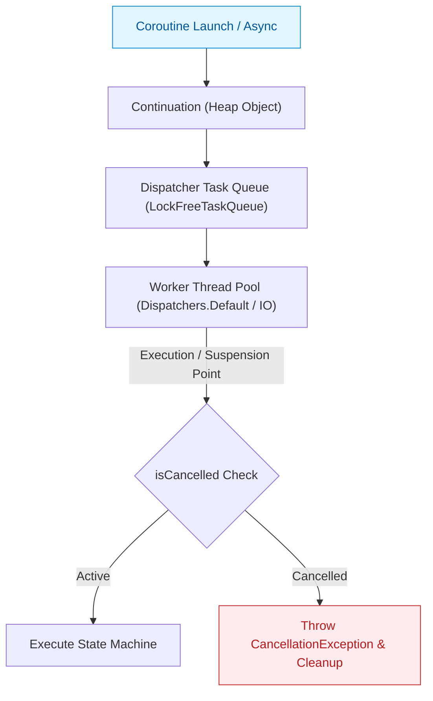

## Coroutine은 thread가 아니라 취소 가능한 경량 작업이다

### 개념 (What)
`Coroutine`은 OS 스레드(Thread)와 1:1 매핑되는 실행 단위가 아니며, Kotlin 런타임에 의해 관리되는 **경량 협조적 실행 단위(Cooperative Lightweight Execution Task)**다. OS 스레드가 커널 스페이스에서 컨텍스트 스위칭과 메모리를 할당받는 반면, Coroutine은 유저 스페이스 힙(Heap) 영역에 생성되는 `Continuation` 객체에 불과하다.

### 왜 필요한가 (Why)
1. **메모리 효율성**: Android에서 OS 스레드 1개는 기본적으로 1MB 상당의 스택 메모리를 소비하며 생성 시 커널 콜이 발생한다. 수천 개의 스레드를 생성하면 `OutOfMemoryError`나 심각한 GC 압박이 발생한다. 반면 Coroutine은 힙에 생성되는 수백 바이트 크기의 객체이므로 수십만 개를 동시에 띄워도 메모리 부담이 적다.
2. **컨텍스트 스위칭 비용 감소**: OS 스레드 전환은 CPU 레지스터 저장, 커널 모드 진입, MMU TLB 플러시 등을 동반하지만, Coroutine 전환은 유저 스페이스 내 함수 상태 머신의 pointer/label 이동에 불과하여 대단히 빠르다.
3. **안전한 작업 취소 (Cooperative Cancellation)**: 과거 Java의 `Thread.stop()`은 동기화 락 상태를 파괴하여 사용이 금지(Deprecated)되었다. Coroutine은 작업 취소 시 강제 종료 대신 취소 상태(`Job.isCancelled`)를 플래그로 전달하고, 중단 지점(Suspension Point)에서 안전하게 `CancellationException`을 던지는 **협조적 취소 규칙**을 제공한다.

### 내부 메커니즘 (How)
1. **Continuation 객체 할당**: `launch`나 `async` 호출 시 코틀린 컴파일러는 루틴을 실행할 `StandaloneCoroutine` 또는 `DeferredCoroutine` 객체를 생성한다.
2. **스레드 풀 큐 등록**: 해당 객체는 지정된 `CoroutineDispatcher` 내부의 task queue(`LockFreeTaskQueue`)로 전달되며, 스레드 풀의 워커 스레드가 큐에서 Coroutine을 가져와 실행한다.
3. **취소 전파와 검사**:
   - 부모 Job이 `cancel()`을 호출하면 상태가 `Cancelling`으로 변경되며 자식 코루틴에 취소가 전달된다.
   - 루틴 내부에서는 `ensureActive()`, `yield()`, 또는 `delay()`와 같은 표준 중단 함수를 만날 때 `coroutineContext[Job]?.ensureActive()`가 호출되어 `CancellationException`이 발생하고 자원이 해제된다.



### 현대 표준 vs 레거시 비교

| 비교 항목 | 레거시 (Thread / AsyncTask / RxJava) | 현대 표준 ([Kotlin Coroutines](kotlin-coroutines.md)) |
| :--- | :--- | :--- |
| **실행 단위** | OS 커널 스레드 (1MB 스택 소비) | 유저스페이스 Continuation 힙 객체 (~수백 바이트) |
| **취소 방식** | `Thread.interrupt()` 수동 검사 또는 `CompositeDisposable.clear()` | Scope 기반 자동 취소 및 `CancellationException` 협조적 전파 |
| **스레드 전환** | `Handler.post()`, `Schedulers.io()` 수동 체이닝 | `withContext(Dispatchers.IO)` 직관적 동기 스타일 서술 |
| **자원 정리** | `onDestroy()`에서 수동 널 처리 및 스레드 종료 조율 | `viewModelScope` / `lifecycleScope`로 수명 자동 바인딩 |

### Idiomatic Kotlin 코드 예시

```kotlin
class UserProfileRepository(
    private val remoteDataSource: RemoteDataSource,
    private val ioDispatcher: CoroutineDispatcher = Dispatchers.IO
) {
    suspend fun fetchAndProcessUserProfile(userId: String): UserProfile = withContext(ioDispatcher) {
        // CPU 대량 연산이나 긴 대기 루프가 포함된 경우 협조적 취소 점검 추가
        coroutineContext.ensureActive()

        val rawData = remoteDataSource.getRawUserData(userId)
        
        // 오랜 시간이 걸리는 인메모리 데이터 변환 연산
        val processedProfile = processHeavyData(rawData)
        
        processedProfile
    }

    private fun processHeavyData(rawData: RawUserData): UserProfile {
        // 수동 루프 내 취소 상태 체크 (중단 함수가 없는 정적 계산 시 필요)
        val filteredList = rawData.items.map { item ->
            if (!Thread.currentThread().isInterrupted) {
                // coroutineContext.ensureActive() 호출 가능
            }
            item.toDomainModel()
        }
        return UserProfile(rawData.id, filteredList)
    }
}
```

공식 문서: [Coroutines basics](https://kotlinlang.org/docs/coroutines-basics.html), [Cancellation and timeouts](https://kotlinlang.org/docs/cancellation-and-timeouts.html)
