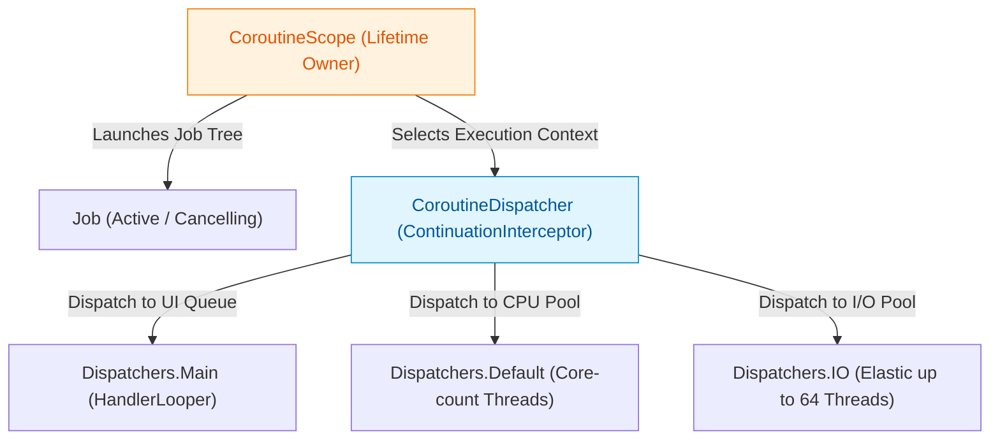

## Dispatcher는 실행 위치를 고르고 Scope는 작업 수명을 소유한다

### 개념 (What)
`CoroutineDispatcher`는 Coroutine이 **어느 스레드 또는 스레드 풀(Execution Context)에서 실행될지** 결정하는 요소다. 반면 `CoroutineScope`는 Coroutine의 **수명(Lifetime)과 트리 형태의 부모-자식 관계([structured concurrency](../../../../../../computer-science/structured-concurrency.md))**를 소유한다. 이 둘은 완전히 직교(Orthogonal)하는 개념이며, Dispatcher를 변경한다고 해서 Coroutine의 수명이나 취소 정책이 변경되지 않는다.

### 왜 필요한가 (Why)
1. **관심사의 완벽한 분리**: 비동기 코드를 작성할 때 "얼마나 오랫동안 살아야 하는가([viewmodel](../../../viewmodel.md) 범위인가, Global 범위인가)"와 "CPU/I/O 중 어떤 자원을 사용하는가"를 따로 관리해야 코드 직관성과 재사용성이 확보된다.
2. **Main-Safety 보장**: UI 레이어나 Repository API 호출 시 외부에서 Dispatcher 전환을 신경 쓰지 않도록 suspend 함수 내부에서 `withContext(Dispatchers.IO)`를 적용하여 Main-safe API 계약을 제공한다.
3. **테스트 용이성**: Dispatcher를 고정 스레드 풀로 하드코딩하지 않고 주입받게 설계하면, 단위 테스트 시 `StandardTestDispatcher`나 `UnconfinedTestDispatcher`로 교체하여 비동기 시간을 결정론적(Deterministic)으로 제어할 수 있다.

### 내부 메커니즘 (How)
1. **ContinuationInterceptor**: `CoroutineDispatcher`는 `CoroutineContext.Element`이자 `ContinuationInterceptor`를 구현한다. Coroutine이 중단 후 재개(Resume)될 때 Dispatcher가 Continuation을 감싸 `DispatchedContinuation`을 생성한다.
2. **Dispatcher 종류별 동작**:
   - `Dispatchers.Main`: Android OS의 `Looper.getMainLooper()`에 연결된 `HandlerDispatcher`다. `Handler.post(runnable)`을 통해 UI 메시지 큐로 작업을 전달한다.
   - `Dispatchers.Default`: CPU 코어 수에 비례하는 고정 크기 스레드 풀을 가진 `CoroutineScheduler`다. 정렬, JSON 파싱, 이미지 변환 등 CPU 집중 작업에 최적화되어 있다.
   - `Dispatchers.IO`: `Dispatchers.Default`와 동일한 스레드 풀 렌더러를 공유하지만, 차단형 I/O(파일 read/write, DB 쿼리, 동기 네트워크 call)를 위해 최대 64개(또는 시스템 설정값)까지 스레드를 탄력적으로 확장한다.
   - `Dispatchers.Unconfined`: 첫 번째 중단 지점 전까지는 호출한 스레드에서 즉시 실행되고, 재개(Resume)될 때는 중단을 해제한 스레드에서 이어 실행된다. 일반적인 프로덕션 코드에서는 예측 가능성이 낮아 사용을 지양한다.
3. **`withContext` 전환**: `withContext(Dispatchers.IO)`를 호출하면 현재 CoroutineContext의 Dispatcher만 교체된 새로운 Continuation이 생성되며, 부모 `Job` 구조는 그대로 유지되어 수명 관리가 보전된다.



### 현대 표준 vs 레거시 비교

| 비교 항목 | 레거시 (AsyncTask / RxJava) | 현대 표준 ([Kotlin Coroutines](../../../kotlin-coroutines.md)) |
| :--- | :--- | :--- |
| **스레드 지정 방식** | `subscribeOn(Schedulers.io())` / `observeOn(AndroidSchedulers.mainThread())` | `withContext(Dispatchers.IO)` (suspend 함수 내부 감싸기) |
| **수명주기 결합** | 스레드 생성 시점에 UI Context 주입 파라미터 필요 | `CoroutineScope`가 수명 관리, Dispatcher는 Context만 변경 |
| **테스트 제어** | `RxAndroidPlugins.setInitMainThreadSchedulerHandler()` 등 글로벌 훅 필요 | `TestDispatcher` 주입 및 Virtual Time 제어 |

### Idiomatic Kotlin 코드 예시

```kotlin
class ImageProcessingRepository(
    private val ioDispatcher: CoroutineDispatcher = Dispatchers.IO,
    private val defaultDispatcher: CoroutineDispatcher = Dispatchers.Default
) {
    // Main-safe API: 호출자가 어떤 스레드에서 불러도 메인 스레드를 차단하지 않음
    suspend fun loadAndCropImage(fileUri: String): Bitmap = withContext(ioDispatcher) {
        // 1. I/O 스레드 풀에서 디스크 파일 읽기
        val rawBytes = File(fileUri).readBytes()
        
        // 2. CPU 스레드 풀로 전환하여 이미지 픽셀 매트릭스 계산
        val croppedBitmap = withContext(defaultDispatcher) {
            decodeAndCrop(rawBytes)
        }
        
        croppedBitmap
    }

    private fun decodeAndCrop(bytes: ByteArray): Bitmap {
        // CPU 사양에 의존하는 중대형 그래픽 처리
        return BitmapFactory.decodeByteArray(bytes, 0, bytes.size)
    }
}
```

공식 문서: [Coroutine context and dispatchers](https://kotlinlang.org/docs/coroutine-context-and-dispatchers.html)
