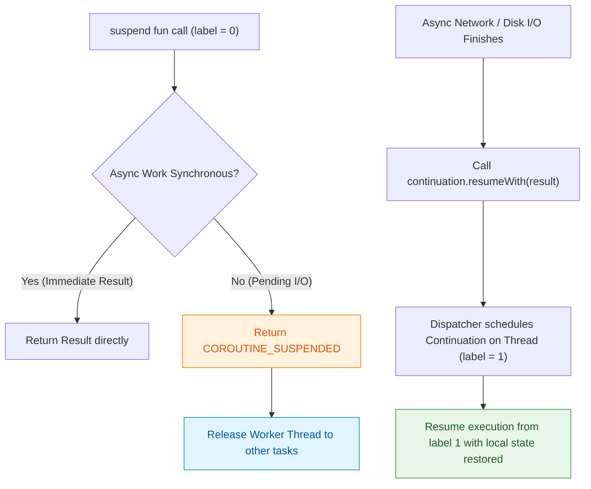

## suspend 함수는 thread가 아니라 coroutine을 멈춘다

### 개념 (What)
`suspend` 키워드가 붙은 함수는 호출한 OS 스레드를 물리적으로 점유(Block)하지 않고, **Coroutine의 실행 상태만 논리적으로 중단(Suspend)**시킨 뒤 작업 완료 시 원래 위치에서 재개(Resume)할 수 있게 하는 Kotlin의 비차단 API 계약이다.

### 왜 필요한가 (Why)
1. **Main Thread ANR 예방**: Android의 Main Thread(UI Thread)는 60fps/120fps 레이아웃 렌더링과 사용자 이벤트를 처리한다. 메인 스레드에서 `Thread.sleep()`이나 동기 I/O를 호출하면 화면이 멈추고 ANR(Application Not Responding)이 발생한다. `suspend` 함수는 I/O 대기 동안 메인 스레드를 자유롭게 풀어주어 화면이 렌더링을 계속하게 만든다.
2. **Callback Hell 제거**: 비동기 결과를 받기 위해 깊은 콜백 구조(`onSuccess`, `onFailure`)를 사용하는 대신, 작성 순서 그대로 깔끔한 동기식(Sequential) 코드를 작성할 수 있다.

### 내부 메커니즘 (How)
1. **CPS (Continuation-Passing Style) 변환**:
   - 코틀린 컴파일러는 `suspend fun fetchUser(id: String): User` 함수를 바이트코드로 변환할 때, 파라미터 맨 뒤에 `completion: Continuation<User>`를 자동으로 추가한다.
   - 반환 타입은 `Any?`로 변경되어, 중단 시에는 내부 예약 상수인 `COROUTINE_SUSPENDED`를 반환하고 즉시 계산된 경우 실제 데이터(`User`)를 반환한다.
2. **컴파일러 생성 상태 머신 (State Machine)**:
   - 컴파일러는 `suspend` 함수 내부를 `ContinuationImpl`을 상속하는 익명 클래스로 감싸고 `label` 필드(0, 1, 2...)를 생성한다.
   - `suspend` 지점(중단 지점)마다 `label` 값이 증가하고, 작업이 끝나 `continuation.resumeWith(result)`가 호출되면 `switch(label)` 구문을 통해 이전 실행 시점의 지역 변수를 복원하며 다음 라인부터 계속 실행한다.



### 현대 표준 vs 레거시 비교

| 비교 항목 | 레거시 (Callback / Thread.sleep) | 현대 표준 (Kotlin suspend) |
| :--- | :--- | :--- |
| **스레드 상태** | `Thread.sleep()` 사용 시 스레드가 BLOCKED 상태로 자원 낭비 | 스레드는 RELEASED 되어 타 코루틴 실행 가능 |
| **비동기 흐름** | 콜백 함수 중첩 (`onSuccess { onSuccess { ... } }`) | `val a = api1(); val b = api2(a)` 순차 서술 |
| **예외 처리** | 각 콜백 내부에서 별도 에러 콜백 전달 | standard `try-catch` 구문으로 비동기 예외 포획 |

### Idiomatic Kotlin 코드 예시

```kotlin
class NetworkUserRepository(
    private val userApi: UserApi
) {
    // suspend 키워드: 메인 스레드를 막지 않는 Non-blocking API 보장
    suspend fun getUserWithFollowers(userId: String): UserFollowerState {
        // 1차 중단 지점: 네트워크 응답 대기 동안 호출 스레드는 차단되지 않음
        val user = userApi.getUser(userId) 
        
        // 2차 중단 지점: user 정보 수령 후 팔로워 목록 요청
        val followers = userApi.getFollowers(user.id)
        
        return UserFollowerState(user = user, followers = followers)
    }
}
```

공식 문서: [Kotlin Coroutines basics](https://kotlinlang.org/docs/coroutines-basics.html)
