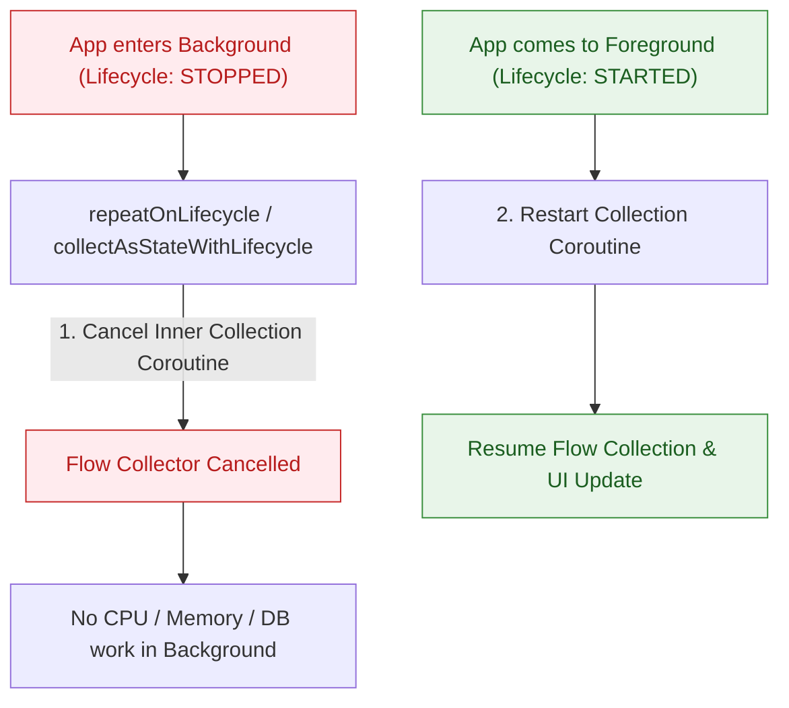

## UI는 lifecycle-aware API로 Flow를 수집해야 한다

### 개념 (What)
Android UI 레이어(Activity, Fragment, Jetpack Compose)에서 `Flow` / `StateFlow`를 수집할 때, 단순한 `lifecycleScope.launch { flow.collect() }`를 사용하지 않고 **화면 수명주기 상태(Lifecycle State, 예: `STARTED`)에 연동하여 백그라운드에서는 데이터 수집 코루틴을 자동 일시 정지/취소하고 화면이 다시 활성화될 때 재개하는 API 계약**이다.

### 왜 필요한가 (Why)
1. **백그라운드 크래시 및 뷰 조작 에러 방지**: 앱이 홈 화면으로 나가 백그라운드로 전환(Lifecycle `STOPPED`)되었는데도 Flow 수집이 계속되면, 파괴되거나 멈춘 View/Fragment 상태를 업데이트하려다 `IllegalStateException` 크래시가 일어난다.
2. **배터리 및 CPU 리소스 절약**: 백그라운드 상태에서 백그라운드 데이터베이스 쿼리나 위치 업데이트 Flow 수집을 멈춤으로써 디바이스 자원 소모를 방지한다.

### 내부 메커니즘 (How)
1. **`repeatOnLifecycle(Lifecycle.State.STARTED)`**:
   - 호출하는 Lifecycle이 지정된 목표 상태(`STARTED`) 미만으로 떨어지면, `repeatOnLifecycle`은 **내부 수집 코루틴을 취소(`Job.cancel()`)**한다.
   - Lifecycle이 다시 `STARTED` 상태로 상향 진입하면 새 코루틴을 생성하여 수집을 처음부터 다시 시작한다.
2. **Compose `collectAsStateWithLifecycle()`**:
   - `androidx.lifecycle.compose` 패키지에서 제공하는 Compose 전용 API다.
   - 내부적으로 `repeatOnLifecycle`을 사용하여 Compose Recomposition scope 내에서 수명주기 안전하게 `StateFlow`를 State로 변환한다.



### 현대 표준 vs 레거시 비교

| 비교 항목 | 레거시 (launchWhenStarted / launch) | 현대 표준 (repeatOnLifecycle / collectAsStateWithLifecycle) |
| :--- | :--- | :--- |
| **취소 여부** | `launchWhenStarted`는 코루틴을 **중단(Suspend)시킬 뿐 취소하지 않아** 업스트림 지속 흐름 | `repeatOnLifecycle`은 백그라운드 시 내부 코루틴을 **완전 취소(Cancel)**함 |
| **리소스 누수** | 백그라운드에서도 업스트림 Flow가 계속 데이터를 내뿜어 배터리 소모 | 업스트림이 Cold Flow인 경우 백그라운드에서 실행 완전히 멈춤 |
| **Compose 지원** | `flow.collectAsState()` (안전하지 않음) | `flow.collectAsStateWithLifecycle()` (표준 추천) |

### Idiomatic Kotlin 코드 예시

```kotlin
// 1. Jetpack Compose UI에서의 표준 수집 방식
@Composable
fun UserProfileScreen(
    viewModel: UserProfileViewModel = hiltViewModel()
) {
    // collectAsStateWithLifecycle: Lifecycle.State.STARTED 이상일 때만 상태 수집
    val uiState by viewModel.uiState.collectAsStateWithLifecycle()

    when (val state = uiState) {
        is ProfileUiState.Loading -> LoadingIndicator()
        is ProfileUiState.Success -> ProfileContent(user = state.user)
        is ProfileUiState.Error -> ErrorView(message = state.message)
    }
}

// 2. View System (Activity / Fragment)에서의 표준 수집 방식
class UserProfileActivity : AppCompatActivity() {
    private val viewModel: UserProfileViewModel by viewModels()

    override fun onCreate(savedInstanceState: Bundle?) {
        super.onCreate(savedInstanceState)
        
        // repeatOnLifecycle: STARTED 상태 동안만 수집 코루틴을 띄움
        lifecycleScope.launch {
            repeatOnLifecycle(Lifecycle.State.STARTED) {
                viewModel.uiState.collect { state ->
                    renderUi(state)
                }
            }
        }
    }

    private fun renderUi(state: ProfileUiState) {
        // View 업데이트
    }
}
```

공식 문서: [Consuming flows safely in Android UI](https://developer.android.com/topic/architecture/ui-layer/state-production#consuming-flows)
