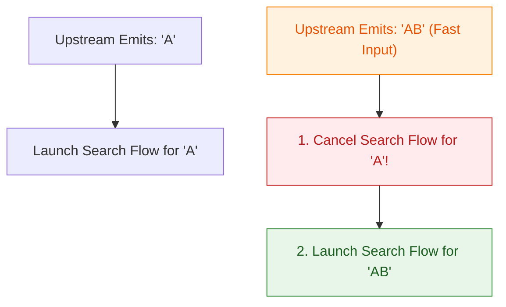

## flatMapLatest는 새 입력이 오면 이전 입력을 취소한다

### 개념 (What)
`flatMapLatest`는 업스트림(Upstream)에서 새로운 데이터 값이 발행되었을 때, **이전 데이터 값으로 인해 진행 중이던 하류(Downstream) 비동기 Flow 수집 코루틴을 즉시 취소(Cancel)하고, 최신 입력값에 기반한 새 Flow 수집을 시작하는 변환 연산자**다.

### 왜 필요한가 (Why)
1. **검색어 자동완성 (Search-as-you-type) 레이스 조건 방지**: 사용자가 "A" $\rightarrow$ "AB" $\rightarrow$ "ABC"를 빠르게 입력할 때, "A"로 요청한 네트워크 응답이 가장 늦게 도착하여 화면 결과가 "ABC" 대신 "A"의 결과로 오염되는 Race Condition 버그를 근본적으로 차단한다.
2. **불필요한 네트워크/DB 리소스 즉시 정지**: 더 이상 유효하지 않은 구 검색어에 대한 비동기 작업을 계속 실행하는 자원 낭비를 줄인다.

### 내부 메커니즘 (How)
1. **`ChannelFlow`와 이전 Job 취소 메커니즘**:
   - `flatMapLatest` 내부에서는 업스트림 스트림을 수집하는 루프가 동작한다.
   - 업스트림에서 새 값이 도착하면, 기존에 하류 Flow를 실행하던 내장 `Job` 객체의 `cancel()`을 즉시 호출한다.
   - 취소 신호를 보낸 후 즉시 새로운 입력값을 람다 블록에 넣어 생성된 새 `Flow`의 수집을 시작한다.



### 현대 표준 vs 레거시 비교

| 비교 항목 | 레거시 (RxJava switchMap) | 현대 표준 (Kotlin flatMapLatest) |
| :--- | :--- | :--- |
| **취소 방식** | `switchMap` 내부 구독 해제 (Unsubscribe) | Coroutine [structured concurrency](../../../../../../computer-science/structured-concurrency.md) 취소 (`Job.cancel()`) |
| **Backpressure** | switchMap 스레드 스케줄러 간 동기화 이슈 존재 | Coroutine suspension으로 백프레셔 자동 조율 |
| **가독성** | `debounce(300)` + `switchMap` 체이닝 복잡 | `searchQuery.debounce(300).flatMapLatest { api.search(it) }` |

### Idiomatic Kotlin 코드 예시

```kotlin
class SearchViewModel(
    private val searchRepository: SearchRepository
) : ViewModel() {

    private val searchQuery = MutableStateFlow("")

    @OptIn(ExperimentalCoroutinesApi::class, FlowPreview::class)
    val searchResultUiState: StateFlow<SearchResultUiState> = searchQuery
        .debounce(300L) // 300ms 핑거 타핑 대기
        .distinctUntilChanged() // 동일 검색어 연속 입력 방지
        .flatMapLatest { query ->
            if (query.isBlank()) {
                flowOf(SearchResultUiState.Empty)
            } else {
                // 새 query가 유입되면 이전 searchRepository API 요청 코루틴은 취소됨
                searchRepository.searchFlow(query)
                    .map { SearchResultUiState.Success(it) }
                    .catch { emit(SearchResultUiState.Error(it.message)) }
            }
        }
        .stateIn(
            scope = viewModelScope,
            started = SharingStarted.WhileSubscribed(5_000),
            initialValue = SearchResultUiState.Empty
        )

    fun onQueryChanged(newQuery: String) {
        searchQuery.value = newQuery
    }
}
```

공식 문서: [flatMapLatest](https://kotlinlang.org/api/kotlinx.coroutines/kotlinx-coroutines-core/kotlinx.coroutines.flow/flat-map-latest.html)
