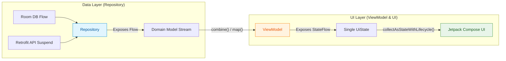

## Repository는 Flow를 노출하고 ViewModel은 화면 상태를 조합한다

### 개념 (What)
Android Recommended App Architecture에 따라 **Repository 레이어는 무상태(Stateless) 또는 Cold Stream 형태의 `Flow<T>`를 노출**하고, **ViewModel 레이어는 비즈니스 로직에 맞춰 복수의 데이터 소스를 `[stateflow](../../../stateflow-and-sharedflow.md)<UiState>` 단일 화면 상태로 조합(Compose)**하는 아키텍처 경계 계약이다.

### 왜 필요한가 (Why)
1. **단방향 데이터 흐름 (Unidirectional Data Flow - UDF)**: UI -> ViewModel(Event), ViewModel -> UI(State)의 명확한 데이터 선순환을 보장하여 상태 불일치 버그를 근본적으로 방지한다.
2. **레이어별 캡슐화 및 테스트 독립성**: Repository는 DB/네트워크 데이터 흐름만 담당하고, ViewModel은 UI 표시용 데이터 변환에 집중하여 가각 독립적인 단위 테스트가 가능해진다.

### 내부 메커니즘 (How)
1. **Repository의 책임 (`Flow<DomainModel>`)**:
   - Room DB Dao(`@Query("SELECT * FROM table") Flow<List<Entity>>`)나 DataStore 데이터를 읽어 Domain Model로 맵핑한 Cold Flow를 반환한다.
   - UI 수명주기나 화면 렌더링 구조를 전혀 알지 못하며, 오직 원천 데이터의 변화만을 감지하여 전달한다.
2. **ViewModel의 책임 (`StateFlow<UiState>`)**:
   - Repository들이 공급하는 여러 `Flow`를 `combine` 또는 `flatMapLatest` 연산자로 조합한다.
   - `stateIn(viewModelScope, SharingStarted.WhileSubscribed(5000), UiState.Loading)`을 사용하여 캡슐화된 `StateFlow`로 변환하여 Compose UI에 공급한다.



### 현대 표준 vs 레거시 비교

| 비교 항목 | 레거시 (LiveData in Repository / EventBus) | 현대 표준 (Flow in Repository + StateFlow in VM) |
| :--- | :--- | :--- |
| **Repository 노출** | `LiveData`를 Repository에서 직접 리턴 (Android SDK 종속) | `Flow<T>` 리턴 (Pure Kotlin 기반) |
| **상태 조합** | `MediatorLiveData` 사용 시 복잡한 수동 addSource 로직 | `combine(flow1, flow2) { a, b -> UiState(a, b) }` |
| **UI 캡슐화** | ViewModel의 MutableLiveData가 외부 노출되어 외부 변경 위험 | `val uiState: StateFlow`로 읽기 전용 캡슐화 |

### Idiomatic Kotlin 코드 예시

```kotlin
// 1. Repository Layer: Cold Flow 노출
class NewsRepository(
    private val newsDao: NewsDao,
    private val newsApi: NewsApi
) {
    fun getArticlesStream(): Flow<List<Article>> = newsDao.getArticles()
        .map { entities -> entities.map { it.toDomain() } }
}

// 2. ViewModel Layer: UiState 조합 및 StateFlow 노출
data class NewsScreenUiState(
    val articles: List<Article> = emptyList(),
    val isRefreshing: Boolean = false
)

class NewsViewModel(
    newsRepository: NewsRepository,
    private val userPreferencesRepository: UserPreferencesRepository
) : ViewModel() {

    val uiState: StateFlow<NewsScreenUiState> = combine(
        newsRepository.getArticlesStream(),
        userPreferencesRepository.isRefreshingStream
    ) { articles, isRefreshing ->
        NewsScreenUiState(articles = articles, isRefreshing = isRefreshing)
    }.stateIn(
        scope = viewModelScope,
        started = SharingStarted.WhileSubscribed(5_000),
        initialValue = NewsScreenUiState()
    )
}
```

공식 문서: [Guide to app architecture - Data layer](https://developer.android.com/topic/architecture/data-layer)
