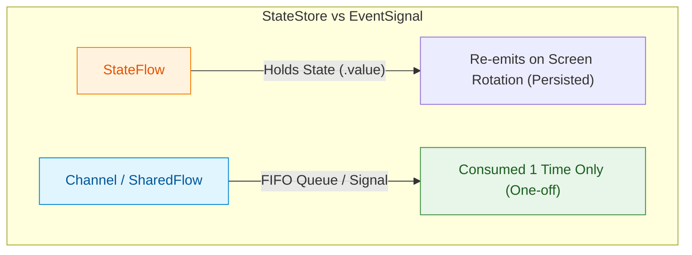

## SharedFlow와 Channel은 상태 저장소가 아니라 이벤트 신호다

### 개념 (What)
`[stateflow](../../../stateflow-and-sharedflow.md)`가 화면에 지속적으로 노출되는 **상태(State)**를 다루는 반면, `SharedFlow` 및 `Channel`은 토스트 메시지 출력, SnackBar 표시, 화면 이동(Navigation)과 같이 **단 1번만 소비되어야 하는 일회성 이벤트 신호(One-off Event Signal)**를 다룬다.

### 왜 필요한가 (Why)
1. **화면 회전 시 이벤트 재발동 방지**: `StateFlow`나 `LiveData`로 1회성 네비게이션 이벤트를 처리하면, 화면 회전 시 `value`가 힙에 남아있어 화면이 다시 복구될 때 수집자가 이벤트를 재수신하여 사용자가 원치 않는 네비게이션이 중복 실행된다.
2. **Channel의 Single-subscriber 보장**: `Channel`은 FIFO 큐 구조로, 단 한 곳의 소비자가 이벤트를 꺼해가면 채널에서 제거되어 1회성 처리가 완벽히 보장된다.

### 내부 메커니즘 (How)
1. **Channel (`Channel.BUFFERED` / `Channel.UNLIMITED`)**:
   - `Channel`은 생산자(Producer)와 소비자(Consumer) 사이의 큐(Queue)다.
   - `Channel.send()`로 넣은 이벤트는 수집자가 `receive()`로 꺼해가면 큐에서 소멸된다. 수집자가 활성화되지 않았을 때는 버퍼에 대기했다가 수집자가 켜지면 1번만 전달된다.
2. **`SharedFlow` (replay = 0)**:
   - `MutableSharedFlow<UiEvent>(replay = 0, extraBufferCapacity = 1, onBufferOverflow = BufferOverflow.DROP_OLDEST)` 형태는 최신 이벤트를 보관하지 않고 현재 활성화된 구독자들에게만 이벤트를 즉시 브로드캐스트한다.
3. **최신 아키텍처 권장안 (Consumable Event in UiState)**:
   - 최근 Android Official Guide는 Channel/SharedFlow 대신 `UiState` 내부에 **Unique Event ID**를 포함시키고, UI가 이벤트를 처리한 뒤 `onEventHandled(id)` 액션을 ViewModel에 보내 상태를 리셋하는 방식을 가장 권장한다.



### 현대 표준 vs 레거시 비교

| 비교 항목 | 레거시 (SingleLiveEvent / EventWrapper) | 현대 표준 (Channel / Consumable State) |
| :--- | :--- | :--- |
| **구현 방식** | LiveData를 상속한 억지 커스텀 클래스 | `Channel<UiEvent>` 또는 `UiState` 내 id 기반 관리 |
| **다중 구독자** | 첫 Observer만 이벤트 수신 가능 | Channel (단일 소비) / SharedFlow (다중 브로드캐스트) 선택 가능 |
| **테스트 검증** | LiveData Observer 캡처 복잡 | Channel `receive()` 호출로 명확한 단위 테스트 |

### Idiomatic Kotlin 코드 예시

```kotlin
sealed interface UserEditEvent {
    data class ShowToast(val message: String) : UserEditEvent
    object NavigateToHome : UserEditEvent
}

class UserEditViewModel : ViewModel() {

    // 1. Channel 기반 1회성 이벤트 백킹 프로퍼티
    private val _eventChannel = Channel<UserEditEvent>(capacity = Channel.BUFFERED)
    val eventFlow: Flow<UserEditEvent> = _eventChannel.receiveAsFlow()

    fun saveUserChanges(name: String) {
        viewModelScope.launch {
            if (name.isBlank()) {
                // 일회성 토스트 이벤트 전송
                _eventChannel.send(UserEditEvent.ShowToast("이름을 입력해주세요."))
            } else {
                // 성공 이벤트 전송
                _eventChannel.send(UserEditEvent.NavigateToHome)
            }
        }
    }
}
```

공식 문서: [Android events guide](https://developer.android.com/topic/architecture/ui-layer/events)
