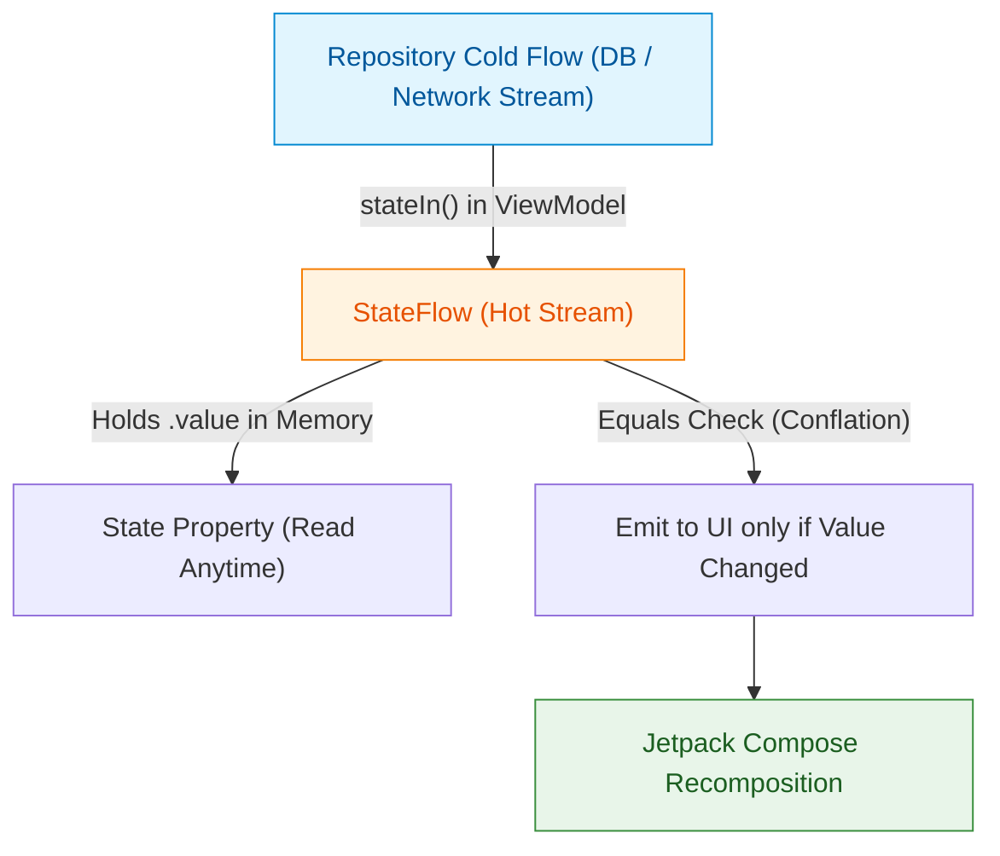

## StateFlow는 화면의 현재 상태를 다루고 Flow는 데이터 저장소 스트림을 다룬다

### 개념 (What)
- `Flow`는 **데이터 저장소(Repository/DataSource)에서 발생하는 연속적 데이터 변경을 묘사하는 Cold Stream**이다.
- `StateFlow`는 **UI 화면 렌더링에 필요한 현재 최신 상태(State)값을 항상 힙에 보유하고 있는 Hot Stream**이다 (`value` 프로퍼티 직접 접근 가능).

### 왜 필요한가 (Why)
1. **화면 재구성(Configuration Change) 대응**: 스마트폰 화면을 회전하거나 다크모드를 변경할 때 Activity/Compose가 다시 그려진다. 이때 `StateFlow`는 최신 `value`를 즉시 새로 그려진 UI에 재전달하여 동기적인 상태 복원을 가능케 한다.
2. **동일 값 중복 렌더링 방지 (Conflation)**: `StateFlow`는 이전 값과 동일한 데이터(`Any.equals`)가 발행되면 구독자에게 재통지하지 않고 버리는 **Conflation** 특성을 내장하여 불필요한 UI Recomposition을 차단한다.

### 내부 메커니즘 (How)
1. **`StateFlow`의 `AtomicReference` 기반 상태 보관**:
   - `MutableStateFlow(initialValue)`는 내부에 원자적 상태 변수(`AtomicReference`)와 상태 시퀀스 버전 카운터를 유지한다.
   - `_state.value = newValue`로 값을 변경하면 `oldValue == newValue` 비교를 거치고, 값이 다를 경우에만 시퀀스 번호를 올린 뒤 대기 중인 수집자들을 재운다(Wake Up).
2. **`StateFlow` 대 `LiveData` 차이점**:
   - LiveData는 안드로이드 SDK 의존성(`android.arch.lifecycle`)을 지니며 lifecycle-aware 자동 관리와 메인 스레드 강제를 특징으로 한다.
   - StateFlow는 순수 Kotlin Standard Library 기반이므로 Multiplatform(KMP), Domain, [viewmodel](../../../architecture/state-management/viewmodel.md) 단위 테스트에서 Android SDK mock 없이 동작한다.
   - 자세한 비교는 [LiveData 문서](../../../architecture/state-management/livedata.md)를 참고하세요.



### 현대 표준 vs 레거시 비교

| 비교 항목 | 레거시 (LiveData / BehaviorSubject) | 현대 표준 (StateFlow) |
| :--- | :--- | :--- |
| **SDK 의존성** | Android Framework 의존 (`androidx.lifecycle`) | Pure Kotlin (KMP 지원, 도메인 레이어 사용 가능) |
| **초기값 요구** | 초기값 없이 null 상태로 시작 가능 | 생성 시점에 반드시 명시적 초기값 필수 (`UiState.Loading`) |
| **Null Safety** | `liveData.value` 접근 시 널 가능성 존재 | `stateFlow.value` 넌널(NonNull) 접근 보장 |
| **Conflation** | `setValue` 호출 시 동일 값이어도 무조건 observer 통지 | `Any.equals` 동등성 비교로 중단 렌더링 자동 차단 |

### Idiomatic Kotlin 코드 예시

```kotlin
sealed interface ProfileUiState {
    object Loading : ProfileUiState
    data class Success(val user: User) : ProfileUiState
    data class Error(val message: String) : ProfileUiState
}

class ProfileViewModel(
    private val userRepository: UserRepository
) : ViewModel() {

    // 1. Immutable 외부 공개용 StateFlow
    val uiState: StateFlow<ProfileUiState> = userRepository.getUserStream()
        .map { user -> ProfileUiState.Success(user) as ProfileUiState }
        .catch { e -> emit(ProfileUiState.Error(e.message ?: "Unknown Error")) }
        .stateIn(
            scope = viewModelScope,
            started = SharingStarted.WhileSubscribed(5_000),
            initialValue = ProfileUiState.Loading
        )
}
```

공식 문서: [StateFlow and SharedFlow](https://kotlinlang.org/docs/sharedflow-and-stateflow.html#stateflow)
