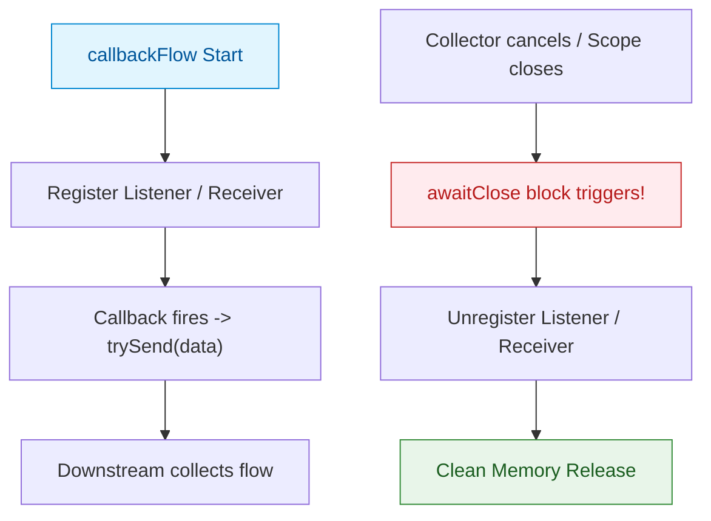

## callbackFlow는 리스너 등록과 해제 자원 정리를 위해 awaitClose를 필수 요구한다

### 개념 (What)
`callbackFlow`는 안드로이드의 기존 리스너/콜백 기반 비동기 API(예: `LocationListener`, `SensorEventListener`, `Firebase Realtime Database`, `BroadcastReceiver`)를 **Kotlin Flow 데이터 스트림으로 전환하는 전용 빌더 API**다.

### 왜 필요한가 (Why)
1. **메모리 누수(Memory Leak) 원천 차단**: 콜백 등록 후 수집이 취소되었을 때 리스너 해제(`unregisterListener`)를 호출하지 않으면, OS 시스템 서비스나 외부 SDK가 App Component를 계속 참조하게 되어 심각한 메모리 누수가 발생한다.
2. **`awaitClose` 필수 계약**: `callbackFlow`는 블록 마지막에 `awaitClose` 호출을 필수적으로 강제한다. `awaitClose`가 없으면 빌더 생성 시 런타임 예외(`IllegalStateException`)가 발생하여 자원 정리를 강제한다.

### 내부 메커니즘 (How)
1. **Channel 기반 데이터 전송**: `callbackFlow`는 내부적으로 `ProducerScope`를 제공하며, 이는 Channel을 래핑하고 있다. 콜백 메서드 내부에서 `trySend(value)` 또는 `send(value)`를 호출하여 채널 버퍼로 데이터를 보낸다.
2. **`awaitClose` 중단 및 동기화**:
   - `awaitClose`는 다운스트림 수집자가 `collect`를 중단하거나 취소할 때까지 해당 Coroutine의 실행을 중단(Suspend)시키고 기다린다.
   - 스트림 취소, 실패, 또는 채널 종료(`close()`) 이벤트가 발생하면 `awaitClose`에 전달된 람다 블록이 **동기적으로 실행**되어 리스너 unregister를 안전하게 수행한다.



### 현대 표준 vs 레거시 비교

| 비교 항목 | 레거시 (Listener Callback / RxJava Subject) | 현대 표준 (callbackFlow + awaitClose) |
| :--- | :--- | :--- |
| **자원 해제 처리** | Activity `onStop` / `onDestroy`에서 수동 unregister | Flow 수집 종료 시 `awaitClose` 람다에서 자동 해제 |
| **스레드 안전성** | 콜백 호출 스레드와 UI 스레드 불일치 시 별도 핸들러 필요 | `trySend()`는 비차단 스레드 안전 전송 보장 |
| **누락 방지** | 개발자의 실수로 리스너 해제 누락 빈번 | `awaitClose` 부재 시 컴파일/런타임 실패 강제 규칙 |

### Idiomatic Kotlin 코드 예시

```kotlin
class LocationTracker(
    private val context: Context,
    private val fusedLocationClient: FusedLocationProviderClient
) {
    fun getRealtimeLocationUpdates(): Flow<Location> = callbackFlow {
        // 1. 위치 측정 콜백 정의
        val locationCallback = object : LocationCallback() {
            override fun onLocationResult(result: LocationResult) {
                for (location in result.locations) {
                    // trySend(): 채널 버퍼로 비차단 데이터 발행
                    trySend(location).isSuccess
                }
            }
        }

        val locationRequest = LocationRequest.Builder(Priority.PRIORITY_HIGH_ACCURACY, 2000).build()

        // 2. 안드로이드 시스템에 리스너 등록
        fusedLocationClient.requestLocationUpdates(
            locationRequest,
            locationCallback,
            Looper.getMainLooper()
        )

        // 3. awaitClose: 수집 종료 시 반드시 해제 로직을 실행
        awaitClose {
            Log.d("LocationTracker", "Flow cancelled. Unregistering location updates...")
            fusedLocationClient.removeLocationUpdates(locationCallback)
        }
    }
}
```

공식 문서: [callbackFlow](https://kotlinlang.org/api/kotlinx.coroutines/kotlinx-coroutines-core/kotlinx.coroutines.flow/callback-flow.html)
