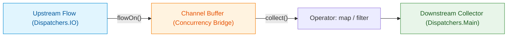

## Flow 연산자는 선언적 취소와 조합을 유지하며 스트림을 변환한다

### 개념 (What)
`Flow` 중간 연산자(Intermediate Operator, 예: `map`, `filter`, `transform`, `flowOn`, `catch`)는 기존 데이터 스트림을 가공하여 새로운 `Flow`를 생성하는 연산이다. 모든 intermediate operator는 **지연 평가(Lazy Evaluation)**되며, 업스트림의 **취소 신호 전파**와 **컨텍스트 보존 원칙**을 완벽하게 유지한다.

### 왜 필요한가 (Why)
1. **가독성 높은 선언적 파이프라인**: 흩어진 비동기 데이터 변환 로직을 함수형 체인 형태로 가공하여, 사이드 이펙트(Side-effect) 없는 [순수 함수](../../../../../../computer-science/pure-function.md) 파이프라인을 구축한다.
2. **협조적 취소 릴레이**: intermediate operator 체인 중간에서 취소가 발생하면, 별도의 플래그 관리 없이 업스트림 데이터 생성 루틴까지 원자적으로 취소가 즉시 전파된다.

### 내부 메커니즘 (How)
1. **Operator Wrapper 객체**:
   - `flow.map { ... }`를 호출하면 데이터를 즉시 변환하지 않고 `unsafeFlow` 체인 객체를 생성하여 반환한다.
   - Downstream 수집자가 `collect()`를 부르면, Wrapper Flow의 수집자가 Upstream의 `collect()`를 호출하면서 데이터가 람다 필터를 거쳐 순차 이동한다.
2. **`flowOn` 연산자의 버퍼 릴레이**:
   - `flowOn(Dispatchers.IO)`는 업스트림의 실행 Dispatcher를 변경하기 위해 내부적으로 `ChannelFlowOperator`를 형성한다.
   - 업스트림은 별도의 Coroutine에서 데이터를 생성하여 Channel 버퍼에 넣고, 다운스트림 수집자는 원래 지정된 Dispatcher에서 Channel 데이터를 꺼내 소비한다.
3. **`catch` 연산자**:
   - Upstream에서 발생한 예외만 포획하며, `catch` 연산자 Downstream(이후의 연산자 또는 `collect` 내부)에서 일어난 예외는 포획하지 않아 책임 범위를 명확히 규정한다.



### 현대 표준 vs 레거시 비교

| 비교 항목 | 레거시 (RxJava Operators) | 현대 표준 (Kotlin Flow Operators) |
| :--- | :--- | :--- |
| **연산자 수** | 백여 개 이상의 비대한 연산자 (flatMap, concatMap, switchMap 등) | 인라인 확장 함수 기반 수십 개 미만의 간결한 연산자 조합 |
| **예외 처리** | `onErrorReturn`, `onErrorResumeNext` 연산 위치에 따른 혼선 | `catch` 연산자의 상류(Upstream) 예외 전용 포획 명확화 |
| **스레드 변경** | `observeOn` 연산자 체이닝 위치마다 스레드가 계속 바뀜 | `flowOn`을 통해 상류 Dispatcher만 직관적으로 지정 |

### Idiomatic Kotlin 코드 예시

```kotlin
class OrderProcessingUseCase(
    private val orderRepository: OrderRepository
) {
    fun getActiveOrderSummaries(userId: String): Flow<List<OrderSummary>> {
        return orderRepository.getOrdersStream(userId)
            // 1. 필터링: 활성화된 주문만 추출
            .map { orders -> orders.filter { it.isActive } }
            // 2. 변환: UI용 DTO로 맵핑
            .map { activeOrders -> activeOrders.map { it.toSummary() } }
            // 3. 상류 예외 처리: 데이터베이스 읽기 에러 포획
            .catch { throwable ->
                emit(emptyList()) // 에러 발생 시 안전한 기본값 발행
            }
            // 4. 업스트림 실행 스레드를 IO로 지정
            .flowOn(Dispatchers.IO)
    }
}
```

공식 문서: [Flow intermediate operators](https://kotlinlang.org/docs/flow.html#intermediate-flow-operators)
