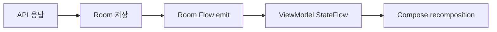

# Android에서 자주 쓰는 실전 패턴

상위 노트: [[kotlin-coroutines-flow-stateflow]]

### 7-1. 화면 상태 패턴: UiState sealed interface

로딩/성공/에러 상태가 분명한 화면에서는 `sealed interface`를 자주 씁니다.

```kotlin
sealed interface BenefitUiState {
    data object Loading : BenefitUiState
    data class Ready(val benefits: List<Benefit>) : BenefitUiState
    data class Error(val message: String) : BenefitUiState
}
```

```kotlin
val uiState: StateFlow<BenefitUiState> =
    repository.observeBenefits()
        .map { benefits ->
            val state: BenefitUiState = BenefitUiState.Ready(benefits)
            state
        }
        .onStart {
            emit(BenefitUiState.Loading)
        }
        .catch {
            emit(BenefitUiState.Error("혜택 목록을 불러오지 못했습니다."))
        }
        .stateIn(
            scope = viewModelScope,
            started = SharingStarted.WhileSubscribed(5000),
            initialValue = BenefitUiState.Loading,
        )
```

### 7-2. 예외 처리 가이드: runCatching vs try-catch

Android 앱 개발 시 예외(Exception) 처리 도구로 `runCatching` 과 `try-catch` 를 많이 사용합니다.두 방식은 처리 목적과 코루틴 취소 메커니즘
전파에 중요한 차이가 있습니다.

| 구분         | `try-catch`                   | `runCatching`                                         |
|:-----------|:------------------------------|:------------------------------------------------------|
| **스타일**    | 명령형 (Imperative)              | 함수형 / 표현식 (Functional)                                |
| **결과 반환**  | 블록 반환값 또는 직접 흐름 제어            | `Result<T>` (`Success` 또는 `Failure`)                  |
| **체이닝**    | 불가 (`try` 블록 내부 처리)           | 가능 (`map`, `recover`, `onSuccess`, `onFailure`)       |
| **코루틴 취소** | `CancellationException` 정상 전파 | ⚠️ `CancellationException`까지 잡아서 `Failure`로 변환할 위험 있음 |

#### 1) Repository / Data 계층: `runCatching` 권장

Repository나 DataSource에서 파일 IO, JSON 파싱 결과를 `Result<T>`로 감싸 반환할 때 적합합니다.

```kotlin
// Data Layer (RepositoryImpl)
override suspend fun getOpenSourceLicenses(): Result<List<OpenSourceArtifact>> =
    withContext(Dispatchers.IO) {
        runCatching {
            val jsonString =
                assetManager.open("licenses/artifacts.json").bufferedReader().use { it.readText() }
            LicenseJsonParser.parseJson(jsonString)
        }.map { dtos ->
            dtos.map { it.toDomain() }
        }
    }
```

#### 2) 특정 예외 조준 및 Coroutine 취소 보장: `try-catch` 권장

부모-자식 코루틴 간 취소 신호(`CancellationException`)를 정상적으로 위로 전달해야 하거나, 특정 예외(`IOException` 등)만 핀포인트로 잡고 싶을
때는 `try-catch`를 사용해야 합니다.

```kotlin
suspend fun syncData() {
    try {
        apiService.uploadLogs()
    } catch (e: IOException) {
        // 네트워크/IO 예외만 복구 처리
        logger.e(e) { "로그 업로드 실패" }
    }
    // CancellationException이나 RuntimeException은 그대로 상위 코루틴으로 전파됨
}
```

Compose는 상태 타입에 따라 화면을 분기합니다.

```kotlin
@Composable
fun BenefitScreen(uiState: BenefitUiState) {
    when (uiState) {
        BenefitUiState.Loading -> LoadingScreen()
        is BenefitUiState.Ready -> BenefitList(uiState.benefits)
        is BenefitUiState.Error -> ErrorScreen(uiState.message)
    }
}
```

### 7-2. 검색 패턴: query StateFlow + flatMapLatest

```kotlin
class SearchViewModel(
    private val repository: ProductRepository,
) : ViewModel() {
    private val query = MutableStateFlow("")

    val uiState: StateFlow<SearchUiState> =
        query
            .debounce(300)
            .distinctUntilChanged()
            .flatMapLatest { keyword ->
                if (keyword.isBlank()) {
                    flowOf(emptyList())
                } else {
                    repository.searchProducts(keyword)
                }
            }
            .map { products ->
                SearchUiState.Ready(products)
            }
            .stateIn(
                scope = viewModelScope,
                started = SharingStarted.WhileSubscribed(5_000),
                initialValue = SearchUiState.Ready(emptyList()),
            )

    fun onQueryChange(value: String) {
        query.value = value
    }
}
```

`flatMapLatest`가 핵심입니다. 새 검색어가 들어오면 이전 검색 Flow를 취소하고 최신 검색만 유지합니다.

### 7-3. 여러 데이터 합치기: combine

홈 화면은 여러 출처의 데이터를 합쳐서 만드는 경우가 많습니다.

```kotlin
val uiState: StateFlow<HomeUiState> =
    combine(
        userRepository.observeUser(),
        benefitRepository.observeBenefits(),
        notificationRepository.observeUnreadCount(),
    ) { user, benefits, unreadCount ->
        HomeUiState(
            userName = user.name,
            benefits = benefits,
            unreadCount = unreadCount,
        )
    }.stateIn(
        scope = viewModelScope,
        started = SharingStarted.WhileSubscribed(5_000),
        initialValue = HomeUiState(),
    )
```

`combine`은 각 Flow의 최신값을 모아 하나의 UI 상태로 만듭니다.

### 7-4. Room + Flow 패턴

Room은 Flow와 매우 잘 맞습니다.

```kotlin
@Dao
interface BenefitDao {
    @Query("SELECT * FROM benefits ORDER BY createdAt DESC")
    fun observeBenefits(): Flow<List<BenefitEntity>>

    @Insert(onConflict = OnConflictStrategy.REPLACE)
    suspend fun insertAll(benefits: List<BenefitEntity>)
}
```

DB가 바뀌면 Room이 Flow에 새 값을 내보내고, ViewModel의 StateFlow가 갱신되고, Compose가 다시 그립니다.



### 7-5. 콜백 API를 Flow로 바꾸기: callbackFlow

위치, 센서, 네트워크 상태처럼 콜백 기반 API는 `callbackFlow`로 감싸면 Flow처럼 다룰 수 있습니다.

```kotlin
fun observeNetworkState(context: Context): Flow<NetworkState> = callbackFlow {
    val callback = object : ConnectivityManager.NetworkCallback() {
        override fun onAvailable(network: Network) {
            trySend(NetworkState.Available)
        }

        override fun onLost(network: Network) {
            trySend(NetworkState.Unavailable)
        }
    }

    val manager = context.getSystemService(ConnectivityManager::class.java)
    manager.registerDefaultNetworkCallback(callback)

    awaitClose {
        manager.unregisterNetworkCallback(callback)
    }
}
```

`awaitClose`는 Flow 수집이 취소될 때 콜백 등록을 해제하는 정리 지점입니다.

---
