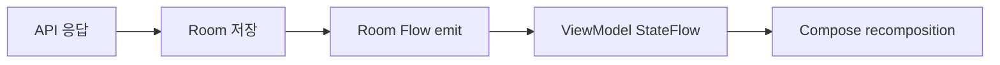

# Room + Flow 패턴

Room은 Flow와 매우 잘 맞습니다.

```kotlin
@Dao
interface BenefitDao {
    @Query("SELECT * FROM benefits ORDER BY createdAt DESC")
    fun observeBenefits(): Flow<List<BenefitEntity>>

    @Insert(onConflict = OnConflictStrategy.REPLACE)
    suspend fun insertAll(benefits: List<BenefitEntity>)
}
```

DB가 바뀌면 Room이 Flow에 새 값을 내보내고, ViewModel의 StateFlow가 갱신되고, Compose가 다시 그립니다.


