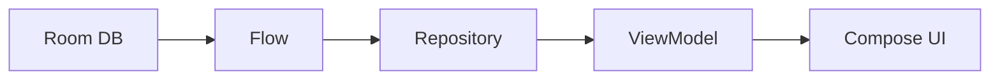

# Flow: 시간이 지나며 여러 값을 내보내는 비동기 스트림

상위 노트: [[kotlin-coroutines-flow-stateflow]]

### 4-1. Flow란?

`Flow`는 **한 프로세스 안에서 시간에 따라 여러 값이 흘러오는 비동기 데이터 스트림**입니다.

일반 `suspend` 함수는 값을 한 번 반환합니다.

```kotlin
suspend fun fetchUser(): User
```

반면 `Flow`는 값을 0번, 1번, 여러 번 계속 내보낼 수 있습니다.

```kotlin
fun observeBenefits(): Flow<List<Benefit>>
```

쉽게 말하면:

| 형태                                           | 의미                |
|:---------------------------------------------|:------------------|
| `suspend fun getUser(): User`                | 유저를 한 번 가져온다      |
| `fun observeUser(): Flow<User>`              | 유저 정보 변화를 계속 관찰한다 |
| `suspend fun fetchProducts(): List<Product>` | 상품 목록을 한 번 요청한다   |
| `fun observeProducts(): Flow<List<Product>>` | 상품 목록 변화를 계속 받는다  |

> [!IMPORTANT]
> Kotlin Flow는 **앱 내부의 비동기 상태/데이터 흐름**을 표현하는 도구입니다. 다른 앱으로 데이터를 공개하거나 전달하는 Android OS 컴포넌트가 아닙니다. 앱
> 밖으로 데이터를 열어야 하면 `ContentProvider`, `FileProvider`, `Intent`, App Link, App Functions, Binder/AIDL
> 같은
> 플랫폼 경계를 사용해야 합니다.

### 4-2. Flow는 왜 Android와 잘 맞나?

Android UI는 상태가 계속 바뀝니다.

* DB 데이터가 바뀜
* 네트워크 결과가 도착함
* 검색어가 바뀜
* 로그인 상태가 바뀜
* 화면이 시작/중지됨

Flow는 이런 변화를 "콜백 지옥"이 아니라 하나의 파이프라인으로 표현합니다.



### 4-3. Cold Flow: 누가 구독해야 흐른다

일반적인 `Flow`는 **Cold Stream**입니다.

뜻은 "누군가 `collect`하기 전까지 아무 일도 하지 않는다"입니다.

```kotlin
val flow = flow {
    emit(1)
    emit(2)
    emit(3)
}

flow.collect { value ->
    println(value)
}
```

`flow { ... }` 블록은 선언만으로 실행되지 않습니다. `collect`를 해야 실행됩니다.

> [!NOTE]
> Flow는 수도관 설계도에 가깝습니다. 물이 실제로 흐르는 시점은 누군가 수도꼭지를 여는 `collect` 순간입니다.

### 4-4. Flow 기본 연산자

Flow는 값을 그대로 받는 것보다 중간에 가공해서 쓰는 경우가 많습니다.

| 연산자                    | 역할                           |
|:-----------------------|:-----------------------------|
| `map`                  | 값 변환                         |
| `filter`               | 조건에 맞는 값만 통과                 |
| `combine`              | 여러 Flow의 최신값을 합침             |
| `debounce`             | 짧은 시간 동안 잦은 입력을 모아서 처리       |
| `distinctUntilChanged` | 같은 값이 반복되면 무시                |
| `flatMapLatest`        | 새 값이 오면 이전 작업 취소 후 최신 작업만 유지 |
| `catch`                | 에러 처리                        |
| `onStart`              | 시작 시 로딩 상태 방출                |

```kotlin
val uiState: Flow<SearchUiState> =
    searchKeyword
        .debounce(300)
        .distinctUntilChanged()
        .flatMapLatest { keyword ->
            repository.searchProducts(keyword)
        }
        .map { products ->
            SearchUiState.Success(products)
        }
        .onStart {
            emit(SearchUiState.Loading)
        }
        .catch {
            emit(SearchUiState.Error)
        }
```

이 패턴은 검색 화면에서 매우 자주 씁니다.

* 유저가 타이핑할 때마다 바로 API 호출하지 않음
* 300ms 동안 입력이 멈추면 검색
* 새 검색어가 들어오면 이전 검색 취소
* 결과를 UI 상태로 변환
* 로딩/에러 상태까지 한 파이프라인에서 처리

### 4-5. Repository는 Flow를 노출하고, ViewModel은 StateFlow로 바꾼다

현대 Android에서 가장 흔한 패턴입니다.

```kotlin
class BenefitRepository(
    private val dao: BenefitDao,
    private val api: BenefitApi,
) {
    fun observeBenefits(): Flow<List<Benefit>> {
        return dao.observeBenefits()
    }

    suspend fun refreshBenefits() {
        val remoteBenefits = api.fetchBenefits()
        dao.replaceAll(remoteBenefits)
    }
}
```

Repository는 데이터 출처를 숨깁니다. UI 입장에서는 이 데이터가 DB에서 오는지, 네트워크에서 오는지, 캐시에서 오는지 몰라도 됩니다.

ViewModel은 이 Flow를 화면 상태로 바꿉니다.

```kotlin
class BenefitViewModel(
    repository: BenefitRepository,
) : ViewModel() {
    val uiState: StateFlow<BenefitUiState> =
        repository.observeBenefits()
            .map { benefits ->
                BenefitUiState.Ready(benefits)
            }
            .stateIn(
                scope = viewModelScope,
                started = SharingStarted.WhileSubscribed(5_000),
                initialValue = BenefitUiState.Loading,
            )
}
```

---
