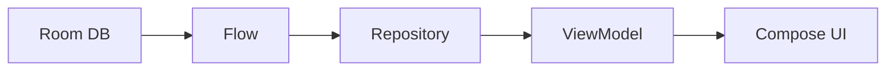

# Flow는 왜 Android와 잘 맞나?

Android UI는 상태가 계속 바뀝니다.

* DB 데이터가 바뀜
* 네트워크 결과가 도착함
* 검색어가 바뀜
* 로그인 상태가 바뀜
* 화면이 시작/중지됨

Flow는 이런 변화를 "콜백 지옥"이 아니라 하나의 파이프라인으로 표현합니다.

```mermaid
graph LR
    DB[Room DB] --> F[Flow]
    F --> Repo[Repository]
    Repo --> VM[ViewModel]
    VM --> UI[Compose UI]
```
