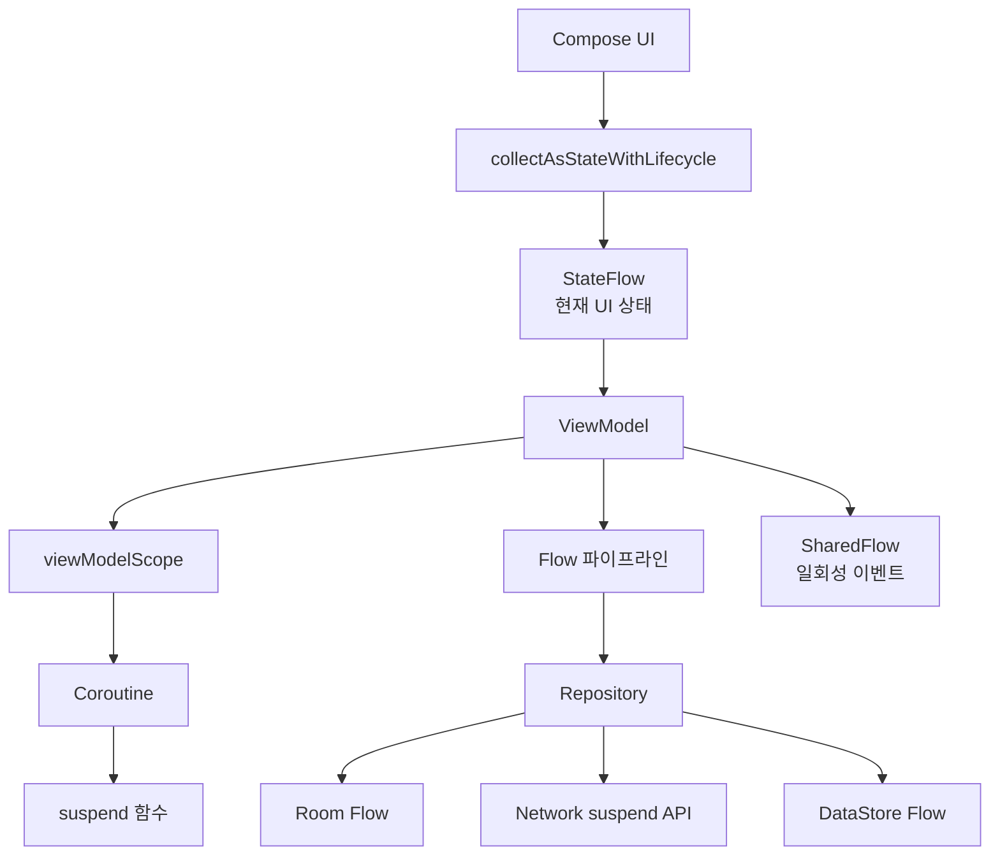

# 전체 그림

상위 노트: [kotlin-coroutines-flow-stateflow](01_inbox/mobile/android/02_app_framework/data/async-flow/kotlin-coroutines-flow-stateflow.md)

핵심은 다음과 같습니다.

* Coroutine은 오래 걸리는 작업을 안전하고 읽기 쉬운 방식으로 실행하는 Kotlin의 비동기 도구입니다.
* `suspend` 함수는 중간에 멈췄다가 다시 이어질 수 있는 비동기 함수입니다.
* Flow는 시간이 지나며 여러 값을 내보내는 비동기 스트림입니다.
* StateFlow는 항상 최신값을 가진 상태 전용 Flow입니다.
* ViewModel은 Repository의 Flow를 StateFlow로 바꿔 UI에 공개하는 역할을 자주 맡습니다.
* Compose는 `collectAsStateWithLifecycle()`로 StateFlow를 구독하고, 상태가 바뀌면 화면을 다시 그립니다.
* 상태는 StateFlow, 일회성 이벤트는 SharedFlow/Channel로 분리하는 것이 현대 Android의 기본 패턴입니다.

> [!NOTE]
> 4대 컴포넌트와 현대 아키텍처에서 Flow와 WorkManager가 어디에
>
배치되는지는 [android-modern-architecture-components](01_inbox/mobile/android/02_app_framework/architecture/jetpack-architecture/android-modern-architecture-components.md)
> 를 참조하세요.
> ViewModel의 화면 상태 소유, user action 처리, Reducer 도입
> 기준은 [viewmodel-ui-state-reducer](01_inbox/mobile/android/02_app_framework/architecture/jetpack-architecture/viewmodel-ui-state-reducer.md)를 참조하세요.
> Compose에서 `collectAsStateWithLifecycle`, `LaunchedEffect`, `remember`, entry-scoped ViewModel을 수명
> 기준으로 고르는 방법은 [jetpack-compose-state-lifetime-api-selection](01_inbox/mobile/android/02_app_framework/jetpack-compose/state-and-lifecycle/jetpack-compose-state-lifetime-api-selection.md)를 참조하세요.
> Compose Navigation의 화면 전환
>
구조는 [jetpack-navigation-3-guide](01_inbox/mobile/android/02_app_framework/navigation/navigation3/jetpack-navigation-3-guide.md)
> 를 참조하세요.
