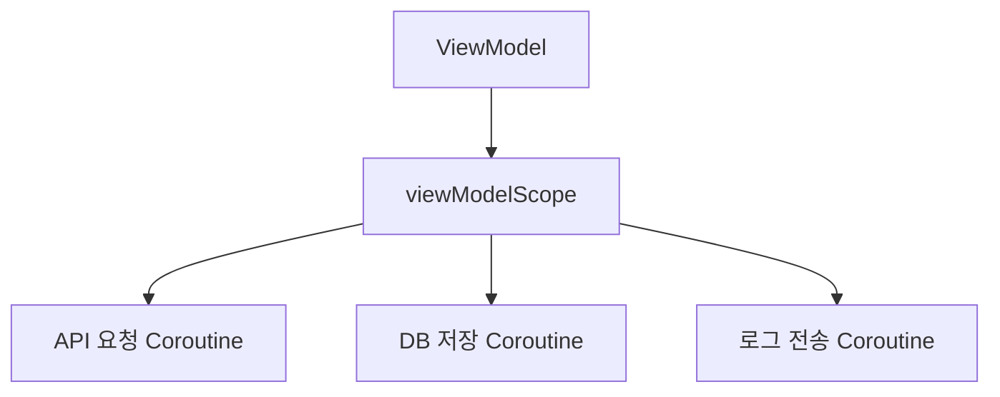

# Structured Concurrency: 부모가 자식을 책임지는 패턴

상위 노트: [kotlin-coroutines-flow-stateflow](01_inbox/mobile/android/02_app_framework/data/async-flow/kotlin-coroutines-flow-stateflow.md)

Coroutine에서 가장 중요한 설계 원칙은 **Structured Concurrency(구조화된 동시성)**입니다.

뜻은 간단합니다.

> Coroutine은 반드시 어떤 Scope 안에서 시작되고, 부모 Scope가 끝나면 자식 Coroutine도 함께 끝나야 한다.



ViewModel이 사라지면 `viewModelScope`가 취소되고, 그 안의 작업도 같이 취소됩니다.

이 원칙 덕분에 아래 문제를 줄일 수 있습니다.

* 화면이 사라졌는데 네트워크 응답이 와서 죽은 UI를 갱신하는 문제
* Activity가 재생성될 때 이전 작업이 계속 살아있는 문제
* 백그라운드 작업이 어디서 시작됐는지 추적하기 어려운 문제

### 3-1. `GlobalScope`를 피해야 하는 이유

```kotlin
// 나쁜 예
GlobalScope.launch {
    repository.refreshBenefits()
}
```

`GlobalScope`는 앱 전체 수명에 가까운 Scope입니다. 누가 취소해야 하는지, 어느 화면에 소속된 작업인지가 흐려집니다.

현대 Android에서는 거의 항상 아래 중 하나를 사용합니다.

* 화면 상태 작업 → `viewModelScope`
* Activity/Fragment 생명주기 작업 → `lifecycleScope`
* Compose UI 이벤트 작업 → `rememberCoroutineScope()`
* 앱이 꺼져도 필요한 작업 → `WorkManager`

### 3-2. `launch` vs `async`

| 함수       | 용도                | 반환            |
|:---------|:------------------|:--------------|
| `launch` | 결과값이 필요 없는 작업 시작  | `Job`         |
| `async`  | 결과값이 필요한 병렬 작업 시작 | `Deferred<T>` |

```kotlin
viewModelScope.launch {
    val userDeferred = async { userRepository.fetchUser() }
    val couponDeferred = async { couponRepository.fetchCoupons() }

    val user = userDeferred.await()
    val coupons = couponDeferred.await()

    _uiState.value = HomeUiState.Ready(user, coupons)
}
```

`async`는 병렬 API 호출처럼 결과값을 나중에 합쳐야 할 때 사용합니다. 단순히 작업을 시작하고 끝이면 `launch`가 맞습니다.

---
