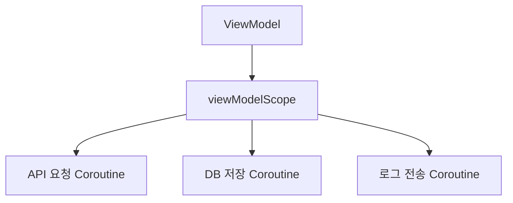
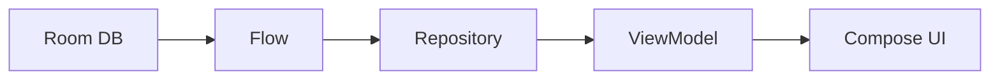
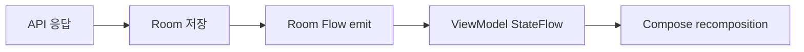
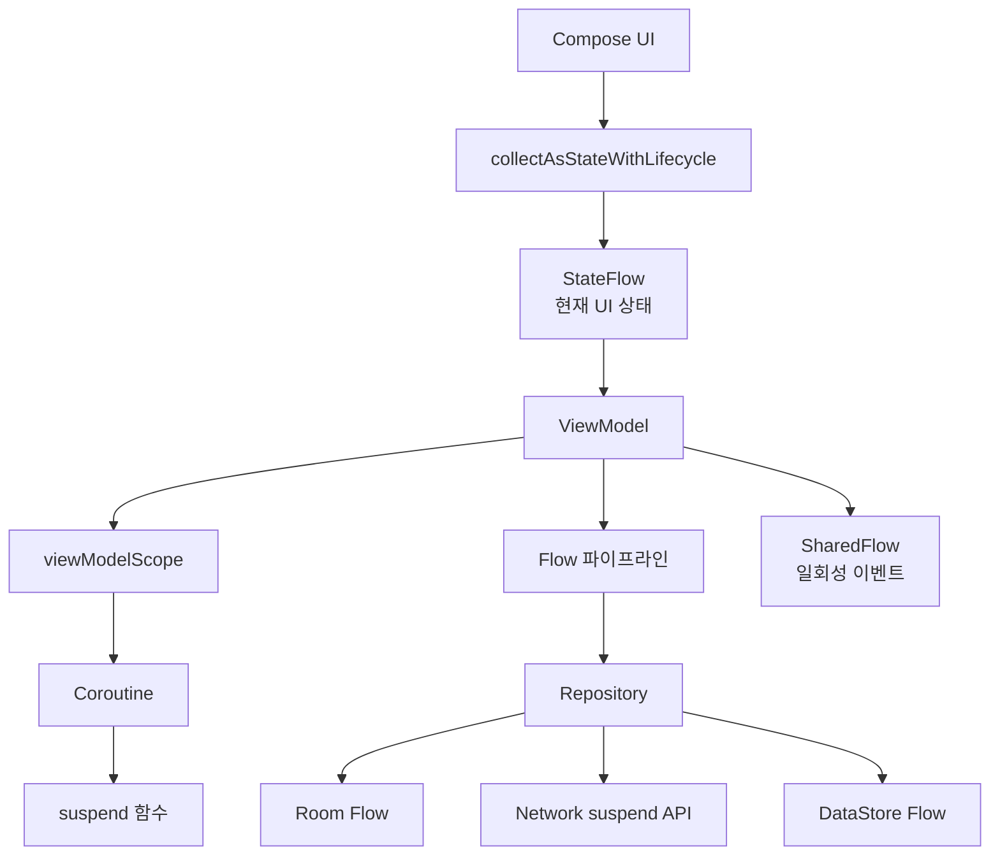

# Kotlin Coroutine & Flow/StateFlow 완전 가이드

이 문서는 현대 Android 개발에서 거의 모든 비동기 처리의 기반이 되는 **Kotlin Coroutine**, **Flow**, **StateFlow**를 바닥부터
설명합니다. "이게 뭔데?", "실제로는 어디에 쓰는데?", "어떤 패턴으로 설계해야 하는데?"라는 질문에 답하는 것을 목표로 합니다.

---

## 1. 왜 Coroutine, Flow, StateFlow가 필요해졌나?

안드로이드 앱은 대부분 기다림의 연속입니다.

* 서버 API 응답 기다리기
* 로컬 DB 조회 기다리기
* 파일 읽기/쓰기 기다리기
* 위치 정보 업데이트 기다리기
* 유저 입력 기다리기
* 화면 생명주기 변화 기다리기

이 기다림을 메인 스레드에서 그대로 처리하면 앱이 멈춥니다. 안드로이드에서 메인 스레드는 유저 터치, 화면 렌더링, 애니메이션을 처리하는 가장 중요한 통로이기 때문입니다.

```kotlin
// 나쁜 예: 메인 스레드에서 오래 걸리는 작업을 직접 실행
val products = api.fetchProducts()
productTextView.text = products.first().name
```

그래서 오래 걸리는 작업은 메인 스레드 밖에서 처리하고, 결과만 다시 UI로 가져와야 합니다.

과거에는 이를 위해 `Thread`, `Handler`, `AsyncTask`, RxJava 같은 도구를 많이 사용했습니다. 현대 Kotlin/Android에서는 이 역할을 *
*Coroutine + Flow**가 맡습니다.

| 문제                       | 현대 해법                            |
|:-------------------------|:---------------------------------|
| 오래 걸리는 작업을 메인 스레드 밖에서 실행 | Coroutine                        |
| 비동기 작업을 순차 코드처럼 읽기 쉽게 작성 | `suspend` 함수                     |
| 시간이 지나며 여러 번 바뀌는 데이터 관찰  | Flow                             |
| 화면의 현재 상태를 항상 최신값으로 보관   | StateFlow                        |
| 앱 내부 상태/이벤트를 여러 곳으로 전달   | StateFlow / SharedFlow / Channel |

---

## 2. Coroutine: 가벼운 비동기 작업 단위

### 2-1. Coroutine이란?

Coroutine은 Kotlin이 제공하는 **가벼운 비동기 실행 단위**입니다.

스레드와 비슷하게 "어떤 일을 따로 실행한다"는 느낌은 있지만, 스레드 자체는 아닙니다.

| 구분     | Thread             | Coroutine                  |
|:-------|:-------------------|:---------------------------|
| 정체     | OS가 관리하는 무거운 실행 단위 | Kotlin 런타임이 관리하는 가벼운 작업 단위 |
| 비용     | 생성/전환 비용이 큼        | 매우 많이 만들어도 상대적으로 가벼움       |
| 중단     | 스레드가 실제로 막힘        | 중단 지점에서 쉬었다가 나중에 재개        |
| 코드 스타일 | 콜백/동기화 코드가 많아지기 쉬움 | 순차 코드처럼 읽히는 비동기 코드         |

쉽게 말하면 Coroutine은 **기다릴 때 자리를 비켜주는 작업 단위**입니다.

```kotlin
viewModelScope.launch {
    val user = userRepository.fetchUser()
    val benefits = benefitRepository.fetchBenefits(user.id)
    _uiState.value = BenefitUiState.Success(benefits)
}
```

위 코드는 위에서 아래로 읽힙니다. 하지만 `fetchUser()`나 `fetchBenefits()`가 오래 걸릴 때 메인 스레드를 붙잡고 멈추는 것이 아니라, Coroutine이
잠시 중단되었다가 결과가 오면 다시 이어서 실행됩니다.

### 2-2. `suspend` 함수란?

`suspend`는 "이 함수는 중간에 멈췄다가 다시 이어질 수 있다"는 표시입니다.

```kotlin
suspend fun fetchBenefits(): List<Benefit> {
    return api.getBenefits()
}
```

`suspend` 함수는 일반 함수처럼 값을 반환하지만, 내부에서 네트워크, DB, 파일 작업처럼 오래 걸리는 일을 안전하게 기다릴 수 있습니다.

> [!IMPORTANT]
> `suspend`는 "무조건 백그라운드에서 실행된다"는 뜻이 아닙니다. 단지 **중단 가능하다**는 뜻입니다. 실제로 어느 스레드에서 실행할지는 Coroutine
> Dispatcher가 결정합니다.

### 2-3. CoroutineScope: Coroutine의 작업장

Coroutine은 아무 데서나 막 띄우면 안 됩니다. 어디에 소속된 작업인지가 중요합니다.

이 소속 범위를 `CoroutineScope`라고 합니다.

| Scope                      | 수명                               | 대표 사용처                        |
|:---------------------------|:---------------------------------|:------------------------------|
| `viewModelScope`           | ViewModel이 사라질 때까지               | 화면 상태 로딩, 유저 액션 처리            |
| `lifecycleScope`           | Activity/Fragment Lifecycle까지    | 생명주기와 직접 연결된 작업               |
| `rememberCoroutineScope()` | Composable이 Composition에 남아있는 동안 | Snackbar, Drawer 열기 같은 UI 이벤트 |
| WorkManager 내부 Scope       | Worker 실행 중                      | 앱이 꺼져도 보장되어야 하는 백그라운드 작업      |

가장 많이 쓰는 것은 `viewModelScope`입니다.

```kotlin
class BenefitViewModel(
    private val repository: BenefitRepository,
) : ViewModel() {
    fun refresh() {
        viewModelScope.launch {
            repository.refreshBenefits()
        }
    }
}
```

ViewModel이 제거되면 `viewModelScope` 안에서 실행 중인 Coroutine도 함께 취소됩니다.

### 2-4. Job: 실행 중인 Coroutine의 손잡이

`launch`를 호출하면 `Job`이 반환됩니다.

`Job`은 실행 중인 Coroutine을 추적하고 취소할 수 있는 손잡이입니다.

```kotlin
private var searchJob: Job? = null

fun search(keyword: String) {
    searchJob?.cancel()
    searchJob = viewModelScope.launch {
        val result = repository.search(keyword)
        _uiState.value = SearchUiState.Success(result)
    }
}
```

검색어가 바뀔 때 이전 검색을 취소하고 최신 검색만 유지하는 패턴입니다. 다만 Flow를 쓰면 이 패턴은 보통 `debounce` + `flatMapLatest`로 더 깔끔하게
표현할 수 있습니다.

### 2-5. Dispatcher: 어떤 스레드에서 실행할지 정하는 관리자

Coroutine은 Dispatcher를 통해 실제 실행 스레드를 고릅니다.

| Dispatcher               | 용도                      |
|:-------------------------|:------------------------|
| `Dispatchers.Main`       | UI 상태 변경, Compose 상태 갱신 |
| `Dispatchers.IO`         | 네트워크, 파일, DB I/O        |
| `Dispatchers.Default`    | CPU 계산, 정렬, JSON 대량 파싱  |
| `StandardTestDispatcher` | Coroutine 테스트           |

```kotlin
suspend fun loadLargeFile(): String {
    return withContext(Dispatchers.IO) {
        file.readText()
    }
}
```

`withContext`는 Coroutine 안에서 실행 환경을 잠시 바꾸는 함수입니다.

> [!TIP]
> Retrofit, Room처럼 Coroutine을 공식 지원하는 라이브러리는 내부에서 적절한 스레드 처리를 해주는 경우가 많습니다. 그래도 파일 I/O나 직접 만든 블로킹
> 코드는 `Dispatchers.IO`로 보내는 습관이 안전합니다.

---

## 3. Structured Concurrency: 부모가 자식을 책임지는 패턴

Coroutine에서 가장 중요한 설계 원칙은 **Structured Concurrency(구조화된 동시성)**입니다.

뜻은 간단합니다.

> Coroutine은 반드시 어떤 Scope 안에서 시작되고, 부모 Scope가 끝나면 자식 Coroutine도 함께 끝나야 한다.



ViewModel이 사라지면 `viewModelScope`가 취소되고, 그 안의 작업도 같이 취소됩니다.

이 원칙 덕분에 아래 문제를 줄일 수 있습니다.

* 화면이 사라졌는데 네트워크 응답이 와서 죽은 UI를 갱신하는 문제
* Activity가 재생성될 때 이전 작업이 계속 살아있는 문제
* 백그라운드 작업이 어디서 시작됐는지 추적하기 어려운 문제

### 3-1. `GlobalScope`를 피해야 하는 이유

```kotlin
// 나쁜 예
GlobalScope.launch {
    repository.refreshBenefits()
}
```

`GlobalScope`는 앱 전체 수명에 가까운 Scope입니다. 누가 취소해야 하는지, 어느 화면에 소속된 작업인지가 흐려집니다.

현대 Android에서는 거의 항상 아래 중 하나를 사용합니다.

* 화면 상태 작업 → `viewModelScope`
* Activity/Fragment 생명주기 작업 → `lifecycleScope`
* Compose UI 이벤트 작업 → `rememberCoroutineScope()`
* 앱이 꺼져도 필요한 작업 → `WorkManager`

### 3-2. `launch` vs `async`

| 함수       | 용도                | 반환            |
|:---------|:------------------|:--------------|
| `launch` | 결과값이 필요 없는 작업 시작  | `Job`         |
| `async`  | 결과값이 필요한 병렬 작업 시작 | `Deferred<T>` |

```kotlin
viewModelScope.launch {
    val userDeferred = async { userRepository.fetchUser() }
    val couponDeferred = async { couponRepository.fetchCoupons() }

    val user = userDeferred.await()
    val coupons = couponDeferred.await()

    _uiState.value = HomeUiState.Ready(user, coupons)
}
```

`async`는 병렬 API 호출처럼 결과값을 나중에 합쳐야 할 때 사용합니다. 단순히 작업을 시작하고 끝이면 `launch`가 맞습니다.

---

## 4. Flow: 시간이 지나며 여러 값을 내보내는 비동기 스트림

### 4-1. Flow란?

`Flow`는 **한 프로세스 안에서 시간에 따라 여러 값이 흘러오는 비동기 데이터 스트림**입니다.

일반 `suspend` 함수는 값을 한 번 반환합니다.

```kotlin
suspend fun fetchUser(): User
```

반면 `Flow`는 값을 0번, 1번, 여러 번 계속 내보낼 수 있습니다.

```kotlin
fun observeBenefits(): Flow<List<Benefit>>
```

쉽게 말하면:

| 형태                                           | 의미                |
|:---------------------------------------------|:------------------|
| `suspend fun getUser(): User`                | 유저를 한 번 가져온다      |
| `fun observeUser(): Flow<User>`              | 유저 정보 변화를 계속 관찰한다 |
| `suspend fun fetchProducts(): List<Product>` | 상품 목록을 한 번 요청한다   |
| `fun observeProducts(): Flow<List<Product>>` | 상품 목록 변화를 계속 받는다  |

> [!IMPORTANT]
> Kotlin Flow는 **앱 내부의 비동기 상태/데이터 흐름**을 표현하는 도구입니다. 다른 앱으로 데이터를 공개하거나 전달하는 Android OS 컴포넌트가 아닙니다. 앱
> 밖으로 데이터를 열어야 하면 `ContentProvider`, `FileProvider`, `Intent`, App Link, App Functions, Binder/AIDL
> 같은
> 플랫폼 경계를 사용해야 합니다.

### 4-2. Flow는 왜 Android와 잘 맞나?

Android UI는 상태가 계속 바뀝니다.

* DB 데이터가 바뀜
* 네트워크 결과가 도착함
* 검색어가 바뀜
* 로그인 상태가 바뀜
* 화면이 시작/중지됨

Flow는 이런 변화를 "콜백 지옥"이 아니라 하나의 파이프라인으로 표현합니다.



### 4-3. Cold Flow: 누가 구독해야 흐른다

일반적인 `Flow`는 **Cold Stream**입니다.

뜻은 "누군가 `collect`하기 전까지 아무 일도 하지 않는다"입니다.

```kotlin
val flow = flow {
    emit(1)
    emit(2)
    emit(3)
}

flow.collect { value ->
    println(value)
}
```

`flow { ... }` 블록은 선언만으로 실행되지 않습니다. `collect`를 해야 실행됩니다.

> [!NOTE]
> Flow는 수도관 설계도에 가깝습니다. 물이 실제로 흐르는 시점은 누군가 수도꼭지를 여는 `collect` 순간입니다.

### 4-4. Flow 기본 연산자

Flow는 값을 그대로 받는 것보다 중간에 가공해서 쓰는 경우가 많습니다.

| 연산자                    | 역할                           |
|:-----------------------|:-----------------------------|
| `map`                  | 값 변환                         |
| `filter`               | 조건에 맞는 값만 통과                 |
| `combine`              | 여러 Flow의 최신값을 합침             |
| `debounce`             | 짧은 시간 동안 잦은 입력을 모아서 처리       |
| `distinctUntilChanged` | 같은 값이 반복되면 무시                |
| `flatMapLatest`        | 새 값이 오면 이전 작업 취소 후 최신 작업만 유지 |
| `catch`                | 에러 처리                        |
| `onStart`              | 시작 시 로딩 상태 방출                |

```kotlin
val uiState: Flow<SearchUiState> =
    searchKeyword
        .debounce(300)
        .distinctUntilChanged()
        .flatMapLatest { keyword ->
            repository.searchProducts(keyword)
        }
        .map { products ->
            SearchUiState.Success(products)
        }
        .onStart {
            emit(SearchUiState.Loading)
        }
        .catch {
            emit(SearchUiState.Error)
        }
```

이 패턴은 검색 화면에서 매우 자주 씁니다.

* 유저가 타이핑할 때마다 바로 API 호출하지 않음
* 300ms 동안 입력이 멈추면 검색
* 새 검색어가 들어오면 이전 검색 취소
* 결과를 UI 상태로 변환
* 로딩/에러 상태까지 한 파이프라인에서 처리

### 4-5. Repository는 Flow를 노출하고, ViewModel은 StateFlow로 바꾼다

현대 Android에서 가장 흔한 패턴입니다.

```kotlin
class BenefitRepository(
    private val dao: BenefitDao,
    private val api: BenefitApi,
) {
    fun observeBenefits(): Flow<List<Benefit>> {
        return dao.observeBenefits()
    }

    suspend fun refreshBenefits() {
        val remoteBenefits = api.fetchBenefits()
        dao.replaceAll(remoteBenefits)
    }
}
```

Repository는 데이터 출처를 숨깁니다. UI 입장에서는 이 데이터가 DB에서 오는지, 네트워크에서 오는지, 캐시에서 오는지 몰라도 됩니다.

ViewModel은 이 Flow를 화면 상태로 바꿉니다.

```kotlin
class BenefitViewModel(
    repository: BenefitRepository,
) : ViewModel() {
    val uiState: StateFlow<BenefitUiState> =
        repository.observeBenefits()
            .map { benefits ->
                BenefitUiState.Ready(benefits)
            }
            .stateIn(
                scope = viewModelScope,
                started = SharingStarted.WhileSubscribed(5_000),
                initialValue = BenefitUiState.Loading,
            )
}
```

---

## 5. StateFlow: 현재 상태를 들고 있는 Flow

### 5-1. StateFlow란?

`StateFlow`는 **항상 현재값을 하나 가지고 있는 Flow**입니다.

일반 Flow가 "흘러오는 데이터"라면, StateFlow는 "현재 상태가 적힌 전광판"에 가깝습니다.

| 구분       | Flow                      | StateFlow     |
|:---------|:--------------------------|:--------------|
| 현재값 보관   | 없음                        | 있음            |
| 초기값 필요   | 필요 없음                     | 반드시 필요        |
| 새 구독자 동작 | collect 시점부터 받음           | 즉시 최신값 1개를 받음 |
| 대표 용도    | DB 관찰, 이벤트 스트림, 비동기 파이프라인 | 화면 UI 상태      |
| 성격       | 보통 Cold                   | Hot           |

`StateFlow`는 UI 상태에 특히 잘 맞습니다. 화면은 언제든 "지금 무엇을 그려야 하는지"를 알아야 하기 때문입니다.

```kotlin
data class ProfileUiState(
    val isLoading: Boolean = false,
    val userName: String = "",
    val errorMessage: String? = null,
)
```

```kotlin
class ProfileViewModel(
    private val repository: ProfileRepository,
) : ViewModel() {
    private val _uiState = MutableStateFlow(ProfileUiState(isLoading = true))
    val uiState: StateFlow<ProfileUiState> = _uiState.asStateFlow()

    fun load() {
        viewModelScope.launch {
            runCatching {
                repository.fetchProfile()
            }.onSuccess { profile ->
                _uiState.value = ProfileUiState(userName = profile.name)
            }.onFailure {
                _uiState.value = ProfileUiState(errorMessage = "프로필을 불러오지 못했습니다.")
            }
        }
    }
}
```

### 5-2. `MutableStateFlow`는 ViewModel 안에 숨긴다

외부에서 상태를 마음대로 바꾸면 안 됩니다. 그래서 보통 아래 패턴을 사용합니다.

```kotlin
private val _uiState = MutableStateFlow(HomeUiState())
val uiState: StateFlow<HomeUiState> = _uiState.asStateFlow()
```

| 변수         | 접근 범위                | 역할        |
|:-----------|:---------------------|:----------|
| `_uiState` | ViewModel 내부 private | 상태 변경 가능  |
| `uiState`  | 외부 공개                | 읽기/구독만 가능 |

이 패턴은 "상태의 소유자는 ViewModel이고, UI는 상태를 읽기만 한다"는 구조를 강제합니다.

ViewModel이 어떤 책임을 맡고, 상태 계산이 커졌을 때 Reducer로 어떻게
분리할지는 [[viewmodel-ui-state-reducer|viewmodel_ui_state_reducer_guide.md]]를 참조하세요. 이 문서는
Flow/StateFlow 자체의 의미와 사용 패턴에 집중합니다.

### 5-3. Compose에서 StateFlow 구독하기

Compose에서는 `collectAsStateWithLifecycle()`을 사용해 StateFlow를 구독합니다.

```kotlin
@Composable
fun ProfileRoute(
    viewModel: ProfileViewModel = viewModel(),
) {
    val uiState by viewModel.uiState.collectAsStateWithLifecycle()

    ProfileScreen(
        uiState = uiState,
        onRetryClick = viewModel::load,
    )
}
```

`collectAsStateWithLifecycle()`은 화면 생명주기를 고려해, 화면이 보이는 동안에만 안전하게 Flow를 수집합니다.

> [!IMPORTANT]
> Compose에서 Flow를 직접 `collect`하려고 `LaunchedEffect`를 남발하지 마세요. 화면에 그릴 상태라면 대부분
`collectAsStateWithLifecycle()`이 맞습니다.

### 5-4. `stateIn`: Flow를 StateFlow로 바꾸는 표준 패턴

Repository에서 받은 Flow를 ViewModel에서 StateFlow로 바꿀 때 `stateIn`을 사용합니다.

```kotlin
val uiState: StateFlow<HomeUiState> =
    repository.observeHome()
        .map { home ->
            HomeUiState.Ready(home)
        }
        .stateIn(
            scope = viewModelScope,
            started = SharingStarted.WhileSubscribed(5_000),
            initialValue = HomeUiState.Loading,
        )
```

각 파라미터의 의미는 다음과 같습니다.

| 파라미터           | 의미                             |
|:---------------|:-------------------------------|
| `scope`        | StateFlow가 살아있을 CoroutineScope |
| `started`      | 언제 upstream Flow를 수집할지         |
| `initialValue` | 첫 화면에 보여줄 초기 상태                |

`SharingStarted.WhileSubscribed(5_000)`은 Android ViewModel에서 자주 쓰는 설정입니다.

뜻은:

* UI가 구독 중이면 upstream Flow를 수집한다.
* UI가 잠깐 사라져도 5초 동안은 수집을 유지한다.
* 화면 회전처럼 짧은 재구성에서 불필요한 재시작을 줄인다.

---

## 6. SharedFlow와 Channel: 상태가 아니라 이벤트를 다루는 도구

### 6-1. 상태와 이벤트는 다르다

UI에서 가장 많이 헷갈리는 부분입니다.

| 구분         | 예시                                   | 적합한 도구               |
|:-----------|:-------------------------------------|:---------------------|
| 상태(State)  | 로딩 중, 목록 데이터, 선택된 탭, 에러 문구           | StateFlow            |
| 이벤트(Event) | Snackbar 한 번 보여주기, 뒤로 가기, 토스트, 네비게이션 | SharedFlow / Channel |

상태는 "지금 화면이 무엇을 그려야 하는가"입니다. 이벤트는 "지금 한 번 발생하고 사라지는 신호"입니다.

### 6-2. Snackbar 이벤트 예시

```kotlin
sealed interface ProfileEvent {
    data class ShowSnackbar(val message: String) : ProfileEvent
}

class ProfileViewModel(
    private val repository: ProfileRepository,
) : ViewModel() {
    private val _events = MutableSharedFlow<ProfileEvent>()
    val events: SharedFlow<ProfileEvent> = _events.asSharedFlow()

    fun save() {
        viewModelScope.launch {
            runCatching {
                repository.saveProfile()
            }.onSuccess {
                _events.emit(ProfileEvent.ShowSnackbar("저장했습니다."))
            }.onFailure {
                _events.emit(ProfileEvent.ShowSnackbar("저장에 실패했습니다."))
            }
        }
    }
}
```

```kotlin
@Composable
fun ProfileRoute(
    viewModel: ProfileViewModel = viewModel(),
    snackbarHostState: SnackbarHostState = remember { SnackbarHostState() },
) {
    LaunchedEffect(viewModel) {
        viewModel.events.collect { event ->
            when (event) {
                is ProfileEvent.ShowSnackbar -> {
                    snackbarHostState.showSnackbar(event.message)
                }
            }
        }
    }

    val uiState by viewModel.uiState.collectAsStateWithLifecycle()
    ProfileScreen(uiState = uiState)
}
```

화면에 그릴 상태는 `collectAsStateWithLifecycle()`, 한 번 처리할 이벤트는 `LaunchedEffect`에서 `collect`하는 식으로 나눕니다.

> [!TIP]
> "새 구독자가 들어왔을 때 이전 값을 다시 받아야 하는가?"라고 물어보면 상태와 이벤트를 구분하기 쉽습니다. 다시 받아야 하면 StateFlow, 다시 받으면 안 되면
> SharedFlow/Channel입니다.

---

## 7. Android에서 자주 쓰는 실전 패턴

### 7-1. 화면 상태 패턴: UiState sealed interface

로딩/성공/에러 상태가 분명한 화면에서는 `sealed interface`를 자주 씁니다.

```kotlin
sealed interface BenefitUiState {
    data object Loading : BenefitUiState
    data class Ready(val benefits: List<Benefit>) : BenefitUiState
    data class Error(val message: String) : BenefitUiState
}
```

```kotlin
val uiState: StateFlow<BenefitUiState> =
    repository.observeBenefits()
        .map { benefits ->
            val state: BenefitUiState = BenefitUiState.Ready(benefits)
            state
        }
        .onStart {
            emit(BenefitUiState.Loading)
        }
        .catch {
            emit(BenefitUiState.Error("혜택 목록을 불러오지 못했습니다."))
        }
        .stateIn(
            scope = viewModelScope,
            started = SharingStarted.WhileSubscribed(5000),
            initialValue = BenefitUiState.Loading,
        )
```

### 7-2. 예외 처리 가이드: runCatching vs try-catch

Android 앱 개발 시 예외(Exception) 처리 도구로 `runCatching` 과 `try-catch` 를 많이 사용합니다.두 방식은 처리 목적과 코루틴 취소 메커니즘
전파에 중요한 차이가 있습니다.

| 구분         | `try-catch`                   | `runCatching`                                         |
|:-----------|:------------------------------|:------------------------------------------------------|
| **스타일**    | 명령형 (Imperative)              | 함수형 / 표현식 (Functional)                                |
| **결과 반환**  | 블록 반환값 또는 직접 흐름 제어            | `Result<T>` (`Success` 또는 `Failure`)                  |
| **체이닝**    | 불가 (`try` 블록 내부 처리)           | 가능 (`map`, `recover`, `onSuccess`, `onFailure`)       |
| **코루틴 취소** | `CancellationException` 정상 전파 | ⚠️ `CancellationException`까지 잡아서 `Failure`로 변환할 위험 있음 |

#### 1) Repository / Data 계층: `runCatching` 권장

Repository나 DataSource에서 파일 IO, JSON 파싱 결과를 `Result<T>`로 감싸 반환할 때 적합합니다.

```kotlin
// Data Layer (RepositoryImpl)
override suspend fun getOpenSourceLicenses(): Result<List<OpenSourceArtifact>> =
    withContext(Dispatchers.IO) {
        runCatching {
            val jsonString =
                assetManager.open("licenses/artifacts.json").bufferedReader().use { it.readText() }
            LicenseJsonParser.parseJson(jsonString)
        }.map { dtos ->
            dtos.map { it.toDomain() }
        }
    }
```

#### 2) 특정 예외 조준 및 Coroutine 취소 보장: `try-catch` 권장

부모-자식 코루틴 간 취소 신호(`CancellationException`)를 정상적으로 위로 전달해야 하거나, 특정 예외(`IOException` 등)만 핀포인트로 잡고 싶을
때는 `try-catch`를 사용해야 합니다.

```kotlin
suspend fun syncData() {
    try {
        apiService.uploadLogs()
    } catch (e: IOException) {
        // 네트워크/IO 예외만 복구 처리
        logger.e(e) { "로그 업로드 실패" }
    }
    // CancellationException이나 RuntimeException은 그대로 상위 코루틴으로 전파됨
}
```

Compose는 상태 타입에 따라 화면을 분기합니다.

```kotlin
@Composable
fun BenefitScreen(uiState: BenefitUiState) {
    when (uiState) {
        BenefitUiState.Loading -> LoadingScreen()
        is BenefitUiState.Ready -> BenefitList(uiState.benefits)
        is BenefitUiState.Error -> ErrorScreen(uiState.message)
    }
}
```

### 7-2. 검색 패턴: query StateFlow + flatMapLatest

```kotlin
class SearchViewModel(
    private val repository: ProductRepository,
) : ViewModel() {
    private val query = MutableStateFlow("")

    val uiState: StateFlow<SearchUiState> =
        query
            .debounce(300)
            .distinctUntilChanged()
            .flatMapLatest { keyword ->
                if (keyword.isBlank()) {
                    flowOf(emptyList())
                } else {
                    repository.searchProducts(keyword)
                }
            }
            .map { products ->
                SearchUiState.Ready(products)
            }
            .stateIn(
                scope = viewModelScope,
                started = SharingStarted.WhileSubscribed(5_000),
                initialValue = SearchUiState.Ready(emptyList()),
            )

    fun onQueryChange(value: String) {
        query.value = value
    }
}
```

`flatMapLatest`가 핵심입니다. 새 검색어가 들어오면 이전 검색 Flow를 취소하고 최신 검색만 유지합니다.

### 7-3. 여러 데이터 합치기: combine

홈 화면은 여러 출처의 데이터를 합쳐서 만드는 경우가 많습니다.

```kotlin
val uiState: StateFlow<HomeUiState> =
    combine(
        userRepository.observeUser(),
        benefitRepository.observeBenefits(),
        notificationRepository.observeUnreadCount(),
    ) { user, benefits, unreadCount ->
        HomeUiState(
            userName = user.name,
            benefits = benefits,
            unreadCount = unreadCount,
        )
    }.stateIn(
        scope = viewModelScope,
        started = SharingStarted.WhileSubscribed(5_000),
        initialValue = HomeUiState(),
    )
```

`combine`은 각 Flow의 최신값을 모아 하나의 UI 상태로 만듭니다.

### 7-4. Room + Flow 패턴

Room은 Flow와 매우 잘 맞습니다.

```kotlin
@Dao
interface BenefitDao {
    @Query("SELECT * FROM benefits ORDER BY createdAt DESC")
    fun observeBenefits(): Flow<List<BenefitEntity>>

    @Insert(onConflict = OnConflictStrategy.REPLACE)
    suspend fun insertAll(benefits: List<BenefitEntity>)
}
```

DB가 바뀌면 Room이 Flow에 새 값을 내보내고, ViewModel의 StateFlow가 갱신되고, Compose가 다시 그립니다.



### 7-5. 콜백 API를 Flow로 바꾸기: callbackFlow

위치, 센서, 네트워크 상태처럼 콜백 기반 API는 `callbackFlow`로 감싸면 Flow처럼 다룰 수 있습니다.

```kotlin
fun observeNetworkState(context: Context): Flow<NetworkState> = callbackFlow {
    val callback = object : ConnectivityManager.NetworkCallback() {
        override fun onAvailable(network: Network) {
            trySend(NetworkState.Available)
        }

        override fun onLost(network: Network) {
            trySend(NetworkState.Unavailable)
        }
    }

    val manager = context.getSystemService(ConnectivityManager::class.java)
    manager.registerDefaultNetworkCallback(callback)

    awaitClose {
        manager.unregisterNetworkCallback(callback)
    }
}
```

`awaitClose`는 Flow 수집이 취소될 때 콜백 등록을 해제하는 정리 지점입니다.

---

## 8. 자주 하는 실수

### 8-1. ViewModel에서 Flow를 만들고 아무도 collect하지 않음

```kotlin
// collect 또는 stateIn이 없으면 실행되지 않음
repository.observeBenefits()
    .map { benefits -> BenefitUiState.Ready(benefits) }
```

Flow는 대부분 Cold입니다. `collect`, `stateIn`, `shareIn` 같은 최종 동작이 있어야 실제로 흐릅니다.

### 8-2. UI 상태를 SharedFlow로 관리

```kotlin
// 화면 상태에는 부적합
private val _uiState = MutableSharedFlow<HomeUiState>()
```

화면 상태는 최신값이 항상 있어야 합니다. `StateFlow`를 쓰는 것이 맞습니다.

### 8-3. 일회성 이벤트를 StateFlow로 관리

```kotlin
// 화면 회전 후 Snackbar가 다시 뜰 수 있음
data class UiState(
    val snackbarMessage: String? = null,
)
```

이 방식은 상태 복원이나 재구독 시 이벤트가 다시 처리될 수 있습니다. Snackbar, Toast, Navigation은 `SharedFlow`나 `Channel`로 분리하는
편이 안전합니다.

### 8-4. Coroutine 취소를 고려하지 않음

Coroutine은 취소될 수 있습니다. 특히 화면이 사라지거나 새 검색어가 들어오면 이전 작업이 취소되는 것이 정상입니다.

긴 루프를 직접 돌린다면 취소 가능 지점을 고려해야 합니다.

```kotlin
while (isActive) {
    syncOnce()
    delay(60_000)
}
```

### 8-5. 무거운 작업을 Main Dispatcher에서 실행

```kotlin
// 대량 JSON 파싱이나 파일 작업을 Main에서 직접 실행하지 않기
viewModelScope.launch {
    val text = file.readText()
    _uiState.value = UiState(text)
}
```

```kotlin
// I/O 작업은 IO Dispatcher로 이동
viewModelScope.launch {
    val text = withContext(Dispatchers.IO) {
        file.readText()
    }
    _uiState.value = UiState(text)
}
```

---

## 9. 선택 기준 요약

| 하고 싶은 일                              | 도구                                  |
|:-------------------------------------|:------------------------------------|
| 네트워크 요청을 한 번 실행                      | `suspend` 함수 + Coroutine            |
| 버튼 클릭 후 저장 작업 실행                     | `viewModelScope.launch`             |
| 화면에 보여줄 최신 UI 상태 관리                  | `StateFlow`                         |
| DB 변경을 화면에 자동 반영                     | Room `Flow` + ViewModel `StateFlow` |
| 검색어 변경마다 최신 검색만 실행                   | `debounce` + `flatMapLatest`        |
| 여러 데이터 출처를 하나의 화면 상태로 합침             | `combine`                           |
| Snackbar/Toast/Navigation 같은 일회성 이벤트 | `SharedFlow` 또는 `Channel`           |
| 콜백 기반 시스템 API를 스트림으로 변환              | `callbackFlow`                      |
| 앱이 꺼져도 해야 하는 작업                      | `WorkManager` + `CoroutineWorker`   |

---

## 10. 전체 그림



핵심은 다음과 같습니다.

* Coroutine은 오래 걸리는 작업을 안전하고 읽기 쉬운 방식으로 실행하는 Kotlin의 비동기 도구입니다.
* `suspend` 함수는 중간에 멈췄다가 다시 이어질 수 있는 비동기 함수입니다.
* Flow는 시간이 지나며 여러 값을 내보내는 비동기 스트림입니다.
* StateFlow는 항상 최신값을 가진 상태 전용 Flow입니다.
* ViewModel은 Repository의 Flow를 StateFlow로 바꿔 UI에 공개하는 역할을 자주 맡습니다.
* Compose는 `collectAsStateWithLifecycle()`로 StateFlow를 구독하고, 상태가 바뀌면 화면을 다시 그립니다.
* 상태는 StateFlow, 일회성 이벤트는 SharedFlow/Channel로 분리하는 것이 현대 Android의 기본 패턴입니다.

> [!NOTE]
> 4대 컴포넌트와 현대 아키텍처에서 Flow와 WorkManager가 어디에
>
배치되는지는 [[android-modern-architecture-components|android_components_and_modern_architecture.md]]
> 를 참조하세요.
> ViewModel의 화면 상태 소유, user action 처리, Reducer 도입
> 기준은 [[viewmodel-ui-state-reducer|viewmodel_ui_state_reducer_guide.md]]를 참조하세요.
> Compose에서 `collectAsStateWithLifecycle`, `LaunchedEffect`, `remember`, entry-scoped ViewModel을 수명
> 기준으로 고르는 방법은 [[jetpack-compose-state-lifetime-api-selection|compose_state_lifetime_api_guide.md]]를 참조하세요.
> Compose Navigation의 화면 전환
>
구조는 [[jetpack-navigation-3-guide|navigation_guide.md]]
> 를 참조하세요.
