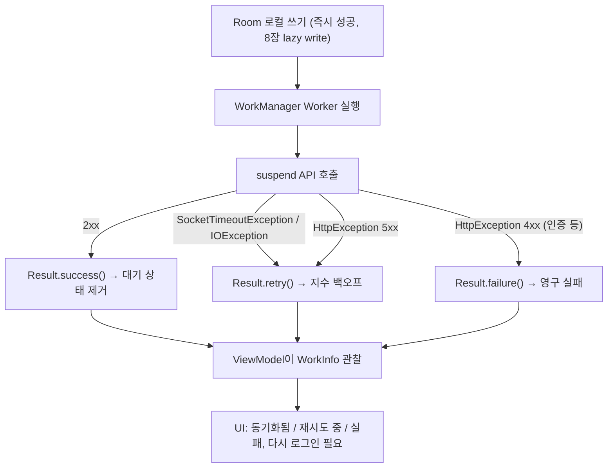

## Timeout·재시도 정책은 UI 에 노출할 실패 상태를 결정하고 offline-first 로컬 쓰기와 연결된다

배경 지식: [HTTP 프로토콜](../../../../../computer-science/networking/http-protocol.md)

네트워크 클라이언트 계층의 실패는 한 가지 종류가 아니다. `OkHttpClient` 의 `connectTimeout`/`readTimeout` 은 소켓 수준에서 "얼마나 기다릴지"를 정하고, HTTP 상태 코드는 서버가 요청을 거부했는지 성공했는지를 알려주며, `IOException` 은 서버에 도달조차 못했다는 뜻이다. 이 세 종류를 구분하지 않고 하나의 "실패"로 뭉뚱그리면, [Learning Spine 8장](../../../00_foundations/learning-spine/08-data-storage-network-and-offline-recovery.md)이 다루는 offline-first 모델에서 로컬 쓰기 이후 어떤 동기화 상태를 사용자에게 보여줄지 결정할 수 없다.

### 내부 동작 메커니즘

- `connectTimeout`/`readTimeout`/`writeTimeout` 은 단일 요청 안에서 소켓이 얼마나 응답을 기다릴지 정하는 클라이언트 레벨 설정이다. 이 timeout 은 "일시적인 네트워크 지연"과 "서버가 아예 응답하지 않음"을 구분하지 못하고 같은 `SocketTimeoutException` 으로 나타난다.
- 이 계층의 재시도(예: interceptor 안에서 실패 시 `chain.proceed()` 를 한 번 더 호출)는 하나의 suspend 호출 안에서, 짧은 시간에 끝나는 재시도다. 이는 [Learning Spine 8장](../../../00_foundations/learning-spine/08-data-storage-network-and-offline-recovery.md)이 다루는 `WorkManager` 의 지수 백오프 재시도와는 다른 층위다 — `WorkManager` 재시도는 화면이 사라지고 프로세스가 재시작돼도 영속적으로 남아 있는 "서버에 동기화를 알리는 작업" 자체의 재시도이고, 네트워크 클라이언트 계층의 재시도는 그 작업 하나가 실행되는 동안의 순간적인 재시도다.
- 8장의 lazy write 원칙("로컬에 먼저 쓰고, 서버 반영은 별도 작업으로 미룬다")에서 이 네트워크 계층이 담당하는 지점은 정확히 "서버 반영" 단계다. Room 쓰기는 이미 끝나 화면에 반영됐고, 이 계층은 그 이후 `WorkManager` worker 안에서 실행되는 suspend API 호출의 성공/실패를 분류해 `Result.success()`/`Result.retry()`/`Result.failure()` 로 변환하는 역할을 한다.
- 실패를 UI 에 노출하려면 예외를 그대로 던지지 말고 재시도 가능 여부로 분류해야 한다. 4xx(인증 실패, 잘못된 요청)는 대개 재시도해도 결과가 같으므로 영구 실패로, 5xx 와 `IOException`/timeout 은 일시적 실패로 재시도 대상이 되는 것이 일반적인 정책이다. 이 판단 기준은 서버 API 계약에 따라 달라질 수 있다.



### 코드 예시

```kotlin
sealed class SyncOutcome {
    data object Success : SyncOutcome()
    data class Retryable(val reason: String) : SyncOutcome()
    data class Fatal(val reason: String) : SyncOutcome()
}

suspend fun syncPendingClaim(api: BenefitApi, request: ClaimRequest): SyncOutcome {
    return try {
        api.claimBenefit(request.benefitId, request)
        SyncOutcome.Success
    } catch (e: SocketTimeoutException) {
        SyncOutcome.Retryable("timeout")
    } catch (e: IOException) {
        SyncOutcome.Retryable("no-connectivity")
    } catch (e: HttpException) {
        if (e.code() in 500..599) SyncOutcome.Retryable("server-${e.code()}")
        else SyncOutcome.Fatal("client-${e.code()}") // 401/403/422 등은 재시도해도 같은 결과
    }
}

class ClaimSyncWorker(
    context: Context,
    params: WorkerParameters,
    private val api: BenefitApi
) : CoroutineWorker(context, params) {
    override suspend fun doWork(): Result {
        return when (val outcome = syncPendingClaim(api, loadPendingClaim())) {
            SyncOutcome.Success -> Result.success()
            is SyncOutcome.Retryable -> Result.retry()
            is SyncOutcome.Fatal -> Result.failure(
                workDataOf("reason" to outcome.reason)
            )
        }
    }
}
```

### 관측 가능한 증거

- `SocketTimeoutException` 은 예외 클래스명 자체로 "timeout" 실패를 구분할 수 있다. `HttpException.code()` 로 4xx/5xx 를 나눈다.
- `adb shell dumpsys jobscheduler` 또는 `WorkManager.getWorkInfosForUniqueWorkLiveData()` 로 특정 동기화 작업이 `RUNNING`/`RETRYING`(내부적으로는 `ENQUEUED` 로 재큐잉)/`FAILED` 상태 중 어디에 있는지 확인한다. `FAILED` 상태로 멈춰 있다면 `Result.failure()` 를 반환한 영구 실패이지 재시도 대기가 아니라는 뜻이다.
- 화면에서 "동기화됨" 배지가 계속 "대기 중"으로 남아 있다면, 8장의 조사 절차대로 `WorkInfo.state` 와 `dumpsys connectivity`/`dumpsys netpolicy` 를 대조해 constraint 미충족인지 실제 API 실패인지 구분한다.

상위 지도: [네트워크 클라이언트 계층 계약](./networking.md)

관련 노트: [데이터, 저장소, 네트워크와 offline recovery](../../../00_foundations/learning-spine/08-data-storage-network-and-offline-recovery.md), [WorkManager는 지연 가능한 보장 작업의 기본 선택이다](../../../04_system_services/background-and-notifications/work-manager.md), [Retrofit 인터페이스는 API 계약을 선언하고 OkHttp가 실제 전송을 담당한다](retrofit-okhttp-boundaries.md)

공식 문서: [Build an offline-first app](https://developer.android.com/topic/architecture/data-layer/offline-first), [Persistent work with WorkManager](https://developer.android.com/topic/libraries/architecture/workmanager)

검증일: 2026-08-04. offline-first lazy write 와 WorkManager 재시도 원칙은 Learning Spine 8장이 이미 공식 문서로 검증한 내용을 그대로 인용했다(8장 검증일 2026-08-03 참조). 4xx/5xx 재시도 분류는 일반적인 관행이며 특정 서버 API 계약에 따라 달라질 수 있어 절대 규칙으로 서술하지 않았다.
