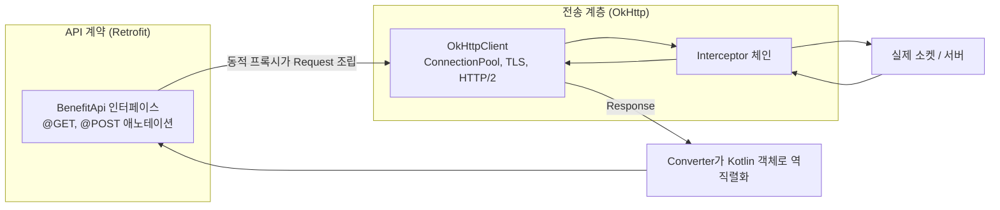

## Retrofit 인터페이스는 API 계약을 선언하고 OkHttp 가 실제 전송을 담당한다

Retrofit 은 스스로 소켓을 열거나 TLS 를 처리하지 않는다. Retrofit 은 "type-safe HTTP client for Android and Java"로 소개되지만, 실제 네트워크 전송은 항상 OkHttp 에 위임한다. Retrofit 이 하는 일은 애노테이션이 달린 인터페이스를 읽어 HTTP 요청을 어떻게 만들지 결정하는 것이고, 그 요청을 실제로 보내고 응답을 받는 것은 `OkHttpClient` 다. 이 분리 덕분에 API 계약(인터페이스)과 전송 정책(timeout, 캐시, 커넥션 풀, interceptor)을 독립적으로 다룰 수 있다.

### 내부 동작 메커니즘

- Retrofit 은 인터페이스 메서드의 `@GET`/`@POST`/`@Path`/`@Query`/`@Body` 같은 애노테이션을 리플렉션으로 읽어, 호출 시점에 `okhttp3.Request` 를 조립하는 동적 프록시(dynamic proxy)를 만들어 낸다. 이 프록시가 실제 인터페이스 구현체 역할을 한다.
- `Retrofit.Builder().client(okHttpClient)` 로 넘긴 `OkHttpClient` 가 실제 `Call` 을 생성하고 실행한다. Retrofit 자체는 커넥션 풀, TLS handshake, HTTP/2 멀티플렉싱 같은 전송 세부사항을 모른다 — 이는 전부 OkHttp 의 책임이다.
- `Converter.Factory`(예: `GsonConverterFactory`, `kotlinx-serialization` converter)는 요청 body 를 직렬화하고 응답 body 를 Kotlin 객체로 역직렬화하는 계층이다. 이 변환은 OkHttp 가 바이트를 주고받은 뒤, Retrofit 쪽에서 별도로 수행한다.
- 이 계층 분리 때문에 "API 계약이 바뀌었다"(엔드포인트 추가, 요청/응답 모델 변경)와 "전송 정책이 바뀌었다"(timeout 조정, 프록시 설정, 인증서 pinning)는 서로 다른 파일, 서로 다른 책임으로 나뉜다. 인터페이스만 보고 전송 세부사항을 알 수 없고, `OkHttpClient` 설정만 보고 어떤 API 를 호출하는지 알 수 없다.



### 코드 예시

```kotlin
interface BenefitApi {
    @GET("benefits/{userId}")
    suspend fun getBenefits(@Path("userId") userId: String): List<BenefitDto>

    @POST("benefits/{id}/claim")
    suspend fun claimBenefit(@Path("id") id: String, @Body request: ClaimRequest): ClaimResponse
}

val okHttpClient = OkHttpClient.Builder()
    .connectTimeout(10, TimeUnit.SECONDS)
    .readTimeout(15, TimeUnit.SECONDS)
    .build()

val retrofit = Retrofit.Builder()
    .baseUrl("https://api.example.com/")
    .client(okHttpClient) // 전송은 여기서만 책임진다
    .addConverterFactory(GsonConverterFactory.create())
    .build()

val benefitApi = retrofit.create(BenefitApi::class.java) // 동적 프록시 생성
```

### 관측 가능한 증거

- `HttpLoggingInterceptor(Level.BODY)` 를 `OkHttpClient` 에 등록하면 logcat 에 실제로 나간 요청/응답 헤더와 body 가 `-->`/`<--` prefix 로 찍힌다. 인터페이스 코드만 봐서는 알 수 없는 실제 전송 내용을 여기서 확인한다.
- 2xx 가 아닌 응답을 suspend 함수로 받으면 Retrofit 은 `retrofit2.HttpException` 을 던진다. `exception.code()` 로 실제 HTTP 상태 코드를 확인할 수 있다.
- Android Studio 의 Network Inspector 로 실제 소켓 레벨 요청/응답을 관찰하면, Retrofit 인터페이스 서명과 실제로 전송된 바이트가 다른 계층에서 만들어진다는 것을 직접 볼 수 있다.

상위 지도: [네트워크 클라이언트 계층 계약](./networking-contracts.md)

관련 노트: [Interceptor 체인은 인증, 로깅, 재시도를 요청·응답 파이프라인에 끼워 넣는다](./interceptor-chain-inserts-cross-cutting-concerns-into-request-response-pipeline.md)

공식 문서: [Retrofit](https://square.github.io/retrofit/), [OkHttp](https://square.github.io/okhttp/)

검증일: 2026-08-04. Retrofit 이 "type-safe HTTP client"이고 OkHttp 가 의존성으로 실제 전송을 담당한다는 사실은 공식 GitHub README 원문으로 확인했다. Retrofit/OkHttp 는 Android 플랫폼 API 가 아니라 서드파티 라이브러리이므로 Android 버전 종속 사실은 아니다.
