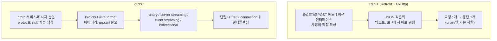

## gRPC 는 Protobuf 기반 강타입 스트리밍 계약을 선언하고 REST 는 단발성 request-response 계약에 머문다

배경 지식: [HTTP 프로토콜](../../../../../../computer-science/networking/http-protocol.md)

[Retrofit/OkHttp](./retrofit-interface-declares-api-while-okhttp-executes-transport.md) 조합이 다루는 REST 계약은 애노테이션이 달린 인터페이스로 엔드포인트를 선언하고, JSON 을 매 호출마다 직렬화/역직렬화하며, 기본적으로 "요청 하나에 응답 하나"만 표현한다. gRPC 는 같은 문제(API 계약 선언과 실제 전송 분리)를 다른 계약으로 푼다 — `.proto` 파일이 서비스와 메시지를 강타입으로 선언하고, 전송은 처음부터 HTTP/2 위에서 이뤄지며, 프로토콜 자체가 스트리밍을 1 급 시민으로 지원한다. gRPC 공식 문서는 gRPC 를 "a modern open source high performance Remote Procedure Call (RPC) framework that can run in any environment"로 소개하고, "Bi-directional streaming and fully integrated pluggable authentication with HTTP/2-based transport"를 핵심 특징으로 명시한다.

### 내부 동작 메커니즘

- **계약 선언 방식이 다르다.** REST/Retrofit 은 Kotlin 인터페이스에 `@GET`/`@POST` 애노테이션을 붙여 계약을 선언하고 런타임에 리플렉션으로 해석한다. gRPC 는 `.proto` 파일에 서비스와 RPC 메서드, 메시지 타입을 선언한다. 공식 문서는 "You define gRPC services in ordinary proto files, with RPC method parameters and return types specified as protocol buffer messages"라고 설명한다. 이 `.proto` 파일을 `protoc` 로 컴파일하면 각 언어용 강타입 stub 코드가 생성된다 — grpc-java 공식 퀵스타트는 빌드 과정에서 `GreeterGrpc.java`(생성된 gRPC client/server 클래스)가 만들어진다고 설명한다. Retrofit 인터페이스는 사람이 직접 작성하지만, gRPC stub 은 스키마에서 자동 생성된다는 점이 계약 선언 단계의 근본적 차이다.
- **전송 프로토콜이 다르다.** OkHttp 는 HTTP/1.1 과 HTTP/2 를 모두 지원하고 서버 협상에 따라 선택하지만, gRPC 는 설계 자체가 HTTP/2 를 전제한다("HTTP/2-based transport"). gRPC 문서는 "each gRPC channel uses zero or more HTTP/2 connections, and each connection typically has a limit on concurrent streams"(각 gRPC channel 은 0개 이상의 HTTP/2 connection 을 사용하고, 각 connection 은 보통 동시 stream 수 제한이 있다)라고 설명한다. 즉 여러 RPC 호출이 하나의 HTTP/2 connection 위에서 멀티플렉싱될 수 있다 — REST 에서 별도 요청마다 커넥션 풀의 소켓을 놓고 경쟁하는 것과는 동시성 모델이 다르다.
- **4 가지 RPC 형태가 프로토콜에 내장돼 있다.** gRPC core concepts 문서는 네 가지 서비스 메서드를 정의한다: "Unary RPCs where the client sends a single request to the server and gets a single response back, just like a normal function call", "Server streaming RPCs where the client sends a request to the server and gets a stream to read a sequence of messages back", "Client streaming RPCs where the client writes a sequence of messages and sends them to the server, again using a provided stream", "Bidirectional streaming RPCs where both sides send a sequence of messages using a read-write stream". REST 는 기본적으로 unary 에 해당하는 한 형태만 표현하며, 서버가 여러 메시지를 밀어 보내거나 클라이언트가 계속 보내는 흐름을 만들려면 Server-Sent Events 나 WebSocket 같은 별도 프로토콜을 얹어야 한다.
- **페이로드 인코딩이 다르다.** REST/JSON 은 로그에서 바로 읽을 수 있는 텍스트다. Protocol Buffers 는 자체 wire format 을 쓴다 — 공식 문서는 "This document describes the protocol buffer wire format, which defines the details of how your message is sent on the wire and how much space it consumes on disk"라고 설명한다. 이 바이너리 wire format 때문에 gRPC 트래픽은 `HttpLoggingInterceptor` 같은 텍스트 기반 도구로 그대로 읽을 수 없고, `grpcurl` 이나 프록시 전용 도구가 필요하다.



### 코드 예시

```protobuf
// benefit.proto — gRPC 계약은 .proto 스키마로 선언한다
service BenefitService {
  rpc GetBenefit(BenefitRequest) returns (Benefit); // unary
  rpc WatchBenefitUpdates(BenefitRequest) returns (stream Benefit); // server streaming
}

message BenefitRequest { string user_id = 1; }
message Benefit { string id = 1; string title = 2; int32 point = 3; }
```

```kotlin
// protoc + grpc-kotlin 플러그인이 생성한 stub 을 사용하는 Android 클라이언트
val channel = ManagedChannelBuilder.forAddress("api.example.com", 443).build()
val stub = BenefitServiceGrpcKt.BenefitServiceCoroutineStub(channel)

// unary — Retrofit 의 suspend fun 호출과 사용감은 비슷하다
val benefit = stub.getBenefit(benefitRequest { userId = "u1" })

// server streaming — REST 로는 SSE/WebSocket 없이 표현할 수 없는 흐름
stub.watchBenefitUpdates(benefitRequest { userId = "u1" })
    .collect { update -> _uiState.update { it.copy(benefit = update) } }
```

### 관측 가능한 증거

- Retrofit/OkHttp 호출은 `HttpLoggingInterceptor` 로 logcat 에서 요청/응답 JSON 본문을 그대로 읽을 수 있지만, 같은 방식으로 gRPC 채널에 interceptor 를 걸어도 body 는 Protobuf 바이너리로 찍혀 사람이 바로 읽을 수 없다. gRPC 호출을 사람이 읽을 수 있게 확인하려면 `grpcurl -plaintext host:port service/Method` 처럼 별도 CLI 도구가 필요하다 — REST 계열보다 툴링 성숙도가 한 단계 더 필요하다는 뜻이다.
- `.proto` 서비스 정의에 새 필드나 메서드를 추가하고 다시 빌드하면, `protoc` 가 stub 클래스를 재생성해 호출부에서 컴파일 타임에 타입 불일치를 즉시 잡아낸다. REST/JSON 계약은 서버가 필드를 바꿔도 클라이언트 쪽 Kotlin data class 가 자동으로 갱신되지 않으므로, 같은 종류의 계약 위반이 런타임 역직렬화 실패로만 드러난다.
- `ManagedChannelBuilder` 로 연 하나의 channel 위에서 여러 unary/streaming 호출을 동시에 실행해도 별도 소켓이 매번 열리지 않는다 — Android Studio Network Profiler 나 시스템 소켓 통계로 관찰하면 REST 클라이언트가 커넥션 풀에서 여러 소켓을 오가는 것과 달리 gRPC 는 적은 수의 HTTP/2 connection 에 스트림이 몰리는 것을 확인할 수 있다.

### Android 앱에서 gRPC 를 선택하는 기준

- **내부 마이크로서비스 통신인가, 공개 REST API 인가.** 서버가 이미 REST/JSON 공개 API 를 제공한다면 클라이언트도 REST 를 따르는 편이 자연스럽다. gRPC 는 서비스 정의를 `.proto` 로 양쪽(서버·클라이언트)이 공유해야 이점이 커지므로, 같은 조직이 관리하는 백엔드-모바일 간 내부 채널에 더 잘 맞는다.
- **서버 푸시나 양방향 스트리밍이 실제로 필요한가.** 실시간 위치 업데이트, 채팅, 라이브 대시보드처럼 서버가 계속 메시지를 밀어 보내야 하는 요구가 있다면 gRPC 의 server/bidirectional streaming 이 WebSocket 을 직접 다루는 것보다 스키마 기반이라 타입 안전성을 확보하기 쉽다. 단발성 CRUD 호출만 필요하면 REST 로 충분하고 gRPC 의 스키마 관리 비용을 감수할 이유가 적다.
- **툴링·디버깅 성숙도 차이를 감수할 수 있는가.** REST 는 `HttpLoggingInterceptor`, Android Studio Network Inspector, 브라우저 devtools 등 사람이 바로 읽을 수 있는 디버깅 도구가 풍부하다. gRPC 는 Protobuf 바이너리 wire format 때문에 `grpcurl` 이나 별도 프록시 도구 없이는 실제 페이로드를 눈으로 확인하기 어렵다. 팀이 이 도구 체인에 익숙하지 않다면 초기 디버깅 비용이 늘어난다.

상위 지도: [네트워크 클라이언트 계층 계약](./networking.md)

관련 노트: [Retrofit 인터페이스는 API 계약을 선언하고 OkHttp가 실제 전송을 담당한다](./retrofit-interface-declares-api-while-okhttp-executes-transport.md), [suspend API 호출의 취소는 호출자의 coroutine scope를 따라간다](./suspend-api-call-cancellation-follows-the-callers-coroutine-scope.md)

공식 문서: [What is gRPC?](https://grpc.io/docs/what-is-grpc/introduction/), [gRPC Core Concepts](https://grpc.io/docs/what-is-grpc/core-concepts/), [gRPC 홈페이지](https://grpc.io/), [gRPC Performance Best Practices](https://grpc.io/docs/guides/performance/), [Android gRPC Quickstart](https://grpc.io/docs/platforms/android/java/quickstart/), [Protocol Buffers Encoding](https://protobuf.dev/programming-guides/encoding/)

검증일: 2026-08-05. Protobuf IDL 정의, HTTP/2 기반 전송, 4 가지 RPC 형태(unary/server streaming/client streaming/bidirectional streaming), channel 당 HTTP/2 connection 과 동시 stream 제한, Protobuf wire format 서술은 이번 세션의 WebFetch 로 grpc.io 와 protobuf.dev 공식 문서 원문을 직접 대조했다. Android 전용 gRPC stub 생성 흐름(`GreeterGrpc.java`)은 grpc-java 공식 퀵스타트로 확인했다. gRPC/Protobuf 는 Android 플랫폼 API 가 아니라 서드파티 프레임워크이므로 Android 버전 종속 사실은 아니다.
