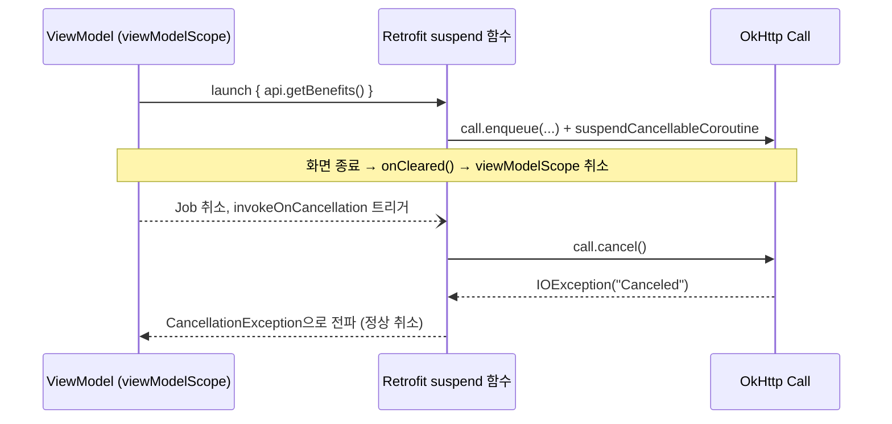

## suspend API 호출의 취소는 호출자의 coroutine scope 를 따라간다

Retrofit interface 메서드를 `suspend fun` 으로 선언하면, 그 호출을 감싸고 있는 coroutine 이 취소될 때 진행 중인 네트워크 요청도 실제로 중단된다. 이것은 우연이 아니라 Retrofit 이 내부적으로 `suspendCancellableCoroutine` 으로 OkHttp `Call` 을 감싸고, coroutine 취소를 `Call.cancel()` 호출로 연결해 두었기 때문이다. [Structured concurrency는 부모 scope가 자식 작업의 수명을 소유하게 한다](../../async-flow/coroutines/structured-concurrency-parent-owns-child-lifetime.md)는 계약이 네트워크 호출까지 그대로 이어지는 지점이다.

### 내부 동작 메커니즘

- `suspend fun getBenefits(): List<BenefitDto>` 처럼 선언하면, Retrofit 은 호출 시점에 `okhttp3.Call` 을 만들고 `suspendCancellableCoroutine { continuation -> ... }` 로 그 결과를 기다린다. 이때 `continuation.invokeOnCancellation { call.cancel() }` 을 등록해, 감싸는 coroutine 이 취소되면 진행 중인 `Call` 도 함께 `cancel()` 된다.
- `viewModelScope.launch { api.getBenefits() }` 로 호출했다면, 화면이 사라져 `ViewModel.onCleared()` 가 호출되고 `viewModelScope` 가 취소되는 순간 이 네트워크 요청도 실제로 중단된다. 소켓 연결이 끊기고 이후 응답을 기다리지 않는다 — 단순히 "결과를 무시하는" 것이 아니라 진짜로 취소된다.
- 이 자동 취소는 메서드가 `suspend fun` 일 때만 성립한다. 같은 인터페이스를 `fun getBenefits(): Call<List<BenefitDto>>` 처럼 콜백 기반으로 선언했다면, coroutine 이 취소돼도 `Call` 은 자동으로 `cancel()` 되지 않는다. 이 경우 호출자가 직접 `call.cancel()` 을 호출해야 한다.
- 취소된 요청은 내부적으로 `java.io.IOException`(OkHttp 의 "Canceled")을 던지지만, coroutine 취소 경로에서는 이것이 `CancellationException` 으로 전파되어 일반적인 예외 처리 로직(`catch (e: Exception)`)에서 잡혀 버그처럼 보이지 않도록 주의해야 한다. `CancellationException` 은 다시 던져 취소를 상위로 전파하는 것이 구조적 동시성의 기본 규칙이다.



### 코드 예시

```kotlin
interface BenefitApi {
    @GET("benefits") suspend fun getBenefits(): List<BenefitDto> // 자동 취소 대상
    @GET("legacy") fun getLegacy(): Call<List<BenefitDto>>        // 수동 취소 필요
}

class BenefitViewModel(private val api: BenefitApi) : ViewModel() {
    init {
        viewModelScope.launch {
            try {
                val benefits = api.getBenefits()
                _uiState.value = UiState.Success(benefits)
            } catch (e: CancellationException) {
                throw e // 취소는 삼키지 않고 다시 던져 상위로 전파한다
            } catch (e: IOException) {
                _uiState.value = UiState.NetworkError
            } catch (e: HttpException) {
                _uiState.value = UiState.ServerError(e.code())
            }
        }
        // ViewModel이 clear되면 viewModelScope가 취소되고,
        // 진행 중이던 getBenefits() 요청도 OkHttp 레벨에서 실제로 cancel된다.
    }
}
```

### 관측 가능한 증거

- `HttpLoggingInterceptor` 를 켠 상태에서 화면을 빠르게 벗어나면, 응답을 다 받지 못한 요청에 대해 logcat 에 완결된 `<--` 응답 로그 없이 중단되는 것을 볼 수 있다.
- OkHttp 내부는 취소된 호출에 대해 "canceled" 상태를 기록한다. `Call.isCanceled()` 를 디버거로 확인하거나, 네트워크가 느린 환경(Android Studio Network profiler 의 throttling)에서 화면을 빠르게 전환하며 요청이 중간에 끊기는지 관찰하면 이 계약을 직접 검증할 수 있다.
- `catch (e: CancellationException)` 을 다시 던지지 않고 삼키면, 화면이 이미 사라진 뒤에도 이후 코드가 실행되려다 `ViewModel` 관련 상태 접근에서 예외가 나거나, `IllegalStateException`("Job was cancelled") 이 다른 곳에서 발생할 수 있다.

상위 지도: [네트워크 클라이언트 계층 계약](./networking.md)

관련 노트: [Structured concurrency는 부모 scope가 자식 작업의 수명을 소유하게 한다](../../async-flow/coroutines/structured-concurrency-parent-owns-child-lifetime.md), [Retrofit 인터페이스는 API 계약을 선언하고 OkHttp가 실제 전송을 담당한다](./retrofit-interface-declares-api-while-okhttp-executes-transport.md)

공식 문서: [Retrofit](https://square.github.io/retrofit/), [Cancellation and exceptions in coroutines](https://developer.android.com/kotlin/coroutines/coroutines-best-practices)

검증일: 2026-08-04. Retrofit 의 suspend 함수 지원과 coroutine 취소 시 `Call.cancel()` 로 이어지는 동작은 Retrofit 2.6 이후 널리 문서화된 라이브러리 동작이나, 이번 세션의 WebFetch 로 1차 changelog 원문을 직접 인용하지는 못해 검색 기반 2차 확인으로 대체했다. 향후 재검증 시 Retrofit CHANGELOG 원문 대조를 권장한다.
