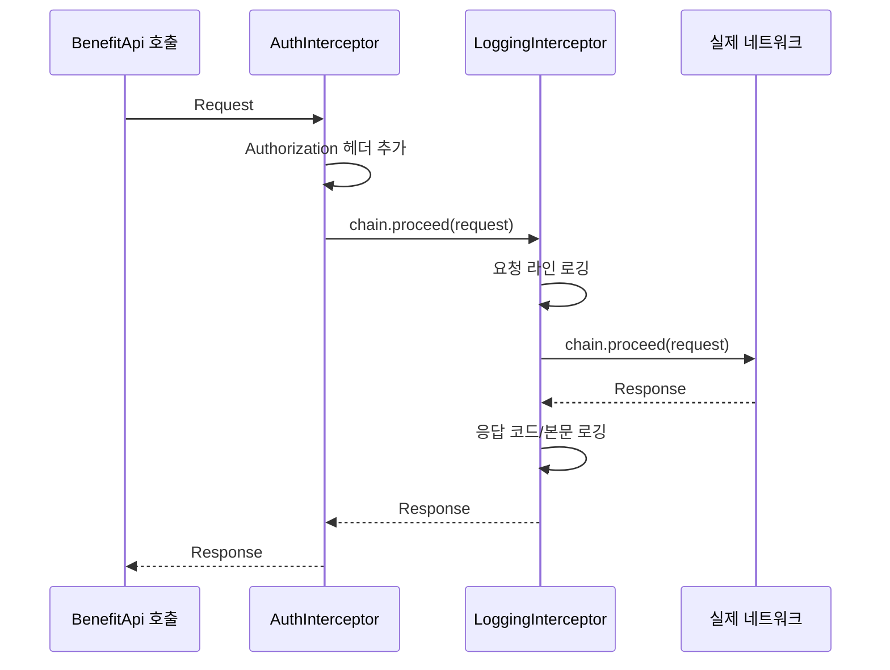

## Interceptor 체인은 인증, 로깅, 재시도를 요청·응답 파이프라인에 끼워 넣는다

배경 지식: [인증과 인가](../../../../../security/fundamentals/authentication-authorization.md)

OkHttp `Interceptor` 는 요청이 나가고 응답이 돌아오는 파이프라인 중간에 끼어들어 관찰하거나 바꿀 수 있는 지점이다. 인증 헤더 추가, 로깅, 재시도, 캐시 정책처럼 여러 API 호출에 공통으로 적용해야 하는 관심사(cross-cutting concern)를 매 호출마다 반복해서 쓰지 않고 한 곳에 모아 둘 수 있다.

### 내부 동작 메커니즘

- `Interceptor` 는 `intercept(chain: Chain): Response` 하나만 구현하면 된다. 그 안에서 `chain.request()` 로 나가는 요청을 확인/수정하고, `chain.proceed(request)` 를 호출해 다음 interceptor(또는 실제 네트워크 호출)로 넘긴 뒤, 돌아온 `Response` 를 다시 관찰/수정해 반환한다. `chain.proceed()` 를 호출하지 않으면 요청 자체가 나가지 않는다(예: 캐시 hit 으로 바로 응답을 만들어 반환하는 경우).
- `OkHttpClient.Builder().addInterceptor()` 로 등록하는 application interceptor 는 호출당 한 번만 실행되고 redirect/retry 를 보지 못한다. `addNetworkInterceptor()` 로 등록하는 network interceptor 는 실제로 소켓에 나가는 요청/응답을 보므로 redirect 가 있으면 여러 번 실행될 수 있다. 인증 헤더 삽입처럼 "논리적으로 한 번만"이면 application interceptor, 압축 해제 이후의 실제 바이트를 보고 싶다면 network interceptor 를 쓴다.
- 등록 순서가 실행 순서다. 여러 interceptor 를 추가하면 등록한 순서대로 요청을 통과시키고, 응답은 그 반대 순서로 돌아온다. 그래서 로깅 interceptor 를 인증 interceptor 뒤에 등록해야 실제로 전송된(인증 헤더가 붙은) 요청을 로그로 볼 수 있다.
- 401 응답을 보고 토큰을 갱신한 뒤 같은 요청을 다시 보내는 재시도는 `Interceptor` 안에서 `chain.proceed()` 결과를 확인하고, 실패 조건이면 새 `Request` 를 만들어 `chain.proceed(newRequest)` 를 한 번 더 호출하는 방식으로 구현하거나, OkHttp 가 제공하는 `Authenticator` 를 쓴다.



### 코드 예시

```kotlin
class AuthInterceptor(private val tokenProvider: () -> String?) : Interceptor {
    override fun intercept(chain: Interceptor.Chain): Response {
        val original = chain.request()
        val token = tokenProvider() ?: return chain.proceed(original)

        val authorized = original.newBuilder()
            .header("Authorization", "Bearer $token")
            .build()
        return chain.proceed(authorized)
    }
}

val loggingInterceptor = HttpLoggingInterceptor().apply {
    level = HttpLoggingInterceptor.Level.BODY
}

val okHttpClient = OkHttpClient.Builder()
    .addInterceptor(AuthInterceptor { tokenStore.currentToken })
    // 등록 순서대로 실행되므로, 인증 헤더가 붙은 뒤의 요청을 로깅한다.
    .addInterceptor(loggingInterceptor)
    .build()
```

### 관측 가능한 증거

- `HttpLoggingInterceptor(Level.BODY)` 를 등록하면 logcat 에 `-->`(요청)와 `<--`(응답) 라인이 찍힌다. `AuthInterceptor` 를 `LoggingInterceptor` 보다 먼저 등록했다면 로그에 `Authorization` 헤더가 보이고, 반대 순서면 보이지 않는 것으로 체인 순서를 직접 확인할 수 있다.
- 인증 재시도 로직이 무한 루프에 빠지면 동일한 URL 에 대해 짧은 시간 안에 반복되는 `-->` 로그가 여러 번 찍히는 것으로 관찰된다. 재시도 횟수 상한을 두지 않으면 이 증상이 나타난다.

상위 지도: [네트워크 클라이언트 계층 계약](./networking.md)

관련 노트: [Retrofit 인터페이스는 API 계약을 선언하고 OkHttp가 실제 전송을 담당한다](retrofit-okhttp-boundaries.md)

공식 문서: [OkHttp Interceptors](https://square.github.io/okhttp/features/interceptors/)

검증일: 2026-08-04. Interceptor/Chain 구조는 OkHttp 자체 API 계약(third-party library)이며 Android 플랫폼 버전에 종속되지 않는다.
