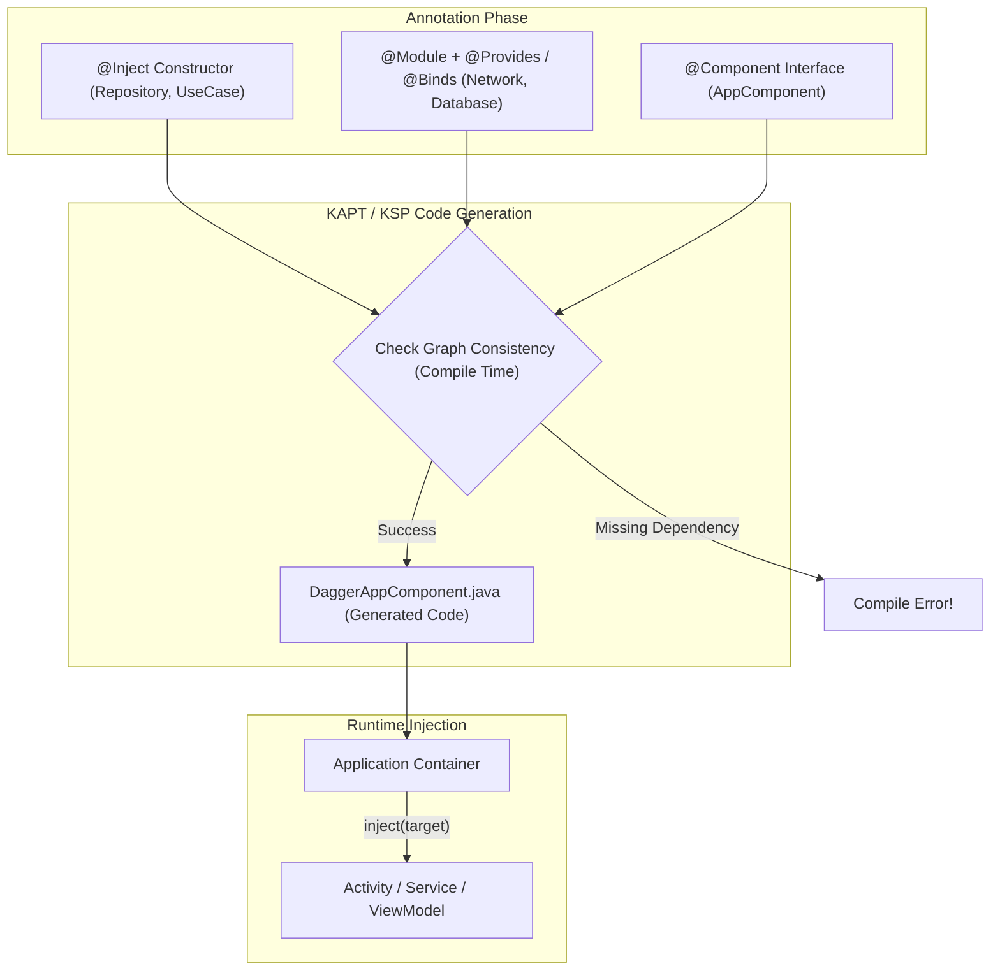

## Dagger DI (엄격한 컴파일 타임 의존성 그래프 생성기)

### 1. 개념 & 비유 (Concept & Real-World Analogy)

#### 개념

**Dagger**는 자바 및 코틀린 환경에서 사용하는 정적 컴파일 타임(Static Compile-time) 의존성 주입(Dependency Injection) 프레임워크입니다. 리플렉션(Reflection)을 전혀 사용하지 않고, 앤디(APT) 및 KSP/KAPT 코스 에노테이션 프로세서를 기반으로 컴파일 타임에 완전한 자바 소스 코드(Java source file) 형태의 주입 그래프 클래스를 자동 생성합니다. 이를 통해 런타임 오버헤드가 제로에 가까우며 최고의 성능과 완전한 형태의 정적 검증을 제공합니다.

#### 실생활 비유: 수석 설계도 검측관 (Master Blueprint Inspector)

Dagger 는 건물을 지어 올리기 직전, 모든 부품과 도면의 연관 관계를 결합하고 확인하는 **수석 설계도 검측관**과 같습니다.

건물(앱)을 짓는 도중(런타임)에 부품이 없거나 결합 방식이 틀렸음을 발견하는 대신, 건물을 짓기 전 설계도 검측 단계(`apt/kapt` 컴파일 시점)에서 `@Component`, `@Module`, `@Inject` 태그를 분석합니다. 조금이라도 누락된 의존성이나 잘못된 도면 연결이 있으면 즉시 빌드를 중단하고 철저한 오류 보고서를 제출합니다.

---

### 2. 핵심 구성 요소 & 동작 원리 (Core Components & How It Works)

#### 핵심 구성 요소
1. **`@Inject`**: 의존성이 필요한 생성자, 필드, 메서드에 부착하거나, Dagger 가 해당 객체를 직접 인스턴스화할 수 있도록 생성자에 부여하는 표식입니다.
2. **`@Module` & `@Provides`**: 생성자를 직접 수정할 수 없는 외부 라이브러리(Retrofit, OkHttp, Room 등)나 인터페이스 구현체의 생성 방법을 Dagger 에 알려주는 클래스 및 메서드 블록입니다.
3. **`@Component`**: Module 및 Inject 요구 사항을 연결하는 의존성 그래프의 핵심 브릿지 인터페이스입니다. Dagger 는 컴파일 시점에 이 인터페이스의 구현체(`DaggerAppComponent`)를 자동으로 생성합니다.
4. **`@Subcomponent`**: 부모 Component 의 의존성 그래프를 상속받으면서 독립적인 서브 스코프 생명주기를 갖는 하위 그래프를 정의합니다.
5. **`@Scope` (예: `@Singleton`, `@ActivityScope`)**: 생성된 객체의 생명주기 범위를 제한하여 동일 스코프 내에서 객체가 단 한번만 생성되고 재사용되도록(메모리 싱글톤 효과) 보장합니다.

#### 동작 흐름도 (Mermaid Diagram)



---

### 3. 코드 예제 & 사용 방법 (Code Example & Implementation)

#### Step 1: 의존성 및 생성자 `@Inject` 선언
```kotlin
import javax.inject.Inject

class NetworkClient @Inject constructor() {
    fun request(): String = "Network Data"
}

class Repository @Inject constructor(
    private val networkClient: NetworkClient
) {
    fun fetchData(): String = networkClient.request()
}
```

#### Step 2: `@Module` 및 `@Provides` 작성
```kotlin
import dagger.Module
import dagger.Provides
import javax.inject.Singleton

class ExternalLogger {
    fun log(msg: String) = println(msg)
}

@Module
class SystemModule {

    @Provides
    @Singleton
    fun provideExternalLogger(): ExternalLogger {
        return ExternalLogger()
    }
}
```

#### Step 3: `@Component` 정의 및 빌드 실행
```kotlin
import dagger.Component
import javax.inject.Singleton

@Singleton
@Component(modules = [SystemModule::class])
interface AppComponent {
    fun getRepository(): Repository
    fun getLogger(): ExternalLogger

    // 필드 주입을 위한 인젝터 함수
    fun inject(activity: DirectDaggerActivity)
}
```

#### Step 4: Dagger 생성 컴파일 클래스 연동
```kotlin
import android.os.Bundle
import androidx.appcompat.app.AppCompatActivity
import javax.inject.Inject

class DirectDaggerActivity : AppCompatActivity() {

    @Inject lateinit var repository: Repository
    @Inject lateinit var logger: ExternalLogger

    override fun onCreate(savedInstanceState: Bundle?) {
        super.onCreate()
        
        // 컴파일 시 자동 생성된 DaggerAppComponent 활용
        val appComponent = DaggerAppComponent.builder()
            .systemModule(SystemModule())
            .build()

        appComponent.inject(this) // 필드 주입 실행
        
        logger.log(repository.fetchData())
    }
}
```

---

### 4. 주의사항 & 팁 (Key Considerations & Best Practices)

1. **보일러플레이트 코드 양**: Pure Dagger 는 `@Component` 생성 및 Subcomponent 계층 수동 연결 시 다량의 보일러플레이트 코드가 필요하므로 안드로이드 표준 프레임워크인 **Hilt** 도입을 적극 권장합니다.
2. **KAPT 대 KSP 이전**: Kotlin 환경에서 KAPT 기반 Dagger 는 빌드 속도를 저하시킬 수 있으므로 Dagger KSP 지원 버전을 사용하거나 Hilt 전환을 고려해야 합니다.
3. **컴파일 에러 메시지 분석**: Dagger 컴파일 실패 에러 로그는 스택트레이스가 매우 길고 무거울 수 있습니다. 에러 메시지 최상단의 `[Dagger/MissingBinding]` 또는 `[Dagger/CircularDependency]` 라인을 찾는 것이 핵심입니다.
4. **Member Injection(필드 주입) 주의**: 필드 주입(`@Inject lateinit var`) 대상이 되는 변수는 `private` 키워드를 사용할 수 없으며, 접근 제어자 설정 시 주의해야 합니다.

---

### 5. 연관 개념 & 참고 링크 (Related Concepts & Relative Markdown Links)

- [Hilt DI Architecture](hilt-di.md) - Dagger 기반의 안드로이드 최적화 DI 시스템
- [Paging 3 Architecture](../data/paging/paging.md) - DI 기반 아키텍처 내 PagingSource 의존성 관리
- [Push Notification & FCM](../architecture/app-components/push-notification-and-fcm.md) - FCM 백그라운드 서비스 내 DI 그래프 결합
