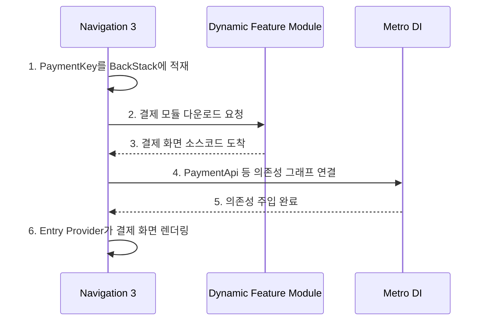

# DI(의존성 주입), DSL & Dynamic Feature Module

이 문서는 Navigation 3와 밀접하게 연결되는 **DI(의존성 주입) 라이브러리** 생태계(Dagger/Hilt, Koin, Metro), 코틀린의 **DSL(
Domain-Specific Language)** 설계 원리와 내부 동작, 그리고 대규모 앱의 **Dynamic Feature Module** 개념을 다룹니다.

---

## 1. DI(의존성 주입)와 Navigation의 관계

### 1-1. 왜 Navigation과 DI가 연결되는가?

Navigation 3의 철학은 **"화면 이동은 곧 상태(State)의 변화일 뿐"**입니다. 화면이 바뀔 때, 그 화면에 필요한 ViewModel이나 Repository 객체도
함께 **생성·주입**되어야 하고, 화면이 꺼지면 메모리에서 같이 **사라져야(Scope)** 합니다.

이 작업을 내비게이션과 연동해 자동으로 관리해 주는 도구가 **DI 라이브러리**입니다.

### 1-2. DI 라이브러리 비교표

| 라이브러리             | 정체 및 특징                                                    | Flutter 매핑              | 왜 Navigation 3 예시에?                 |
|:------------------|:-----------------------------------------------------------|:------------------------|:------------------------------------|
| **Dagger / Hilt** | 구글 공식 안드로이드 전용 DI. 컴파일 타임 그래프 검증. 안드로이드 OS 의존성 강함          | `get_it` + `injectable` | 전통적인 안드로이드 전용 아키텍처 예시               |
| **Koin**          | 코틀린 순수 코드 기반 가볍고 실용적 DI. 런타임 주입                            | `Provider` / `get_it`   | **KMP(멀티플랫폼)** 지원 → 크로스 플랫폼 예시      |
| **Metro** ★       | Zac Sweers가 만든 최신 컴파일 타임 코틀린 DI. Kotlin Compiler Plugin 기반 | `riverpod` (컴파일 타임 안전성) | Navigation 3의 멀티플랫폼 목표에 부합하는 최첨단 DI |

### 1-3. 왜 DI 라이브러리가 이렇게 많은가?

각 라이브러리가 **풀고자 하는 도메인(문제)**이 다릅니다:

#### 안드로이드 전용 vs. 멀티플랫폼(KMP)

* **Hilt**: Activity/Fragment에 종속되어 iOS/Web 코드에서 사용 불가
* **Koin, Metro**: Pure Kotlin 기반이라 Android, iOS, Web에서 동일 DI 코드 공유 가능

#### 런타임 에러 vs. 컴파일 에러

* **Koin**: 앱 실행 중(런타임)에 객체 주입 → 오타 시 앱 실행 중 크래시. 대신 빌드 속도 빠름
* **Metro, Hilt**: 빌드(컴파일) 시점에 의존성 그래프 전수 검증 → 에러를 사전에 완벽 통제

### 1-4. Metro 상세

* **제작자**: Zac Sweers (안드로이드 오픈소스 대부. Block/Square, Cash App, OpenAI 등에서 채택)
* **구글 공식이 아닌 오픈소스** 프로젝트
* **이름 유래**: DI는 여러 모듈의 의존성들을 촘촘하게 연결하여 목적지까지 수송하는 '교통망'과 같다 하여 🚇 **Metro(지하철)**

#### Metro의 킬러 피쳐: Dynamic Feature Module 자동 수집

```kotlin
@ContributesTo(AppGraph::class) // 메인 앱 그래프에 의존성을 바치겠다는 선언
@BindingContainer
interface PaymentModule {
    @Provides
    fun providePaymentApi(): PaymentApi = PaymentApiImpl()
}
```

컴파일러가 각 모듈의 `@ContributesTo` 장부를 자동 수집하여 최상위 `AppGraph`에 코드를 자동으로 연결합니다.

---

## 2. DSL (Domain-Specific Language)

### 2-1. DSL이란?

**"특정 영역(도메인)의 문제만 아주 쉽고 직관적으로 해결하기 위해 만든 미니 언어"**

* **External DSL**: HTML(웹 구조), SQL(데이터베이스 명령)
* **Internal DSL**: 코틀린 코드 안에서 마치 새로운 언어를 쓰는 것 같은 내장 DSL

### 2-2. DSL의 내부 동작 원리

코틀린 DSL이 작동하는 배후에는 **2가지 핵심 치트키**가 있습니다:

#### ① 수신 객체 지정 람다 (Lambda with Receiver)

```kotlin
// 일반적인 스타일 (지저분함)
fun buildUser(user: User) {
    user.name = "Youngmin"
    user.age = 31
}

// DSL 스타일 (수신 객체 지정 람다)
fun user(block: User.() -> Unit): User {
    val user = User()
    user.block()
    return user
}

// 사용하는 쪽: 마치 전용 미니 언어처럼 사용
val myUser = user {
    name = "Youngmin"  // this.name에서 this가 생략됨!
    age = 31
}
```

#### ② 스코프 제한자 (`@DslMarker`)

중첩 DSL에서 자식 블록이 부모의 엉뚱한 변수를 건드리지 못하도록 **컴파일러가 감시하는 제약 조건**.

### 2-3. DSL이 탄생한 언어적 근간

> 함수가 1급 객체(First-class citizen)이고, 마지막 인자인 람다를 소괄호 밖으로 꺼내서 중괄호 형태로 쓸 수 있는 **코틀린 언어의 특성**에서 나온 것.

여기에 **수신 객체 지정 람다**라는 치트키가 결합되어 중괄호 내부를 특정 클래스의 "안방"처럼 만들어 줍니다.

### 2-4. Swift와의 비교

| 기능         | Kotlin                       | Swift                                  |
|:-----------|:-----------------------------|:---------------------------------------|
| 함수의 지위     | 1급 객체                        | 1급 객체                                  |
| 소괄호 탈출 문법  | **Trailing Lambda**          | **Trailing Closure** (후행 클로저)          |
| DSL 치트키 엔진 | 수신 객체 지정 람다 (`T.() -> Unit`) | **Result Builders** (`@resultBuilder`) |

```kotlin
// Kotlin (Jetpack Compose DSL)
Row {
    Text("안녕 안드로이드")
}
```

```swift
// Swift (SwiftUI DSL)
HStack {
    Text("안녕 iOS")
}
```

> [!TIP]
> SwiftUI의 `VStack { }` 안에서 `return`도 없고 컴마도 없이 여러 `Text`를 나열할 수 있는 이유는, **`@ViewBuilder`라는 Result
Builder**가 컴파일 시 이를 자동으로 하나의 컴포넌트 묶음으로 변환해 주기 때문입니다.

### 2-5. 안드로이드/Jetpack Compose/KMP 진영의 대표 DSL들

#### Jetpack Compose UI DSL

```kotlin
LazyColumn {
    items(restaurantList) { restaurant ->
        RestaurantRow(restaurant)
    }
}
```

내부적으로 `LazyListScope.() -> Unit` 수신 객체 지정 사용.

#### Gradle KTS DSL

```kotlin
plugins {
    kotlin("android")
}
dependencies {
    implementation(libs.android.navigation.compose)
}
```

#### Ktor DSL (KMP 네트워크)

```kotlin
val client = HttpClient(CIO) {
    install(ContentNegotiation) {
        json(Json { prettyPrint = true })
    }
}
```

#### Koin DSL (의존성 주입)

```kotlin
val appModule = module {
    single { RestaurantRepository() }        // Singleton 등록
    factory { RestaurantViewModel(get()) }   // 매번 새로 생성
}
```

#### Navigation 3의 Entry Provider DSL

```kotlin
val entryProvider = { key ->
    when (key) {
        is HomeKey -> Entry(key) { HomeScreen() }
        is DetailKey -> Entry(key) { DetailScreen(id = key.id) }
        else -> null
    }
}
```

---

## 3. Dynamic Feature Module

### 3-1. 개념

앱을 처음 다운로드할 때는 **최소한의 메인 기능만 다운**받고, 유저가 특정 기능(결제, 고급 카메라 필터 등)을 클릭하는 순간 해당 모듈의 코드와 UI를 **구글 서버에서
실시간으로 다운로드해 앱에 합체(Dynamic Delivery)** 시키는 기술.

* **Flutter 매핑**: Deferred Loading (지연 로딩 / 온디맨드 로딩)

### 3-2. Navigation 3와의 연결

기존 Navigation 2에서는 코드 파일이 없으면 NavGraph를 그릴 수 없어 에러가 발생했지만, **Navigation 3는 백스택이 단순 `List<Any>`**이므로:

1. 일단 `PaymentKey`를 백스택에 넣고
2. Dynamic Feature 모듈이 구글 서버에서 다운로드 완료되면
3. Entry Provider가 화면을 동적으로 결합해 무대에 올림

### 3-3. Metro + Dynamic Feature Module 조합

Navigation 3 + Metro DI + Dynamic Feature Module **트리오 결합**:



> [!NOTE]
> Metro의 초보자용 사용 방법은 [[metro-di-get-it-guide|metro_di_get_it_guide.md]]를 참조하세요.
> KAPT/KSP에서 컴파일러 플러그인으로의 진화와 Metro의 빌드 속도 이점에 대한 상세
> 내용은 [[android-build-system-and-serialization|build_system_and_serialization.md]]
> 를 참조하세요.
