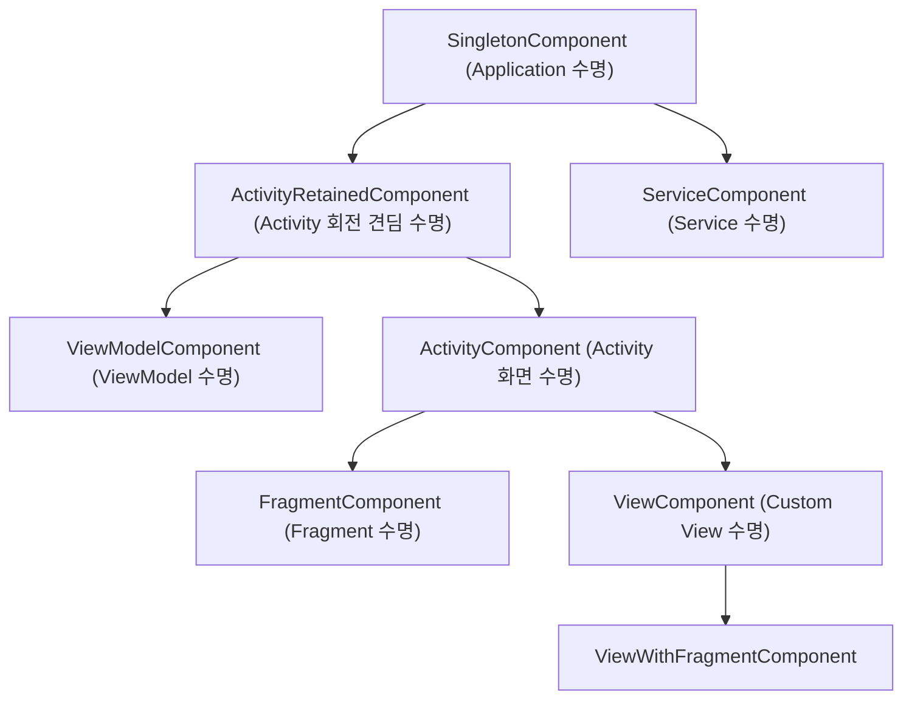

## Hilt 는 Android 용 공식 Dagger 통합 경로다

안드로이드 애플리케이션 개발에서 **Hilt**는 Dagger2 의 정적 컴파일 타임 의존성 검증 성능을 그대로 유지하면서, 안드로이드 프레임워크 컴포넌트(Application, Activity, Fragment, Service, View, ViewModel 등)의 수명주기(Lifecycle)에 맞추어 의존성 그래프를 자동으로 생성하고 주입하는 **구글의 공식 의존성 주입(Dependency Injection: DI) 프레임워크**다.

---

### 1. 개념 및 핵심 명제 (What)

- **순수 Dagger 와의 차이점**: 순수 Dagger2 는 안드로이드 수명주기를 알지 못하므로 개발자가 직접 `@Component`, `@Subcomponent`, `AndroidInjector` 보일러플레이트 코드를 일일이 조립해야 했다. Hilt 는 이 과정을 상용화 표준 컴포넌트(`SingletonComponent`, `ActivityComponent` 등)로 표준화하여 의존성 주입을 자동화한다.
- **주요 어노테이션 계약**:
  - `@HiltAndroidApp`: Application 클래스에 부착하여 의존성 그래프의 루트(Root Component)를 생성한다.
  - `@AndroidEntryPoint`: Activity, Fragment, View, Service, BroadcastReceiver 등 안드로이드 컴포넌트에 주입 앵커(Entry Point)를 생성한다.
  - `@HiltViewModel`: ViewModel 에 주입을 활성화하고 Jetpack ViewModelFactory 생성을 자동화한다.
  - `@Module` & `@InstallIn`: 객체 생성 방법(`@Provides`, `@Binds`)과 바인딩이 존재하는 스코프 범위(`@InstallIn(SingletonComponent::class)`)를 지정한다.

---

### 2. 왜 Hilt 가 필요한가? (Why)

1. **보일러플레이트 코드 대폭 감소**: 순수 Dagger 의 복잡한 컴포넌트 계층 작성, 커스텀 팩토리(ViewModelProvider.Factory) 조작 코드가 수백 줄 이상 절감된다.
2. **수명주기 일치 및 메모리 누수 방지**: Hilt 컴포넌트는 안드로이드 수명주기와 1:1 로 동기화된다. Activity 파괴 시 ActivityComponent 하위 의존성들도 자동으로 메모리에서 해제되어 Context Leak 을 방지한다.
3. **Multi-Module & KSP 가속 지원**: 최신 KSP(Kotlin Symbol Processing) 지원을 통해 kapt 의 Java Stub 오버헤드 없이 빠르게 컴파일 타임 그래프를 검증하고 코드를 생성한다.

---

### 3. 내부 컴포넌트 계층 및 수명주기 매핑 (How)



| Hilt 컴포넌트 | 소유 및 생성 주체 | 수명주기 (Lifetime) | 제공 Scope 어노테이션 |
| :--- | :--- | :--- | :--- |
| `SingletonComponent` | Application | 앱 프로세스 전체 수명 | `@Singleton` |
| `ActivityRetainedComponent` | ActivityRetainedLifecycle | 화면 회전(Configuration Change)을 견디는 수명 | `@ActivityRetainedScoped` |
| `ViewModelComponent` | ViewModel | ViewModel 존재 수명 | `@ViewModelScoped` |
| `ActivityComponent` | Activity | Activity 생존 수명 | `@ActivityScoped` |
| `FragmentComponent` | Fragment | Fragment 생존 수명 | `@FragmentScoped` |
| `ServiceComponent` | Service | Service 생존 수명 | `@ServiceScoped` |

---

### 4. 현대 안드로이드 표준 구현 코드

```kotlin
// 1. 앱 진입점 어노테이션 (의존성 그래프 루트 생성)
@HiltAndroidApp
class MainApplication : Application()

// 2. 모듈 정의 및 스코프 바인딩
@Module
@InstallIn(SingletonComponent::class) // 앱 프로세스 전역 스코프에 바인딩
abstract class NetworkModule {

    @Binds
    @Singleton
    abstract fun bindUserRepository(
        impl: UserRepositoryImpl
    ): UserRepository
}

// 3. ViewModel 주입
@HiltViewModel
class UserProfileViewModel @Inject constructor(
    private val userRepository: UserRepository,
    private val savedStateHandle: SavedStateHandle
) : ViewModel() {
    val user = userRepository.getUserStream()
}

// 4. Activity 앵커 포인트 주입
@AndroidEntryPoint
class UserProfileActivity : ComponentActivity() {

    // ViewModelProvider 팩토리 없이 Hilt가 자동 주입
    private val viewModel: UserProfileViewModel by viewModels()

    override fun onCreate(savedInstanceState: Bundle?) {
        super.onCreate(savedInstanceState)
        setContent {
            UserProfileScreen(viewModel)
        }
    }
}
```

---

### 5. 관련 문서 및 참조

상위 문서: [Android 의존성 주입(DI) 가이드](../android-dependency-injection-map.md)

관련 계약 문서:
- [Dagger는 정적 그래프 엔진이며 안드로이드 수명주기 정책이 아니다](./dagger-is-static-graph-engine-not-android-lifecycle-policy.md)
- [ViewModel DI는 의존성을 주입할 뿐 ViewModel 소유권을 변경하지 않는다](./viewmodel-di-injects-dependencies-not-viewmodel-ownership.md)
- [Entry Point는 프레임워크가 소유한 객체를 그래프와 연결하는 비상 인터페이스다](./entry-points-bridge-framework-owned-objects-to-the-graph.md)
- [KSP는 Kotlin-first 코드 생성 기술이며 kapt는 유지보수 모드다](../../../03_packaging_deployment/build/dependency-versioning/dependency-ci-contracts/ksp-is-kotlin-first-code-generation-and-kapt-is-maintenance-mode.md)

공식 가이드: [Dependency injection with Hilt](https://developer.android.com/training/dependency-injection/hilt-android)

검증일: 2026-08-05. Hilt 최신 공식 가이드 및 KSP 컴파일러 연동 기준 검증 반영 완료.

