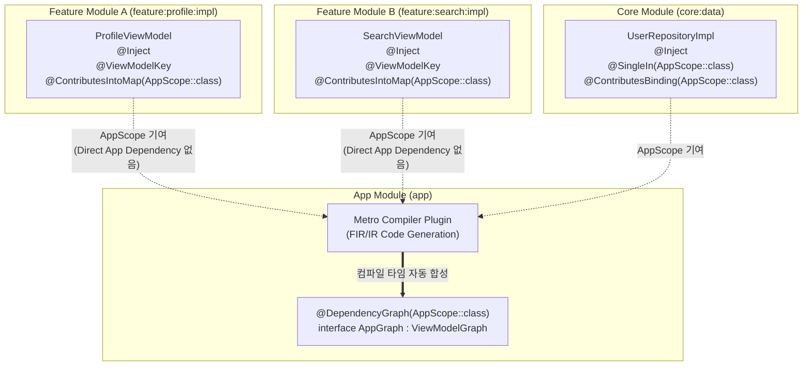
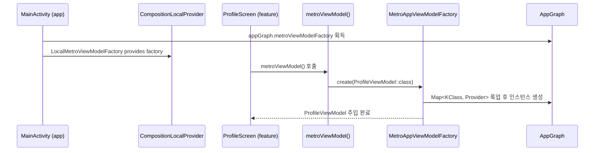
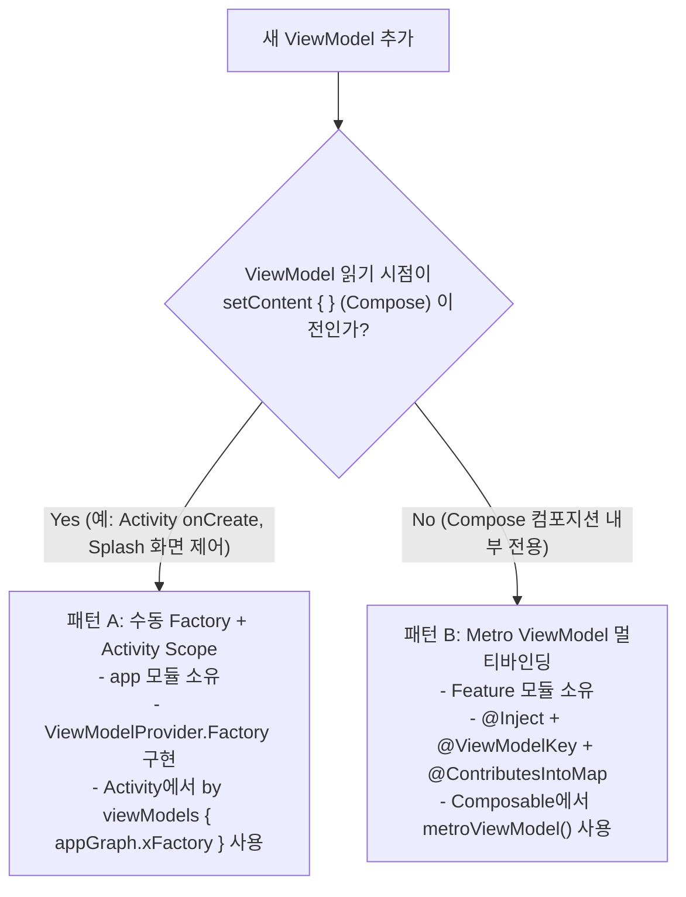

## Metro DI 아키텍처와 멀티모듈 바인딩 계약

### 개요 및 컴파일 타임 검증 메커니즘

**Metro**(`dev.zacsweers.metro`)는 Dagger 와 Anvil 조합을 대체하도록 설계된 **Kotlin 컴파일러 플러그인 기반 정적 의존성 주입(DI) 프레임워크**이다. 런타임 리플렉션을 통해 그래프를 조립하는 대신, 컴파일 타임(IR 단계)에서 의존성 그래프 전체를 생성하고 바인딩 유효성을 검증한다.

- **컴파일 타임 완전 보장**: 의존성 배선이 누락되거나 순환 참조가 발생하면 런타임 크래시가 아닌 **컴파일 에러**가 발생한다.
- **Zero-reflection 코드 생성**: Dagger 대비 런타임 오버헤드가 없으며, Kotlin 친화적인 어노테이션과 DSL 을 제공한다.
- **버전 호환성 계약**: Metro `1.4.0` 버전에서는 멀티모듈 환경의 다운스트림 크로스 모듈 contribution hint 수집 결함으로 런타임 `IllegalArgumentException`이 발생할 수 있으므로, 크로스 모듈 바인딩 기여를 사용할 때는 반드시 **Metro `1.4.1` 이상** 버전을 사용해야 한다.

---

### 핵심 어노테이션과 범용 멀티모듈 Aggregation 계약

| 어노테이션 / 타입 | 역할 및 경계 계약 |
|---|---|
| `@DependencyGraph(Scope::class)` | 최종 그래프 인터페이스 선언. 최상위 조립 지점 역할. |
| `@Provides` | 팩토리 함수 선언. 외부 라이브러리(Retrofit, Room)나 Context 등 생성자 주입이 불가능한 객체 생성. |
| `@Inject constructor` | 생성자 주입. 그래프가 알고 있는 타입들로 Metro 가 자동 생성. |
| `@SingleIn(Scope::class)` | 특정 스코프 그래프 인스턴스 내에서 객체를 재사용(싱글턴)하도록 제약. |
| `AppScope` | 애플리케이션 전체 수명을 나타내는 표준 스코프 마커. |
| `@ContributesTo(Scope::class)` | 특정 스코프의 최종 그래프에 인터페이스 바인딩을 기여(Mix-in). |
| `@ContributesBinding(Scope::class)` | 구현체를 인터페이스 타입으로 최종 그래프에 바인딩. |
| `@ContributesIntoMap(Scope::class)` | 여러 모듈이 각자 타입을 Map 의 한 엔트리로 기여. 멀티바인딩의 핵심 메커니즘. |
| `@GraphExtension` | 부모 그래프보다 좁은 수명의 하위 서브그래프(Sub-graph) 확장. |

#### 범용 멀티모듈 Aggregation 구조

Metro 는 Anvil 스타일의 **Aggregating Code Generation**을 제공한다. Feature 모듈은 최상위 `app` 모듈이나 최종 `AppGraph` 클래스 타입을 몰라도, 단지 `@ContributesIntoMap(AppScope::class)` 또는 `@ContributesBinding(AppScope::class)` 어노테이션을 통해 자신이 제공하는 객체를 스코프에 등록한다.



- **모듈 의존성 단방향 제약 준수**: Feature 모듈(`feature:*:impl`)은 `app` 모듈을 참조하지 않는다 (참조 시 순환 의존성 컴파일 에러).
- **컴파일 타임 스캔**: Metro 컴파일러 플러그인이 프로젝트 내 `AppScope::class`로 기여된 모든 바인딩 힌트(Hint)를 스캔하여 최종 `AppGraph` 구현체에 자동으로 합성한다.

---

### ViewModel 멀티바인딩 및 Compose 통합 계약 (`metrox-viewmodel`)

#### 인프라 구조 및 가시성 계약

ViewModel 멀티바인딩은 각 모듈의 ViewModel 을 Map 형태로 수집하여 팩토리에서 동적으로 생성하는 패턴이다.

```kotlin
// 1. 앱 모듈 - 그래프에 ViewModelGraph 상속
@DependencyGraph(AppScope::class)
interface AppGraph : ViewModelGraph {
    // ViewModelGraph 상속을 통해 metroViewModelFactory가 자동 포함됨
}

// 2. 앱 모듈 - 제너릭 ViewModel 팩토리 선언
@Inject
@ContributesBinding(AppScope::class)
@SingleIn(AppScope::class)
class MetroAppViewModelFactory(
    override val viewModelProviders: Map<KClass<out ViewModel>, () -> ViewModel>,
    override val assistedFactoryProviders: Map<KClass<out ViewModel>, () -> ViewModelAssistedFactory>,
    override val manualAssistedFactoryProviders:
        Map<KClass<out ManualViewModelAssistedFactory>, () -> ManualViewModelAssistedFactory>,
) : MetroViewModelFactory()

// 3. Feature 모듈 - ViewModel 자동 기여 (public 가시성 필수)
@Inject
@ViewModelKey
@ContributesIntoMap(AppScope::class)
class ProfileViewModel(
    private val userRepository: UserRepository,
) : ViewModel()
```

>**가시성(Visibility) 계약**: Feature 모듈의 ViewModel 은 `internal`이 아닌 **`public`**으로 선언해야 한다. `app` 모듈에서 생성되는 Metro 의 바인딩 코드가 모듈 경계를 넘어 해당 생성자를 직접 호출해야 하기 때문이다.

#### Compose 인프라 및 주입 흐름



Compose 최상위에서 `LocalMetroViewModelFactory`를 통해 팩토리를 전역 제공하면, 하위 어떠한 Feature 컴포저블에서도 `app` 모듈에 대한 직접적인 import 없이 `metroViewModel()` 로 안전하게 ViewModel 을 주입받을 수 있다.

---

### ViewModel 배선 패턴 선택 계약 (Pattern A vs Pattern B)

의존성 주입 시 진입 시점과 타이밍 요구사항에 따라 2 가지 ViewModel 배선 방식을 명확히 구분하여 적용한다.



#### 배선 패턴 비교 매트릭스

| 판단 기준 | 패턴 A (Activity Scope / Manual Factory) | 패턴 B (Compose Scope / Metro Multibinding) |
|---|---|---|
| **시작 타이밍** | `setContent {}` 이전 (Activity `onCreate()` 내 즉시 실행 필요) | Compose 컴포지션 시작 이후 수집 |
| **소유 모듈** | `app` 모듈 | Feature 모듈 (`feature:*:impl`) |
| **그래프 접근** | `AppGraph`를 Activity 에서 직접 참조 | `@ContributesIntoMap`으로 자동 기여 (`app` 참조 없음) |
| **주입 API** | `by viewModels { appGraph.factory }` | `val viewModel: CustomViewModel = metroViewModel()` |
| **주요 사용처** | 앱 세션 관리, 스플래시 화면 제어 ViewModel | 일반 화면 단위 Feature ViewModel (기본 표준) |

---

### 상위 및 연관 문서

- [DI 계약 전체 보기](./di-contracts.md)
- [DI 도구 및 엔진 비교](./di-tool-comparison.md)
- [DI 소유권과 스코프 계약](./di-ownership-scope-contracts.md)
- [Android 의존성 주입 지도](../android-dependency-injection-map.md)
