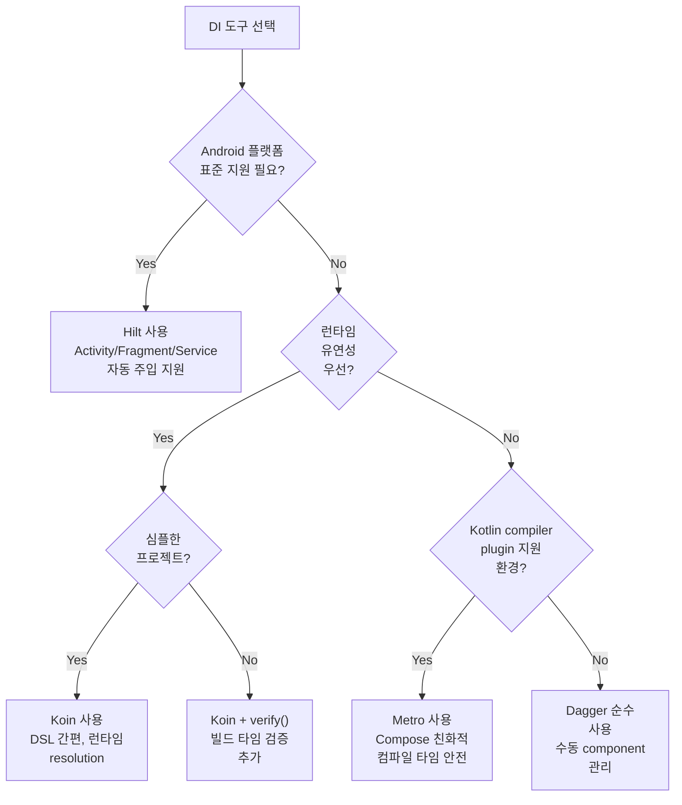

## DI Tool Comparison and Engine Contracts

### Dagger와 Hilt
**Dagger**는 compile time에 dependency graph를 생성하고 검증하는 정적 DI engine이다. Android component 생성 시점과 표준 hierarchy 통합은 **Hilt**를 통해 공식적으로 지원된다. Dagger 자체는 정적 graph 엔진이지 Android lifecycle 정책을 강제하지는 않는다.

#### Hilt 코드 예시
```kotlin
// Module: 의존성 제공
@Module
@InstallIn(SingletonComponent::class)
object RepositoryModule {
    @Singleton
    @Provides
    fun provideUserRepository(
        apiService: ApiService
    ): UserRepository = UserRepositoryImpl(apiService)
}

// Activity: 자동 주입
@AndroidEntryPoint
class MainActivity : AppCompatActivity() {
    @Inject
    lateinit var userRepository: UserRepository
    
    override fun onCreate(savedInstanceState: Bundle?) {
        super.onCreate(savedInstanceState)
        // userRepository는 Hilt가 생성해서 주입해줌
        userRepository.getUsers()
    }
}
```

### Koin
**Koin** classic DSL은 Kotlin 코드로 definition을 선언하고 container가 런타임에 dependency를 resolve한다. 런타임 resolution 편의성을 제공하며, compiler plugin이나 module verify()를 쓰면 빌드 타임 검증을 앞당길 수 있다.

#### Koin 코드 예시
```kotlin
// 모듈 정의
val repositoryModule = module {
    single<UserRepository> {
        UserRepositoryImpl(get())  // get()은 ApiService 의존성 자동 해결
    }
    single { ApiService() }
}

// Activity에서 사용
class MainActivity : AppCompatActivity() {
    private val userRepository: UserRepository by inject()
    
    override fun onCreate(savedInstanceState: Bundle?) {
        super.onCreate(savedInstanceState)
        // container.startKoin { modules(repositoryModule) }으로 초기화됨
        userRepository.getUsers()
    }
}
```

### Metro
**Metro**는 Kotlin compiler plugin 기반의 compile-time DI로, get_it 식 전역 locator가 아니라 graph가 생성자를 호출하고 binding을 검증하게 두는 도구다. 상세 아키텍처와 멀티모듈 바인딩 계약은 [Metro DI 아키텍처와 멀티모듈 바인딩 계약](metro-di.md)을 참조한다.


#### Metro 코드 예시
```kotlin
// 의존성 정의
class UserRepositoryImpl(val apiService: ApiService) : UserRepository

// 컴파일 타임에 graph 생성
@Composable
fun rememberUserRepository(): UserRepository {
    val apiService = remember { ApiService() }
    return remember(apiService) { UserRepositoryImpl(apiService) }
}

// 사용
val userRepository = rememberUserRepository()
```

### Compile-time DI와 Runtime DI의 실패 시점
Dagger/Hilt, Metro 같은 compile-time DI는 누락 binding, cycle을 build 단계에서 드러낸다. 반면 runtime resolution 성격이 강한 구성은 해당 실행 경로에서 처음 예외가 발생할 수 있다.

### DSL 문법은 ownership과 lifetime 계약을 바꾸지 않는다
Koin DSL, Compose 등의 DSL 문법은 선언을 쉽게 하지만 owner와 lifetime을 자동으로 올바르게 만들어 주지는 않는다. 언제 생성되고 사라지는지 별도로 설계해야 한다.

### DI 도구 선택 의사결정



### 도구별 선택 매트릭스

| 기준 | Dagger | Hilt | Koin | Metro |
|---|---|---|---|---|
| **검증 시점** | Compile-time | Compile-time | Runtime (optional verify) | Compile-time |
| **Android lifecycle 통합** | 수동 | 자동 (Activity/Fragment) | 수동 | 수동 |
| **학습 곡선** | 높음 (graph 이해 필요) | 중간 (Hilt 문법만) | 낮음 (DSL 간편) | 중간 (compiler plugin) |
| **성능** | 높음 (zero-cost) | 높음 (zero-cost) | 중간 (런타임 resolve) | 높음 (zero-cost) |
| **Compose 친화도** | 낮음 | 중간 | 중간 | 높음 |
| **모듈 단위 검증** | 가능 | 가능 | verify() 플러그인 | 가능 |
