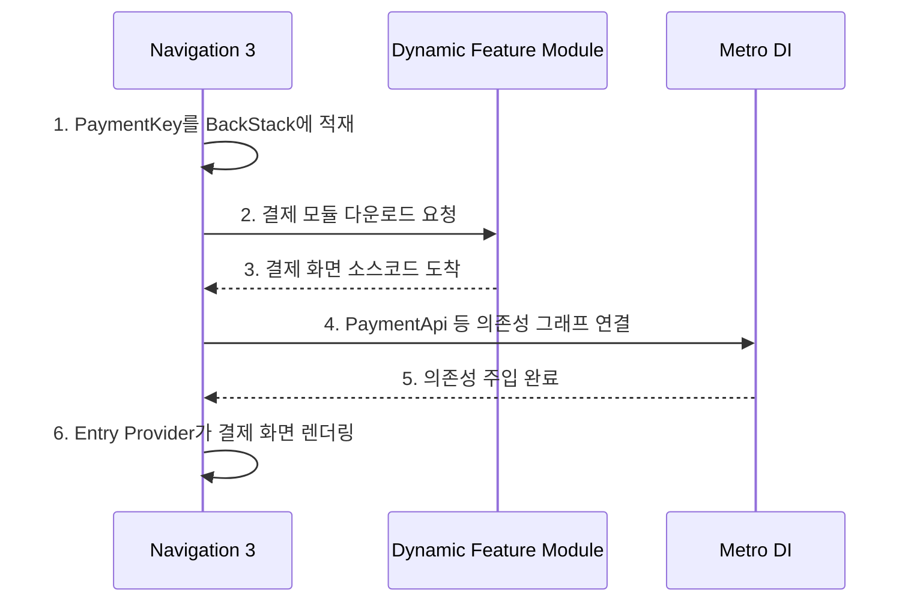

# Dynamic Feature Module

### 3-1. 개념

앱을 처음 다운로드할 때는 **최소한의 메인 기능만 다운**받고, 유저가 특정 기능(결제, 고급 카메라 필터 등)을 클릭하는 순간 해당 모듈의 코드와 UI를 **구글 서버에서
실시간으로 다운로드해 앱에 합체(Dynamic Delivery)** 시키는 기술.

* **Flutter 매핑**: Deferred Loading (지연 로딩 / 온디맨드 로딩)

### 3-2. Navigation 3와의 연결

기존 Navigation 2에서는 코드 파일이 없으면 NavGraph를 그릴 수 없어 에러가 발생했지만, **Navigation 3는 백스택이 단순 `List<Any>`**이므로:

1. 일단 `PaymentKey`를 백스택에 넣고
2. Dynamic Feature 모듈이 구글 서버에서 다운로드 완료되면
3. Entry Provider가 화면을 동적으로 결합해 무대에 올림

### 3-3. Metro + Dynamic Feature Module 조합

Navigation 3 + Metro DI + Dynamic Feature Module **트리오 결합**:

> [!NOTE]
> Metro의 초보자용 사용 방법은 [metro-di-get-it-guide](01_inbox/mobile/android/02_app_framework/dependency-injection/frameworks/metro-di-get-it-guide.md)를 참조하세요.
> KAPT/KSP에서 컴파일러 플러그인으로의 진화와 Metro의 빌드 속도 이점에 대한 상세
> 내용은 [android-build-system-and-serialization](01_inbox/mobile/android/03_packaging_deployment/build/versioning-and-serialization/android-build-system-and-serialization.md)
> 를 참조하세요.
