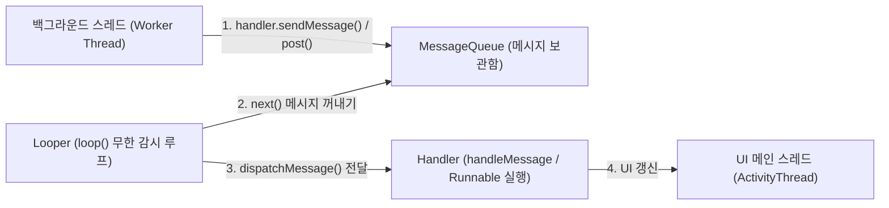

## Handler & Looper & MessageQueue (안드로이드 메인 이벤트 루프)

### 1. 개요 (Overview)

**Handler, Looper, MessageQueue** 삼총사는 Android 단일 스레드 모델에서 **스레드 간 메시지(Message) 및 작업(Runnable)을 주고받고, 순차적으로 일관성 있게 처리하기 위해 구축된 이벤트 루프(Event Loop) 아키텍처**이다.

[ActivityThread](activity-thread.md) 메인 스레드는 시작과 동시에 이 이벤트 루프를 가동하여, 화면 터치 이벤트, 애니메이션 프레임, 생명주기 콜백 및 백그라운드 스레드 결과 전달을 일관되게 수용한다.

---

#### 초보자를 위한 쉽게 이해하는 비유

- **`MessageQueue` (신문 우체통 상자)**:
  - 배달할 편지나 신호(Message/Runnable)가 타임스탬프 순서대로 차곡차곡 쌓이는 **우체통 보관함**.
- **`Looper` (우체통을 계속 감시하는 열성 우체부)**:
  - 우체통(`MessageQueue`) 앞에 서서 **무한 루프(`loop()`)를 돌며 편지가 들어오는지 24 시간 감시하다가, 편지가 오면 하나씩 꺼내 전달하는 우체부**.
- **`Handler` (편지를 발송하고 수신한 편지를 해석하는 통신 창구)**:
  - 다른 스레드에서 우체통에 편지를 넣고(`sendMessage/post`), 우체부(`Looper`)가 꺼내온 편지를 실제로 읽고 작업을 실행하는(`handleMessage`) **통신 단말기 창구**.



---

### 2. 3 대 구성 요소의 역할과 상호작용

1. **`MessageQueue`**:
   - 스레드당 1 개만 존재하는 C++ 층의 `epoll` 기반 메시지 큐.
   - 실행 예정 시각(Target Time)순으로 정렬되어 메시지를 보관한다. 메시지가 없으면 스레드를 대기(Sleep) 상태로 전환하여 CPU 소비를 0 으로 만든다.
2. **`Looper`**:
   - `ThreadLocal` 에 저장되는 스레드 전속 무한 루프 객체.
   - `Looper.prepare()` 로 생성하고 `Looper.loop()` 로 무한 순환하며 `MessageQueue` 에서 메시지를 꺼내 Handler 로 전달한다.
3. **`Handler`**:
   - 특정 스레드의 `Looper` 와 바인딩되어 메시지를 큐에 추가(`enqueueMessage`)하거나, 꺼내진 메시지를 전달받아 `handleMessage()` 콜백으로 처리한다.

---

### 3. 실전 사용 코드 패턴 및 주의사항

```kotlin
// 1. 백그라운드 스레드에서 메인 스레드 Handler 로 작업 전달
val mainHandler = Handler(Looper.getMainLooper())

thread {
    // 무거운 백그라운드 작업 수행
    val result = doHeavyComputation()
    
    // UI 스레드로 결과 전달
    mainHandler.post {
        updateUI(result)
    }
}
```

- **안티패턴: 메모리 누수 (Implicit Reference Leak)**:
  - Activity 내부에서 넌스태틱(Non-static) 익명 클래스로 `Handler` 를 선언하면, `Message` 가 큐에 남아있는 동안 outer Activity 에 대한 암묵적 참조가 유지되어 메모리 누수가 발생한다. 반드시 `static` / `companion object` 로 선언하거나 `WeakReference` 를 사용해야 한다.

---

### 4. 연결 문서 (Related Links)

- [ActivityThread](activity-thread.md) - Handler/Looper 메인 이벤트 루프를 구동하는 메인 스레드 진입점
- [system_server](../04_system_services/system-server.md) - Handler 를 통해 앱 프로세스로 트랜잭션을 전송하는 시스템 서비스
