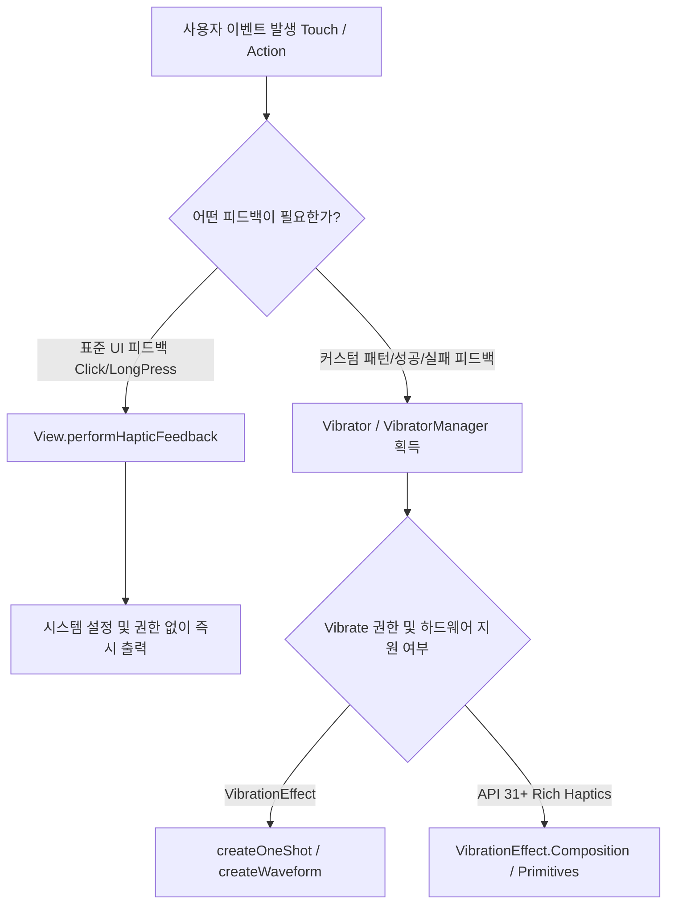

# Haptic Feedback: 촉각적 UX 및 진동 모터 제어 완전 가이드

`Haptic Feedback`은 사용자가 화면을 터치하거나 특정 이벤트가 발생했을 때, 기기의 **진동 모터(Vibration Motor)**를 제어하여 시각/청각 정보 외에 **물리적 촉각 반응(Tactile Feedback)**을 제공함으로써 피드백 전달력과 UX 몰입감을 극대화하는 안드로이드 기술입니다.

---

## 1단계: 개념 소개 & 비유 (Core Concept & Analogy)

### 비유로 이해하기: 촉각으로 연주하는 악기 (Tactile Musical Instrument) 🎻

Android 햅틱 제어는 **촉각 악기 연주**와 매우 유사합니다.

* **단순 진동 (`Vibrator.vibrate(500)`)**: 악기의 줄을 뚱~ 하고 강하게 한 번 튕기는 단조로운 단음입니다.
* **상수 기반 햅틱 (`HapticFeedbackConstants`)**: 악기에 미리 조율된 건반(클릭, 긴 누름, 키보드 탭)을 눌러 사용자에게 익숙한 표준 타악음을 내는 것입니다.
* **웨이브폼/파형 햅틱 (`VibrationEffect.createWaveform`)**: 음표의 길이, 진폭(Volume), 주파수를 정밀하게 악보로 그려 다채롭고 섬세한 교향곡(성공, 실패, 틱-톡-틱-톡 시계 톱니 느낌)을 연주하는 것과 같습니다.

```text
[단순 진동]  ─────────> "부웅~" (단조로운 피드백)
[표준 햅틱]  ─────────> "톡", "딸깍" (익숙하고 정교한 버튼 피드백)
[웨이브폼]   ─────────> "두-둥.. 톡톡" (진폭/패턴이 연주되는 하이엔드 햅틱)
```

---

## 2단계: 안드로이드 햅틱 시스템 구조 (Architecture & Decision Flow)

안드로이드는 UI 뷰 단위에서 간편하게 처리하는 **View Haptic API**와 진동 모터를 직접 제어하는 **Vibrator System API**의 두 가지 접근 방식을 제공합니다.



### 접근 방식 비교

| 구분 | View.performHapticFeedback() | Vibrator / VibrationEffect |
| :--- | :--- | :--- |
| **목적** | 버튼 클릭, 키보드 탭, Long Click 등 표준 UI 피드백 | 성공/실패 패턴, 게임 효과, 커스텀 진동 패턴 |
| **권한 필요 여부** | **불필요** | **`android.permission.VIBRATE` 필요** |
| **시스템 옵션 연동** | 사용자의 '햅틱 피드백 활성화' 설정에 자동 종속 | 시스템 설정 및 무음 모드 조건을 직접 확인 권장 |
| **복잡도** | 매우 간단 (1줄) | 상대적으로 코드 복잡 (버전별 분기 처리 필요) |

---

## 3단계: 핵심 API & 주요 상수 (Key APIs & Constants)

### 1. `HapticFeedbackConstants` (View 레벨)
* `KEYBOARD_TAP`: 가상 키보드 입력 시 촉각.
* `VIRTUAL_KEY`: 가상 홈/뒤로가기 버튼 입력 시 촉각.
* `LONG_PRESS`: 긴 누름 피드백.
* `CONFIRM` (API 30+): 작업 성공/승인 피드백.
* `REJECT` (API 30+): 작업 실패/거절 피드백.
* `TOGGLE_ON` / `TOGGLE_OFF` (API 34+): 스위치 토글 피드백.

### 2. `VibrationEffect` (API 26+)
* `createOneShot(milliseconds, amplitude)`: 단발성 진동 (진폭 1~255 제어).
* `createWaveform(timings, amplitudes, repeat)`: 파형 진동 패턴 (시간 배열과 진폭 배열 조합).
* `createPredefined(effectId)`: `EFFECT_CLICK`, `EFFECT_HEAVY_CLICK`, `EFFECT_DOUBLE_CLICK`, `EFFECT_TICK` 등 디바이스 사전 정의 효과.

---

## 4단계: 실전 활용 코드 예시 (Practical Code Examples)

### 예시 1: 간결한 View 햅틱 피드백 실행 (추천)

권한 선언이 필요 없으며 가장 안전한 방법입니다.

```kotlin
import android.view.HapticFeedbackConstants
import android.view.View

fun onButtonClick(view: View) {
    // 1. 일반 클릭 햅틱 피드백
    view.performHapticFeedback(HapticFeedbackConstants.VIRTUAL_KEY)
}

fun onLongTouchView(view: View) {
    // 2. 롱 클릭 햅틱 피드백
    view.performHapticFeedback(HapticFeedbackConstants.LONG_PRESS)
}
```

### 예시 2: Android 버전 대응 커스텀 Vibrator 헬퍼 클래스

`AndroidManifest.xml` 권한 필요:
```xml
<uses-permission android.permission.VIBRATE />
```

```kotlin
import android.content.Context
import android.os.Build
import android.os.VibrationEffect
import android.os.Vibrator
import android.os.VibratorManager

class HapticHelper(private val context: Context) {

    private val vibrator: Vibrator by lazy {
        if (Build.VERSION.SDK_INT >= Build.VERSION_CODES.S) {
            val vibratorManager = context.getSystemService(Context.Vibrator_MANAGER_SERVICE) as VibratorManager
            vibratorManager.defaultVibrator
        } else {
            @Suppress("DEPRECATION")
            context.getSystemService(Context.VIBRATOR_SERVICE) as Vibrator
        }
    }

    // 1. 단발성 진동 (시간 및 강도 제어)
    fun triggerCustomShot(durationMs: Long = 50, amplitude: Int = VibrationEffect.DEFAULT_AMPLITUDE) {
        if (!vibrator.hasVibrator()) return

        if (Build.VERSION.SDK_INT >= Build.VERSION_CODES.O) {
            val effect = VibrationEffect.createOneShot(durationMs, amplitude)
            vibrator.vibrate(effect)
        } else {
            @Suppress("DEPRECATION")
            vibrator.vibrate(durationMs)
        }
    }

    // 2. 성공/실패 커스텀 파형 패턴 진동
    fun triggerSuccessPattern() {
        if (!vibrator.hasVibrator()) return

        if (Build.VERSION.SDK_INT >= Build.VERSION_CODES.O) {
            // [대기 0ms, 진동 40ms, 대기 60ms, 진동 40ms]
            val timings = longArrayOf(0, 40, 60, 40)
            // [진폭 0, 강도 100, 진폭 0, 강도 255] (두 번째 진동이 더 강함)
            val amplitudes = intArrayOf(0, 100, 0, 255)
            
            val waveform = VibrationEffect.createWaveform(timings, amplitudes, -1) // -1은 반복 없음
            vibrator.vibrate(waveform)
        } else {
            @Suppress("DEPRECATION")
            vibrator.vibrate(longArrayOf(0, 40, 60, 40), -1)
        }
    }
}
```

---

## 5단계: 주의사항 & 꿀팁 (Pitfalls & Best Practices)

> [!IMPORTANT]
> **1. 사용자의 피로감 고려 (Overuse Avoidance)**
> 모든 버튼 터치마다 강한 진동을 발생시키면 손가락 피로감을 유발하고 사용자가 피드백을 무시하게 됩니다. 일반 조작에는 미세한 `KEYBOARD_TAP`이나 `VIRTUAL_KEY`를 사용하고, 중요 성공/실패/경고 순간에만 커스텀 진동 패턴을 적용하세요.

> [!WARNING]
> **2. 하드웨어 지원 여부 및 설정 확인**
> 구형 기기(ERM 진동 모터)는 진폭(Amplitude) 제어를 지원하지 않을 수 있습니다. `vibrator.hasAmplitudeControl()`을 확인하여 하드웨어 제약 조건에 맞춰 예외 처리하세요. 또한, 시스템 '무음 모드' 또는 '진동 끔' 상태를 무시하고 강제로 울리는 무분별한 햅틱은 UX를 해칩니다.

### 핵심 요약 체크리스트 💡
- [x] 단순 UI 클릭 피드백인가요? -> `view.performHapticFeedback()` 사용 (권한 미필요)
- [x] 커스텀 파형 진동이 필요한가요? -> `VIBRATE` 권한 추가 및 `VibrationEffect.createWaveform()` 활용
- [x] Android 12(API 31) 이상 대응 시 `VibratorManager`로 구성을 업데이트했나요?

---

## 연관 참고 문서
* [ViewTreeObserver](./view-tree-observer.md)
* [Custom View](./custom-view.md)
