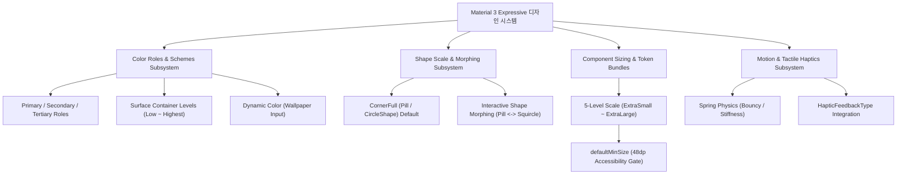

## Material 3 Expressive 디자인 시스템 및 컴포넌트 아키텍처

**Material 3 Expressive (M3 Expressive)** 디자인 시스템은 기존 Material 3 의 시각적 언어를 확장하여, 고정된 UI 규격을 넘어서 **[색상 역할(Color Roles) + Shape 스케일 & Morphing + 컴포넌트 크기 토큰 번들 + 타이포그래피 + 모션 물리]**가 유기적으로 상호작용하는 종합 컴포저블 디자인 시스템 아키텍처 지도다.

---

### 1. M3 Expressive 아키텍처 구조도 (System Overview)

---

### 2. M3 Expressive 4대 핵심 서브시스템 계약 지도

1. **Color Roles & Dynamic Scheme 서브시스템**:
   - [Material 3 색상 역할은 고정된 색상이 아닌 의미적 의도를 표현한다](./material3-color-roles-express-semantic-intent-not-fixed-colors.md)
   - [Material 3 on-color와 surface 계열은 대비와 계층을 함께 만든다](./material3-on-colors-and-surfaces-pair-contrast-with-hierarchy.md)
   - [Dynamic Color는 Material Color Scheme에 대한 플랫폼 입력이다](./dynamic-color-is-platform-input-to-a-material-color-scheme.md)
   - *핵심*: 단순 `#FF0000` 색상이 아닌 `primaryContainer`, `surfaceContainerHigh` 등 시각적 깊이와 다크 모드/동적 테마 호환성을 위한 의미적 역할(Semantic Roles)을 매핑한다.

2. **Shape Scale & Shape Morphing 서브시스템**:
   - [Material 3 Expressive Shape 스케일과 인터랙티브 Shape Morphing 계약](./m3-expressive-shape-scale-and-interactive-shape-morphing.md)
   - *핵심*: 모든 버튼의 디폴트 사양인 `CornerFull` (Pill Shape)을 기본으로 유지하고, 누름(Pressed) 상태 시 물리 용수철 애니메이션 기반의 Shape Morphing 피드백을 제공한다.

3. **Component Sizing & Token Bundles 서브시스템**:
   - [Material 3 Expressive 컴포넌트 크기 스케일과 토큰 번들 계약](./m3-expressive-component-sizing-and-token-bundles.md)
   - [Material 3 Expressive는 크기, Shape, 타이포그래피, 패딩 토큰과 Shape Morphing을 결합한다](../../layout-and-ui/compose-ui-contracts/m3-expressive-bundles-size-shape-typography-padding-and-shape-morphing.md)
   - *핵심*: 크기(Small~ExtraLarge)에 따른 높이/폰트/패딩 토큰 번들링과 `.defaultMinSize(minWidth = 48.dp, minHeight = minHeight)` 터치 접근성 보장 규약.

4. **Motion & Haptics 모션 서브시스템**:
   - [HapticFeedbackType은 UX 인터랙션과 안드로이드 플랫폼 햅틱 패턴을 1:1 매핑한다](../../../../04_system_services/device-capabilities/haptics-vibrator-contracts/haptic-feedback-types-map-ux-interactions-to-platform-patterns.md)
   - [AnimationSpec은 시간, 물리, 반복 정책을 정의한다](../../layout-and-ui/compose-ui-contracts/animation-spec-defines-time-physics-and-repeat-policy.md)
   - *핵심*: 햅틱 파동과 Spring 물리 모션의 결합으로 입체적인 대화형 촉각 피드백을 완성한다.

---

### 3. 관련 문서 및 참조

상위 문서: [Compose Design System 은 Material Theme 과 프로젝트 토큰을 통합한다](../compose-design-system.md)

공식 가이드: [Material Design 3 Expressive Guidelines](https://m3.material.io/)

검증일: 2026-08-05. Material Design 3 Expressive 전체 시스템 아키텍처 매핑 완료.
