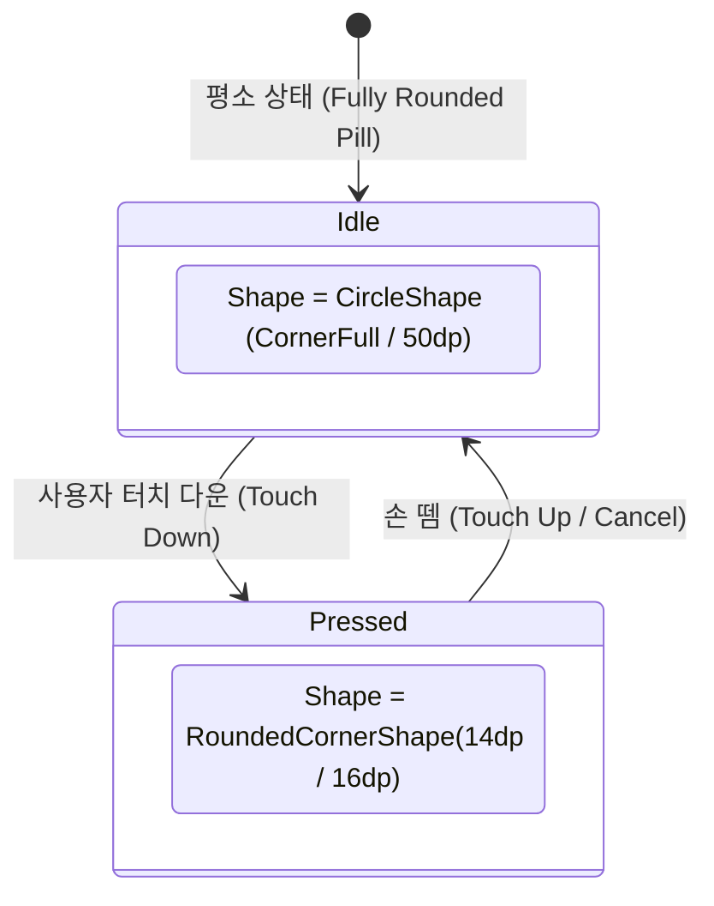

## Material 3 Expressive Shape 스케일과 인터랙티브 Shape Morphing 계약

Material 3 Expressive (M3 Expressive) 시스템에서 **Shape(모서리 모양)**는 단순한 정적 테두리 곡률이 아니라, **기본 형태(Fully Rounded Pill Shape)를 유지하다가 사용자 터치 인터랙션(Pressed, Selected 등)에 따라 동적으로 모서리 곡률이 반응 변형되는 Shape Morphing 피드백 시스템**으로 동작한다.

---

### 1. 개념 및 핵심 명제 (What)

- **Shape Scale 사양**:
  - `CornerNone` (0.dp)
  - `CornerExtraSmall` (4.dp) / `CornerSmall` (8.dp) / `CornerMedium` (12.dp) / `CornerLarge` (16.dp) / `CornerExtraLarge` (28.dp)
  - **`CornerFull` (`CircleShape` / Fully Rounded Pill / 50.dp+)**: 모든 M3 Expressive 기본 버튼 및 주요 대화형 컴포넌트의 디폴트 사양이다.
- **인터랙티브 Shape Morphing (Interactive Shape Morphing)**:
  - 평소(Idle) 상태에서는 양 끝이 완전히 둥근 **Pill (캡슐 / `CircleShape`)** 모형을 유지한다.
  - 사용자가 버튼을 손으로 누르는(Pressed) 순간, 모서리 곡률이 100ms 파동으로 오므라들며 **둥근 사각형(Squircle / Compressed Shape: 12dp ~ 16dp)**으로 실시간 변형된다.
  - 손을 떼면 용수철(Spring Physics) 반동을 타고 다시 원복된다.

---

### 2. 왜 Shape Morphing 피드백이 필요한가? (Why)

1. **촉각 및 시각적 반응성 극대화**: 단순 평면 색상 변경(Ripple Effect)만으로는 작은 터치스크린에서 즉각적인 피드백을 전달하기 어렵다. Shape 자체가 물리적으로 오므라드는 변형 효과를 통해 확실한 터치 감각을 제공한다.
2. **컴포넌트 그룹화 및 상태 구별**: 리스트 툴바나 토글 컴포넌트에서 선택(Selected)되었을 때 형태가 둥근 Pill 에서 사각형 형태로 굳어지는 시각적 구별을 형성한다.

---

### 3. 내부 메커니즘 및 물리 스프링 보간 (How)



---

### 4. 올바른 구현 코드 예시

```kotlin
@Composable
fun ExpressiveMorphingShape(isPressed: Boolean): Shape {
    // 평소: Fully Rounded (50.dp), 눌렀을 때: 둥근 사각형 (14.dp)
    val targetRadius = if (isPressed) 14.dp else 50.dp

    val animatedRadius by animateDpAsState(
        targetValue = targetRadius,
        animationSpec = spring(
            dampingRatio = Spring.DampingRatioMediumBouncy,
            stiffness = Spring.StiffnessHigh
        ),
        label = "ShapeMorphingAnimation"
    )

    return RoundedCornerShape(CornerSize(animatedRadius))
}
```

---

### 5. 관련 문서 및 참조

- 상위 문서: [Material 3 Expressive 디자인 시스템 및 컴포넌트 아키텍처](./m3-expressive-design-system-and-component-architecture.md)
- 관련 계약 문서:
  - [Material 3 Expressive 컴포넌트 크기 스케일과 토큰 번들 계약](./m3-expressive-component-sizing-and-token-bundles.md)
  - [Material 3 색상 역할은 고정된 색상이 아닌 의미적 의도를 표현한다](./material3-color-roles-express-semantic-intent-not-fixed-colors.md)

공식 가이드: [Material Design 3 - Shape System Overview](https://m3.material.io/styles/shape/overview)

검증일: 2026-08-05. M3 Expressive Shape Scale 및 Interactive Morphing 사양 반영 완료.
