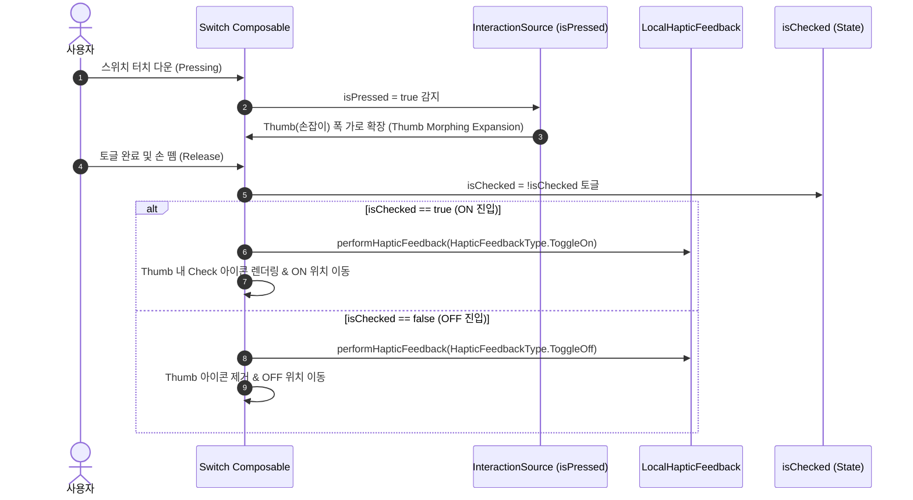

## Material 3 Expressive Switch 는 Thumb Morphing, Check 아이콘 및 Toggle 햅틱 계약을 따른다

Material 3 Expressive (M3 Expressive) 명세에서의 **`Switch` 컴포넌트**는 정적인 ON/OFF 이진 상태 전환을 넘어서, **(1) 누름/드래그 상태 시 Thumb(손잡이) 폭이 확장되는 Interactive Thumb Morphing, (2) ON 상태 시 Thumb 내부 Check 아이콘 표시, (3) `ToggleOn` 및 `ToggleOff` 상태별 독립 햅틱 피드백**을 상호작용의 표준 계약으로 지정한다.

---

### 1. 개념 및 핵심 명제 (What)

- **Interactive Thumb Morphing (손잡이 반응형 변형)**:
  - 사용자가 스위치를 손으로 누르거나(Pressed) 드래그하는 순간, Thumb(손잡이)의 폭이 가로로 늘어나며 확장(Expansion) 피드백을 제공한다.
  - 토글이 완료되어 손을 떼는 순간, 용수철(Spring Physics) 모션을 타고 목적지(ON/OFF)로 이동하며 둥근 원형/캡슐로 복원된다.
- **Thumb Icon 시각 명세 (ON 상태 Check 아이콘)**:
  - **`checked == true` (ON 상태)**: Thumb 내부에 Check 아이콘(`Icons.Filled.Check`)을 표시하여 토글이 활성화되었음을 명확히 시각화한다.
  - **`checked == false` (OFF 상태)**: Thumb 내부 아이콘을 비우거나 깔끔하게 처리하여 트랙 색상과의 시각적 대비(Contrast)를 극대화한다.
- **상태별 이원화 햅틱 피드백 (`ToggleOn` vs `ToggleOff`)**:
  - 단순 클릭 햅틱이 아니라, `isChecked` 상태 변화에 따라 **`HapticFeedbackType.ToggleOn`**(ON 상태 진입)과 **`HapticFeedbackType.ToggleOff`**(OFF 상태 진입) 햅틱을 구별하여 호출해야 한다.

---

### 2. 왜 M3 Expressive Switch 계약이 필요한가? (Why)

1. **상태 인지 명확성 극대화**: 색약 사용자나 야외 직사광선 환경에서 단색 변경만으로는 토글 상태를 오인할 수 있다. Thumb 내부 Check 아이콘과 햅틱 구별을 통해 시각적/촉각적 이중 확신을 제공한다.
2. **다감각 물리 피드백 (Multisensory Feedback)**: Thumb 가 터치 압력에 반응해 확장되는 Shape Morphing 과 `ToggleOn`/`ToggleOff` 햅틱 파동이 결합되어 컴포넌트의 물리적 몰입감을 형성한다.

---

### 3. 내부 메커니즘 및 상태 변화 (How)



---

### 4. 현대 Jetpack Compose M3 Expressive 올바른 구현 예시

```kotlin
@OptIn(ExperimentalMaterial3Api::class)
@Composable
fun ExpressiveM3Switch(
    checked: Boolean,
    onCheckedChange: (Boolean) -> Unit,
    modifier: Modifier = Modifier
) {
    val haptic = LocalHapticFeedback.current

    Switch(
        checked = checked,
        onCheckedChange = { newChecked ->
            // 1. 상태별 ToggleOn / ToggleOff 햅틱 피드백 이원화 호출
            haptic.performHapticFeedback(
                if (newChecked) HapticFeedbackType.ToggleOn else HapticFeedbackType.ToggleOff
            )
            onCheckedChange(newChecked)
        },
        modifier = modifier,
        // 2. M3 표준 Thumb Icon 명세: ON 상태 시 Check 아이콘 표시
        thumbContent = {
            if (checked) {
                Icon(
                    imageVector = Icons.Filled.Check,
                    contentDescription = "선택됨",
                    modifier = Modifier.size(SwitchDefaults.IconSize)
                )
            } else {
                null // OFF 상태 시 비워서 대비 극대화
            }
        },
        colors = SwitchDefaults.colors(
            checkedThumbColor = MaterialTheme.colorScheme.onPrimary,
            checkedTrackColor = MaterialTheme.colorScheme.primary,
            uncheckedThumbColor = MaterialTheme.colorScheme.outline,
            uncheckedTrackColor = MaterialTheme.colorScheme.surfaceContainerHighest
        )
    )
}
```

---

### 5. 관련 문서 및 참조

상위 문서: [Material 3 Expressive 디자인 시스템 및 컴포넌트 아키텍처](./m3-expressive-design-system-and-component-architecture.md)

관련 계약 문서:

- [Material 3 Expressive Shape 스케일과 인터랙티브 Shape Morphing 계약](./m3-expressive-shape-scale-and-interactive-shape-morphing.md)
- [HapticFeedbackType은 UX 인터랙션과 안드로이드 플랫폼 햅틱 패턴을 1:1 매핑한다](../../../../04_system_services/device-capabilities/haptics-vibrator-contracts/haptic-feedback-types-map-ux-interactions-to-platform-patterns.md)
- [Material 3 색상 역할은 고정된 색상이 아닌 의미적 의도를 표현한다](./material3-color-roles-express-semantic-intent-not-fixed-colors.md)

공식 가이드: [Material Design 3 - Switch Specs](https://m3.material.io/components/switch/specs)

검증일: 2026-08-05. Material Design 3 Expressive Switch 명세 및 Compose Material 3 릴리즈 사양 검증 완료.
