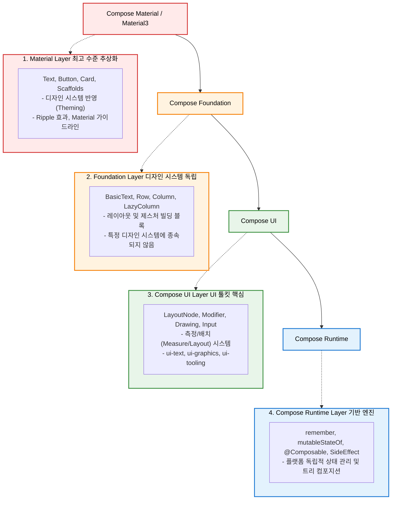

# 컴포즈의 4가지 아키텍처 레이어 (Core Layers)

Jetpack Compose는 모듈식 계층 구조로 설계되어 있어, 개발자가 필요한 수준의 추상화 단계를 선택하여 사용할 수 있습니다. 아래 다이어그램은 각 레이어의 관계와 주요 구성요소를 보여줍니다.

```mermaid
graph TD
    classDef high fill:#FFEAEA,stroke:#D32F2F,stroke-width:2px,color:#000000;
    classDef mid fill:#FFF3E0,stroke:#F57C00,stroke-width:2px,color:#000000;
    classDef low fill:#E8F5E9,stroke:#388E3C,stroke-width:2px,color:#000000;
    classDef runtime fill:#E3F2FD,stroke:#1976D2,stroke-width:2px,color:#000000;

    Material[Compose Material / Material3] --> Foundation[Compose Foundation]
    Foundation --> ComposeUI[Compose UI]
    ComposeUI --> Runtime[Compose Runtime]
    
    subgraph MaterialLayer [1. Material Layer 최고 수준 추상화]
        MaterialText["Text, Button, Card, Scaffolds<br/>- 디자인 시스템 반영 (Theming)<br/>- Ripple 효과, Material 가이드라인"]
    end
    
    subgraph FoundationLayer [2. Foundation Layer 디자인 시스템 독립]
        BasicText["BasicText, Row, Column, LazyColumn<br/>- 레이아웃 및 제스처 빌딩 블록<br/>- 특정 디자인 시스템에 종속되지 않음"]
    end
    
    subgraph UILayer [3. Compose UI Layer UI 툴킷 핵심]
        UIElements["LayoutNode, Modifier, Drawing, Input<br/>- 측정/배치(Measure/Layout) 시스템<br/>- ui-text, ui-graphics, ui-tooling"]
    end
    
    subgraph RuntimeLayer [4. Compose Runtime Layer 기반 엔진]
        RuntimeElements["remember, mutableStateOf, @Composable, SideEffect<br/>- 플랫폼 독립적 상태 관리 및 트리 컴포지션"]
    end

    Material -.-> MaterialLayer
    Foundation -.-> FoundationLayer
    ComposeUI -.-> UILayer
    Runtime -.-> RuntimeLayer

    class Material,MaterialLayer high;
    class Foundation,FoundationLayer mid;
    class ComposeUI,UILayer low;
    class Runtime,RuntimeLayer runtime;
```

---
