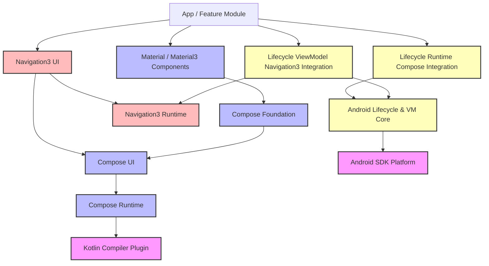

# Androidx Modularization & Jetpack Compose Module Architecture

이 문서는 Android 라이브러리의 핵심인 `androidx`의 역사적 배경부터 시작하여 왜 패키지가 잘게 쪼개져 수많은 import 구조를 가질 수밖에 없는지, 그리고 Jetpack Compose와 Navigation3를 포함한 세분화된 모듈 구조와 의존성 관계를 정리합니다.

---

## 1. 'androidx'는 무엇이며 왜 생겨났는가?

### 1-1. 'androidx'의 어원
`androidx`는 **Android Extension**의 줄임말입니다. 뒤에 붙은 `x`는 확장(Extension)을 의미하며, 향후 안드로이드 프레임워크와 완전히 분리되어 독립적으로 진화할 수 있도록 설계된 차세대 지원 라이브러리 패키지 명칭입니다.

### 1-2. 역사적 배경: Android Support Library에서 androidx로의 전환
* **과거 (android.support.*)**: 
  구글은 안드로이드 OS 버전이 파편화되는 문제를 해결하기 위해 OS 버전에 상관없이 새로운 UI 컴포넌트나 백포트 기능을 쓸 수 있게 `support-v4`, `support-v7` 같은 라이브러리를 배포했습니다. 하지만 버전 숫자가 붙은 이름(v4는 API Level 4 이상 지원을 의미했으나 시간이 흘러 무의미해짐) 때문에 관리가 혼란스러워졌고, 라이브러리들이 서로 엉켜 덩치가 너무 커졌습니다.
* **현재 (androidx.*)**:
  2018년 구글은 이를 완전히 리팩토링하여 **Jetpack**이라는 브랜드 하에 모든 확장 라이브러리를 `androidx` 패키지명 아래로 통합시켰습니다. 이때부터 엄격한 시맨틱 버저닝(Semantic Versioning)을 따르고 각 모듈을 철저하게 분리하기 시작했습니다.

---

## 2. 왜 안드로이드는 수많은 패키지를 import해야 하는가?

안드로이드 프로젝트(특히 Jetpack Compose와 Modern Android Development)를 보면 사소한 함수 하나를 쓰기 위해 수많은 라이브러리 의존성(Gradle Dependency)을 추가하고 `import`해야 합니다. 이는 구글이 의도적으로 설계한 **모듈화(Modularization) 아키텍처** 때문입니다.

### 2-1. 단일 거대 라이브러리(Monolith)의 문제점 해결
과거 라이브러리 하나에 모든 기능을 다 집어넣었을 때는 사용하지 않는 기능까지 앱 빌드에 포함되어 앱 용량(APK)이 불필요하게 커지고 빌드 시간이 극도로 길어졌습니다.

### 2-2. 느슨한 결합(Loose Coupling)과 관심사 분리
예를 들어 UI 레이아웃과 생명주기(Lifecycle), 뷰모델(ViewModel), 네비게이션(Navigation)은 서로 관련이 있지만 **이론적으로 완전히 분리될 수 있는 영역**입니다.
* 개발자는 UI 그리기에 Compose를 쓰고 싶지만, 아키텍처 패턴은 MVVM 대신 다른 걸 쓰고 싶을 수 있습니다.
* 반대로, 뷰모델은 그대로 쓰되 화면 그리기는 기존의 XML View System을 쓰고 싶을 수 있습니다.
* 구글은 이를 위해 **핵심 엔진만 각각 독립된 모듈로 만들고, 이들을 연결해 주는 중간 다리(Bridge)용 모듈을 따로 출시**하는 전략을 취했습니다.

### 2-3. 모듈별 독립적인 릴리즈 주기 (Rapid Release Cycles)
모든 라이브러리가 하나로 묶여 있으면 사소한 버그 하나를 고치기 위해 프레임워크 전체를 업데이트해야 합니다. 하지만 패키지를 쪼개놓으면 `androidx.compose.runtime`은 안정적이니 그대로 두고, 버그가 발생한 `androidx.navigation`만 따로 패키지 버전을 올려 빠르게 배포할 수 있습니다.

---

## 3. 세분화된 모듈 레이어 및 의존성 아키텍처

아래의 그림은 기존 컴포즈 코어뿐만 아니라 Navigation 및 하위 그래픽 바인딩 모듈까지를 포함한 확장 아키텍처입니다.

### 상세 패키지 분할 구조 및 실제 예시

| 모듈(Artifact) | 실제 Import 경로 예시 | 핵심 역할 및 관심사 분리 이유 |
| :--- | :--- | :--- |
| **`compose.runtime`** | `androidx.compose.runtime.*` | **순수 런타임 상태 관리**: 화면에 무언가 그려지는 일조차 모릅니다. 단지 상태 변화값(`mutableStateOf`)이 들어왔을 때 코틀린 컴파일러와 협력해 어느 지점이 재호출되어야 하는지만 판별합니다. (KMP를 통해 iOS/Desktop에서도 공통 사용) |
| **`compose.ui`** | `androidx.compose.ui.*` | **물리적인 측정과 그리기**: 컴포즈 런타임 위에서 실제 좌표계, 터치 제스처, 포커스, 레이아웃 정렬 등을 담당합니다. |
| **`compose.foundation`** | `androidx.compose.foundation.*` | **일반화된 UI 빌딩 블록**: 디자인 정책이 가미되지 않은 순수 스크롤, 리스트, 제스처, 모양 등을 정의합니다. |
| **`compose.material3`** | `androidx.compose.material3.*` | **구글 브랜드 테마 가이드라인**: Material Design 규격에 최적화된 테마(Color, Typography) 및 기성품 컴포넌트를 제공합니다. |
| **`lifecycle-viewmodel`** | `androidx.lifecycle.ViewModel` | **비즈니스 로직 수명 주기**: 플랫폼(Activity)의 비정상 종료 및 재생성 생명주기 동안 데이터를 유지하기 위한 순수 아키텍처 라이브러리입니다. |
| **`lifecycle-runtime-compose`** | `androidx.lifecycle.compose.*` | **생명주기 감지 바인딩**: 안드로이드 Lifecycle 상태의 변화(Start, Stop 등)를 Compose UI가 효율적으로 구독할 수 있도록 돕는 다리 모듈입니다. |
| **`navigation3-runtime`** | `androidx.navigation3.runtime.*` | **순수 백스택 관리**: 화면이 그려지는 방식(UI)과 관계없이 화면을 식별하는 키(`NavKey`)가 들어오고 나가는 백스택 상태만을 제어합니다. |
| **`navigation3-ui`** | `androidx.navigation3.ui.*` | **화면 전환 렌더러**: 백스택의 변경사항을 Compose UI 화면으로 변환하여 그려주는 UI 컴포넌트(`NavDisplay`)를 제공합니다. |
| **`lifecycle-viewmodel-navigation3`**| `androidx.lifecycle.viewmodel.navigation3.*` | **내비게이션 전용 VM 바인딩**: 백스택의 각 화면(`NavEntry`) 단위로 독립적인 ViewModel 수명주기를 결합해 주는 특화 모듈입니다. |

---

## 4. 왜 Android 패키지들은 '-runtime'을 따로 분리해 놓았을까?

안드로이드의 최신 라이브러리들(특히 Jetpack Compose나 Navigation3)을 보면 항상 이름 뒤에 **`-runtime`**이 붙은 패키지가 분리되어 있는 것을 볼 수 있습니다.

이와 같이 런타임 패키지를 분리하는 아키텍처적 이유는 크게 3가지로 설명할 수 있습니다.

### 4-1. 플랫폼 독립성 (Multiplatform & KMP)
가장 결정적인 이유는 **"안드로이드 OS 색깔 빼기"**입니다.
* **Compose Runtime** 패키지는 스마트폰 화면에 픽셀을 어떻게 그리는지 전혀 모릅니다. 단지 **"상태(State)가 바뀔 때 어떤 데이터 트리(Slot Table)를 갱신해야 하는가"**라는 순수한 알고리즘만 처리합니다.
* 이 런타임은 안드로이드 OS에 종속된 코드가 없기 때문에, 그대로 복사해서 **iOS, Desktop, Web**에 사용할 수 있습니다. 실제로 Jetbrains의 **Compose Multiplatform**은 구글의 `compose.runtime`을 100% 그대로 가져다 쓰며, 화면에 그리는 `compose.ui`만 각 OS(iOS는 UIKit Canvas, Web은 Canvas/HTML)에 맞춤형으로 구현해서 결합합니다.
* `navigation3.runtime` 역시 마찬가지입니다. 백스택에 값을 넣고 빼는 논리 구조(`NavBackStack`)는 안드로이드 화면 전환 애니메이션이나 OS API와 무관하므로 런타임에 속하며, 이를 화면에 그리는 `navigation3.ui` 모듈과 철저히 격리됩니다.

### 4-2. 컴파일러 플러그인과의 역할 분담 (Compile-time vs Run-time)
* **Compile-time (컴파일 시점)**: 코틀린 컴파일러 플러그인은 개발자가 작성한 `@Composable` 어노테이션을 분석해 상태 추적용 코드를 주입하고 바이너리를 변형합니다.
* **Run-time (실행 시점)**: 컴파일된 코드가 스마트폰에서 실행될 때, 메모리에 올라가서 실제로 돌기 위해 필요한 최소한의 공통 백업 뼈대 인터페이스들이 모인 곳이 바로 `compose.runtime` 라이브러리입니다.

### 4-3. 테스트 용이성 (Unit Testing)
UI 라이브러리를 테스트하는 것은 매우 무겁고 까다롭습니다. 에뮬레이터나 디바이스를 띄워야 하기 때문입니다.
* 하지만 `-runtime` 모듈들은 안드로이드의 `Context`나 `View` 객체, 디바이스 화면과 엮여있지 않은 **순수 코틀린 JVM 라이브러리**입니다.
* 따라서 개발자나 구글 엔진팀은 무거운 에뮬레이터를 켜지 않고도 런타임 모듈의 상태 변화, 백스택 로직 등을 **로컬 컴퓨터에서 1초 만에 실행되는 JUnit Test**로 완벽하게 검증할 수 있습니다.

---

## 5. 참조 문서

* **Compose 아키텍처 레이어링**: 상위 레이어에서 하위 API 수준으로 내려가는 "Dropping Down" 설계 철학 및 포킹 주의사항은 [[jetpack-compose-architectural-layering]] 문서를 참조하세요.
* **ViewModel과 화면 상태**: `ViewModel`을 화면 단위 state holder로 쓰는 기준, `UiState`, user action, 일회성 이벤트, Reducer 분리 기준은 [[viewmodel-ui-state-reducer]]를 참조하세요.
