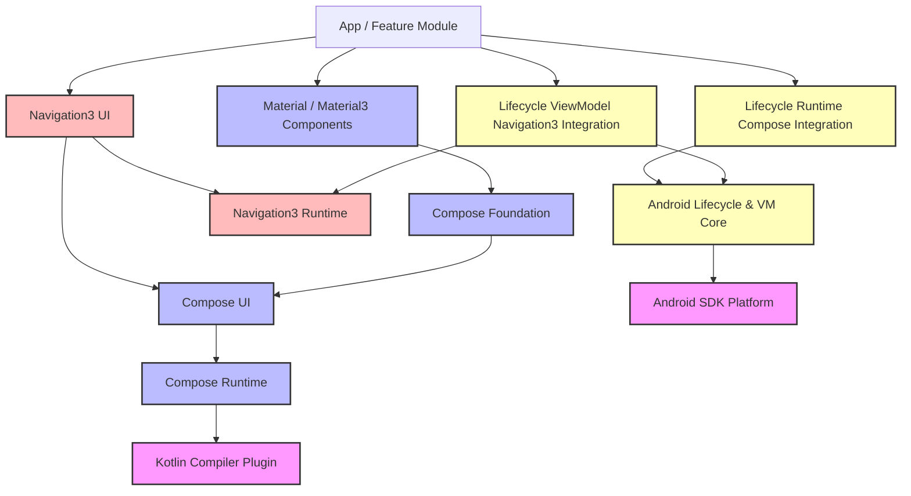

# 세분화된 모듈 레이어 및 의존성 아키텍처

아래의 그림은 기존 컴포즈 코어뿐만 아니라 Navigation 및 하위 그래픽 바인딩 모듈까지를 포함한 확장 아키텍처입니다.

### 상세 패키지 분할 구조 및 실제 예시

| 모듈(Artifact) | 실제 Import 경로 예시 | 핵심 역할 및 관심사 분리 이유 |
| :--- | :--- | :--- |
| **`compose.runtime`** | `androidx.compose.runtime.*` | **순수 런타임 상태 관리**: 화면에 무언가 그려지는 일조차 모릅니다. 단지 상태 변화값(`mutableStateOf`)이 들어왔을 때 코틀린 컴파일러와 협력해 어느 지점이 재호출되어야 하는지만 판별합니다. (KMP를 통해 iOS/Desktop에서도 공통 사용) |
| **`compose.ui`** | `androidx.compose.ui.*` | **물리적인 측정과 그리기**: 컴포즈 런타임 위에서 실제 좌표계, 터치 제스처, 포커스, 레이아웃 정렬 등을 담당합니다. |
| **`compose.foundation`** | `androidx.compose.foundation.*` | **일반화된 UI 빌딩 블록**: 디자인 정책이 가미되지 않은 순수 스크롤, 리스트, 제스처, 모양 등을 정의합니다. |
| **`compose.material3`** | `androidx.compose.material3.*` | **구글 브랜드 테마 가이드라인**: Material Design 규격에 최적화된 테마(Color, Typography) 및 기성품 컴포넌트를 제공합니다. |
| **`lifecycle-viewmodel`** | `androidx.lifecycle.ViewModel` | **비즈니스 로직 수명 주기**: 플랫폼(Activity)의 비정상 종료 및 재생성 생명주기 동안 데이터를 유지하기 위한 순수 아키텍처 라이브러리입니다. |
| **`lifecycle-runtime-compose`** | `androidx.lifecycle.compose.*` | **생명주기 감지 바인딩**: 안드로이드 Lifecycle 상태의 변화(Start, Stop 등)를 Compose UI가 효율적으로 구독할 수 있도록 돕는 다리 모듈입니다. |
| **`navigation3-runtime`** | `androidx.navigation3.runtime.*` | **순수 백스택 관리**: 화면이 그려지는 방식(UI)과 관계없이 화면을 식별하는 키(`NavKey`)가 들어오고 나가는 백스택 상태만을 제어합니다. |
| **`navigation3-ui`** | `androidx.navigation3.ui.*` | **화면 전환 렌더러**: 백스택의 변경사항을 Compose UI 화면으로 변환하여 그려주는 UI 컴포넌트(`NavDisplay`)를 제공합니다. |
| **`lifecycle-viewmodel-navigation3`**| `androidx.lifecycle.viewmodel.navigation3.*` | **내비게이션 전용 VM 바인딩**: 백스택의 각 화면(`NavEntry`) 단위로 독립적인 ViewModel 수명주기를 결합해 주는 특화 모듈입니다. |

---
