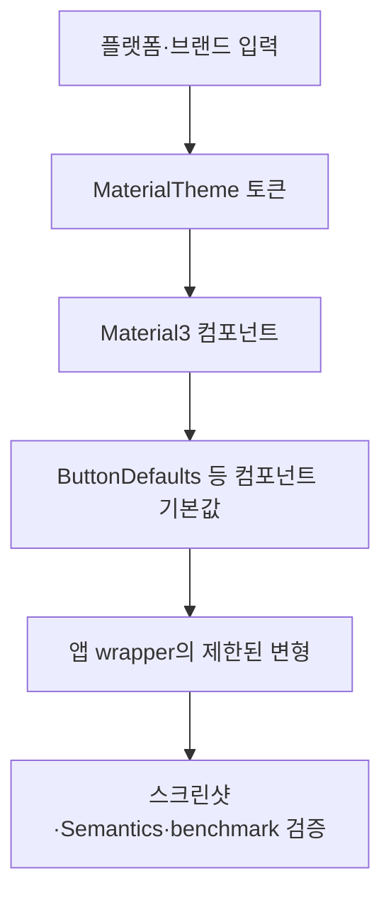

## Material 3 Expressive는 테마 토큰과 컴포넌트 API를 계층적으로 적용한다

Material 3 Expressive는 별도 렌더러가 아니라 Material 3의 색·타이포그래피·shape·motion과 컴포넌트 API가 확장된 디자인 방향이다. 앱은 먼저 `MaterialTheme`에 전역 토큰을 공급하고, 버튼 크기나 상호작용 shape처럼 컴포넌트에만 있는 선택은 해당 `Defaults` API에서 적용한다.



```kotlin
@Composable
fun AppTheme(content: @Composable () -> Unit) {
    MaterialTheme(
        colorScheme = AppColorScheme,
        typography = AppTypography,
        shapes = AppShapes,
        content = content,
    )
}

@Composable
fun PrimaryAction(label: String, onClick: () -> Unit) {
    Button(
        onClick = onClick,
        shapes = ButtonDefaults.shapes(),
    ) {
        Text(label)
    }
}
```

`ButtonDefaults.shapes()` 같은 expressive API는 지원하는 Material3 버전에서 button의 interaction state에 따른 shape 집합을 전달한다. 모든 컴포넌트가 shape morphing, 다섯 크기, 햅틱을 공통으로 제공한다고 일반화하면 안 된다. `Switch.thumbContent`는 아이콘 slot이고, `LocalHapticFeedback` 호출은 앱이 별도로 선택하는 UX 정책이다.

설계 결정은 세 층으로 나눈다.

| 층 | 소유하는 결정 | 증거 |
|---|---|---|
| Theme | scheme, typography, shape scale | theme별 screenshot |
| Component API | 지원 상태·size·shape parameter | API reference와 컴파일 |
| App wrapper | 브랜드 제한, 햅틱, telemetry | UI test와 실제 기기 관찰 |

실험적 API는 안정 API와 같은 영구 계약으로 기록하지 않는다. artifact 버전, `@OptIn` 여부, fallback 구현을 함께 남기고 업그레이드 때 API reference와 screenshot baseline을 다시 확인한다.

관련 노트: [Material 3 Expressive 컴포넌트 크기와 토큰 선택](m3-expressive-sizing-tokens.md), [Material 3 Expressive shape 스케일과 상호작용 shape 변형](m3-expressive-shapes-morphing.md), [Switch의 thumb 아이콘과 햅틱은 별도 계약이다](m3-expressive-switch.md)

출처: [Material Design 3 in Compose](https://developer.android.com/develop/ui/compose/designsystems/material3), [Material 3 Button API](https://developer.android.com/reference/kotlin/androidx/compose/material3/Button.composable)
