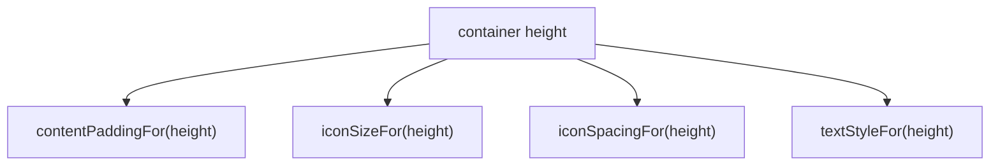

## Material 3 Expressive의 크기 토큰은 컴포넌트별 API로 선택한다

Material 3 Expressive가 모든 UI 컴포넌트에 동일한 5단계 크기를 자동 적용하는 것은 아니다. 현재 Compose Material 3의 `Button` 계열은 ExtraSmall·Small·Medium·Large·ExtraLarge container height와 그 높이에 맞는 padding·icon·text style helper를 제공한다. 다른 컴포넌트는 각 API의 `Defaults` 계약을 따로 확인해야 한다.

```kotlin
@Composable
fun LargeEditButton(onClick: () -> Unit) {
    val height = ButtonDefaults.LargeContainerHeight
    Button(
        onClick = onClick,
        modifier = Modifier
            .heightIn(min = height)
            .testTag("large_edit"),
        contentPadding = ButtonDefaults.contentPaddingFor(
            buttonHeight = height,
            hasStartIcon = true,
        ),
    ) {
        Icon(
            Icons.Default.Edit,
            contentDescription = null,
            modifier = Modifier.size(ButtonDefaults.iconSizeFor(height)),
        )
        Spacer(Modifier.size(ButtonDefaults.iconSpacingFor(height)))
        Text("편집", style = ButtonDefaults.textStyleFor(height))
    }
}
```

이 예제의 결합 메커니즘은 자동 추론이 아니라 같은 `height`를 네 helper에 명시적으로 전달해 만드는 것이다.



고정 숫자를 자체 표로 복제하면 Material3 버전 변화와 어긋날 수 있다. `ButtonDefaults` 상수와 helper를 정본으로 삼고, 실험적/alpha API를 사용할 때는 artifact 버전과 opt-in 요구를 모듈 문서에 남긴다. 시각 container 크기와 최소 터치 target도 같은 개념이 아니므로 작은 variant는 접근성 검사까지 통과해야 한다.

관찰 증거는 각 variant의 screenshot과 Compose UI test 결과다. 태그 노드의 높이와 클릭 가능 여부를 assert하고, 글꼴 배율 2.0에서도 label이 잘리거나 touch target이 축소되지 않는지 실제 기기에서 확인한다.

관련 노트: [Material 3 Expressive 디자인 시스템 및 컴포넌트 아키텍처](m3-expressive-architecture.md), [Material 3 Expressive shape 스케일과 상호작용 shape 변형](m3-expressive-shapes-morphing.md)

출처: [Material 3 Button API](https://developer.android.com/reference/kotlin/androidx/compose/material3/Button.composable), [ButtonDefaults API](https://developer.android.com/reference/kotlin/androidx/compose/material3/ButtonDefaults)
