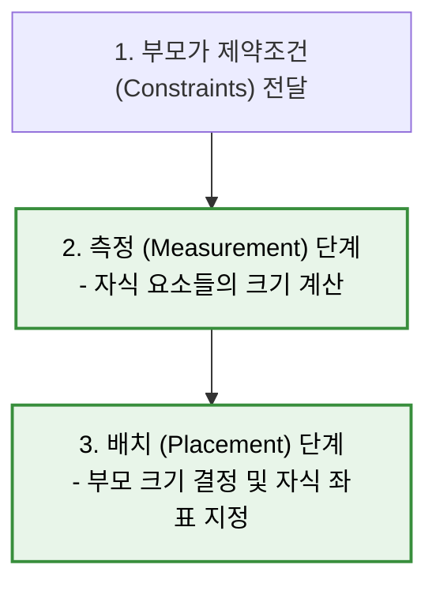
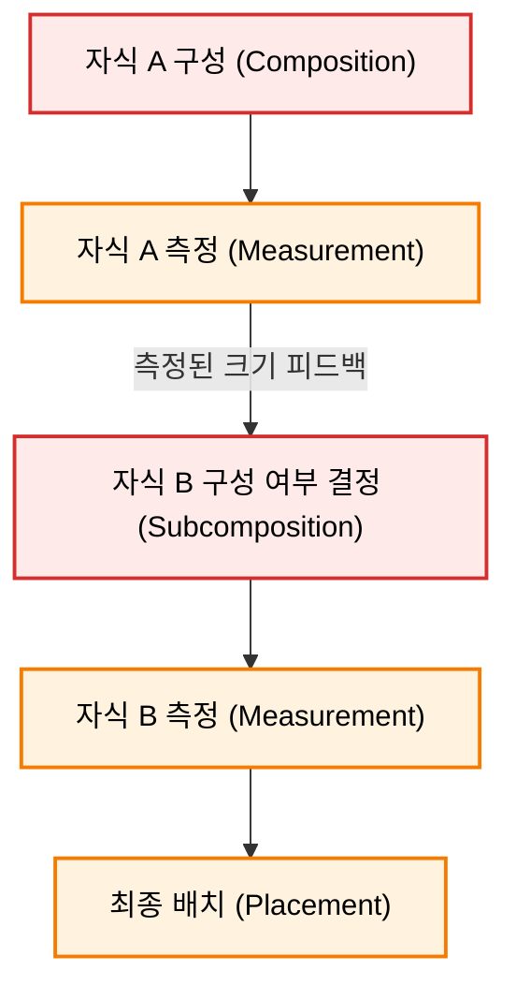

# Jetpack Compose 고급 레이아웃 (Advanced Layouts)

이 문서는 기본 제공 레이아웃(Row, Column 등)만으로 구현하기 어려운 복잡하고 정교한 UI를 구현하기 위한 **고급 레이아웃 개념(Advanced Layout Concepts)** 을 다룹니다.

---

## 1. 커스텀 레이아웃 제작과 레이아웃 단계 (Layout Phase)

기본 제공 레이아웃으로 표현할 수 없는 독창적인 디자인(예: 복잡한 타임라인 그래프, 원형 배치 뷰 등)을 구현할 때는 `Layout` 컴포저블을 사용하여 직접 커스텀 레이아웃을 정의합니다.

### 1-1. 레이아웃 단계의 2가지 핵심 스텝

레이아웃 단계는 모든 컴포저블 노드를 순회하며 다음 두 단계를 거쳐 크기와 위치를 확정합니다.



1. **측정 (Measurement) 단계**:
   * 부모 레이아웃이 자식들에게 제약 조건(Constraints: 최소/최대 너비와 높이)을 전달합니다.
   * 자식 요소들은 전달받은 제약 조건을 준수하며 자신의 크기(`Placeable`)를 측정합니다.
2. **배치 (Placement) 단계**:
   * 측정된 자식들의 크기를 취합하여 부모 레이아웃 스스로의 최종 크기를 결정합니다.
   * 부모 레이아웃은 2D 공간상의 구체적인 `(X, Y)` 좌표를 계산하여 자식들을 배치(`placeable.place()`)합니다.

### 1-2. 단일 패스 측정 원칙 (Single-Pass Measurement)
* **제약**: Compose는 성능 최적화를 위해 **모든 자식 요소를 단 한 번만 측정**할 수 있도록 제한합니다.
* **이유**: 기존 Android XML 뷰 시스템은 중첩된 뷰 그룹 내에서 자식을 여러 번 반복 측정하는 **이중 측정(Double Taxation)** 이 잦아 성능 저하를 유발했습니다. Compose는 $O(N)$의 선형 시간 복잡도로 빠르게 레이아웃을 처리하기 위해 이를 아키텍처 수준에서 금지합니다.

---

## 2. 레이아웃 수정자 (Layout Modifier) & 제약 조건 덮어쓰기

전체 커스텀 레이아웃을 만드는 것이 과도할 때(Overkill), 단 하나의 컴포저블 속성이나 여백만을 부모 제약 조건과 다르게 직접 조작하기 위해 `Modifier.layout`을 사용합니다.

### 2-1. Modifier.layout 사용법
개별 컴포저블의 측정 및 배치 로직에 직접 개입할 수 있습니다.

```kotlin
fun Modifier.customPosition() = this.layout { measurable, constraints ->
    // 1. 전달받은 제약조건으로 자식을 측정
    val placeable = measurable.measure(constraints)
    
    // 2. 부모의 크기 및 자식의 배치 위치 지정
    layout(placeable.width, placeable.height) {
        // 원하는 X, Y 위치에 배치
        placeable.placeRelative(0, 0)
    }
}
```

### 2-2. Modifier.width vs Modifier.requiredWidth (제약 조건 강제)
부모 레이아웃이 자식에게 엄격한 제약(Constraints)을 보낼 때, Modifier가 작동하는 방식의 차이를 이해해야 합니다.

* **Modifier.width**:
  * 부모가 제공하는 제약 조건 범위 내에서 작동합니다.
  * 만약 부모가 최대 너비를 `100.dp`로 제한(`Constraints.maxWidth`)하고 자식이 `Modifier.width(150.dp)`를 요구하더라도, **부모의 제약 조건이 우선(Override)** 하여 최종 너비는 `100.dp`로 강제 제한됩니다.
* **Modifier.requiredWidth**:
  * 부모가 부여한 제약 조건을 무시하고 지정한 크기를 강제로 보장합니다.
  * 부모의 최대 너비가 `100.dp`라 하더라도 `requiredWidth(150.dp)`를 적용하면 자식은 `150.dp` 크기로 그려지며, 이로 인해 부모 영역을 벗어나는 오버플로우나 클리핑(Clipping)이 발생할 수 있습니다.

---

## 3. 조건부 배치를 위한 서브컴포즈 레이아웃 (SubcomposeLayout)

원래 Jetpack Compose는 `Composition(구성) -> Layout(측정/배치) -> Drawing(그리기)`의 단방향 흐름으로 작동합니다. 그러나 **"자식 A의 측정 결과(크기)를 보고 자식 B를 구성(Compose)할지 말지"** 를 결정해야 하는 예외적인 경우에는 이 순서를 조율할 수 있는 `SubcomposeLayout`을 사용합니다.



### 3-1. 동작 원리
1. 특정 자식(Subcomposable)들의 컴포지션 단계를 지연시킵니다.
2. 먼저 활성화된 자식 노드들을 측정하여 구체적인 크기를 알아냅니다.
3. 측정된 크기를 기반으로 동적으로 새로운 자식 노드를 구성(Compose)하고 추가로 측정 및 배치합니다.

### 3-2. 대표적인 활용 사례
* **LazyColumn / LazyRow**: 화면의 전체 높이/너비를 측정한 후, 화면에 실제로 표시되는 영역만큼만 아이템들을 동적으로 그리기(Subcompose) 위해 사용합니다.
* **BoxWithConstraints**: 부모 레이아웃이 주는 최대/최소 제약 조건을 미리 파악한 후, 그 크기에 맞추어 내부 콘텐츠 컴포저블을 다르게 구성하고 싶을 때 사용합니다.

---

## 4. 고유 크기 측정 (Intrinsic Measurements)

Compose는 단일 패스 측정 원칙을 고수하지만, **"실제 자식들을 측정하기 전에 특정 크기 정보를 미리 조회"** 해야 하는 상황을 해결하기 위해 고유 크기 측정(Intrinsic Measurements) 기능을 제공합니다.

### 4-1. 언제 사용하는가?
자식 컴포넌트들의 실제 콘텐츠 길이에 의존하여 부모 크기를 결정하고, 그 부모 크기를 다시 모든 자식 컴포넌트에 동일하게 전파해야 할 때 유용합니다.

```
[Intrinsic Size 적용 예시]
Column (가장 넓은 버튼 너비에 맞추어 모든 버튼 통일)
┌────────────────────────┐
│      [ 짧은 버튼 ]       │ -> IntrinsicSize.Max 너비 적용
├────────────────────────┤
│   [ 매우 긴 텍스트 버튼 ]  │ -> 이 버튼의 너비가 기준이 됨
└────────────────────────┘
```

### 4-2. 작동 방식

부모 레이아웃(예: `Column`)에 `Modifier.width(IntrinsicSize.Max)`를 설정하면, 실제 세밀한 레이아웃 측정 단계를 밟기 전에 자식들에게 **"너희가 콘텐츠를 다 표현하기 위해 필요한 최대 너비가 얼마니?"** 라고 사전 질의(Pre-measure Query)를 보냅니다. 자식들이 회신한 최댓값을 기준으로 부모의 너비 제약조건을 고정한 뒤 단일 패스 측정을 완수합니다.

---

## 5. 관련 문서

* **제약 조건과 Modifier 순서**: [[jetpack-compose-constraints-and-modifier-order|compose_constraints_and_modifiers_order.md]]
* **렌더링 파이프라인 개요**: [[jetpack-compose-phases-and-layout-system|compose_phases_and_layout.md]]
* **애니메이션 시스템**: [[jetpack-compose-animation|compose_animation.md]]

