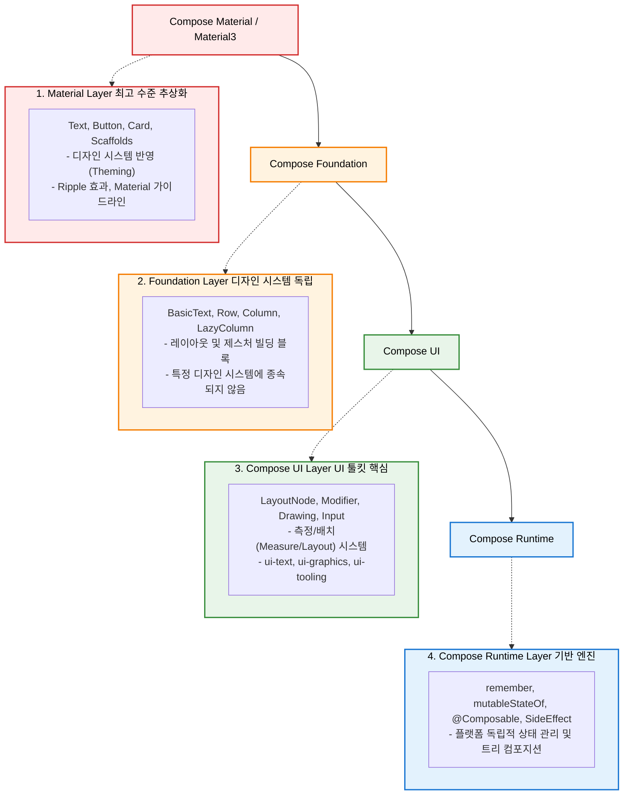

# Jetpack Compose Architectural Layering (아키텍처 레이어링)

이 문서는 Jetpack Compose의 계층화된 아키텍처(Architectural Layering) 구조와 핵심 설계 원칙, 그리고 상위 레벨에서 하위 레벨 API로 내려가는 "Dropping Down" 설계 철학에 대해 상세히 다룹니다.

---

## 1. 컴포즈의 4가지 아키텍처 레이어 (Core Layers)

Jetpack Compose는 모듈식 계층 구조로 설계되어 있어, 개발자가 필요한 수준의 추상화 단계를 선택하여 사용할 수 있습니다. 아래 다이어그램은 각 레이어의 관계와 주요 구성요소를 보여줍니다.

---

## 2. 각 레이어의 역할과 세부 메커니즘

| 레이어 | 주요 패키지(Artifact) 및 API | 핵심 역할 및 특징 |
| :--- | :--- | :--- |
| **Compose Material (Material3)** | `androidx.compose.material3.*` `Text`, `Button`, `FloatingActionButton`, ripple | **가장 높은 추상화 수준**: 구글의 Material Design 규격을 완벽하게 구현한 모듈입니다. 테마 설정, 색상/타이포그래피 시스템 및 접근성(Accessibility) 가이드라인을 기본적으로 준수합니다. |
| **Compose Foundation** | `androidx.compose.foundation.*` `Row`, `Column`, `LazyColumn`, `BasicText`, gestures | **디자인 시스템 불요**: 특정 브랜드 디자인 가이드라인에 얽매이지 않는 기본 UI 구조와 제스처 메커니즘을 제공합니다. 커스텀 디자인 시스템을 구축하려는 프로젝트는 이 레이어를 기반으로 시작합니다. |
| **Compose UI** | `androidx.compose.ui.*` `LayoutNode`, `Modifier`, `graphics`, `text` | **UI 툴킷의 뼈대**: 측정(Measure), 배치(Layout), 그리기(Drawing), 포커스 및 터치 입력 전달을 담당하는 핵심 UI 인프라 레이어입니다. |
| **Compose Runtime** | `androidx.compose.runtime.*` `remember`, `mutableStateOf`, `SideEffect` | **상태 및 트리 관리 엔진**: 화면 렌더링에 관여하지 않고, 트리 구성과 상태 변경 감지(Recomposition)만을 순수하게 처리합니다. Kotlin Multiplatform(KMP)을 통해 iOS, Desktop, Web 등 다른 플랫폼에서도 공용으로 쓰입니다. |

---

## 3. "Dropping Down" 디자인 철학 (하향식 설계 모델)

Jetpack Compose는 개발자가 원하는 대로 **하위 레이어로 직접 하강(Drop Down)**하여 유연하게 커스터마이징을 할 수 있는 아키텍처적 유연성을 보장합니다.

### 3-1. 동작 원리: 래퍼(Wrapper) 구조
Compose의 고수준 컴포넌트들은 마법처럼 새로운 것을 띄우는 것이 아니라, 하위 레이어의 기본 컴포넌트들을 감싼 **래퍼(Wrapper)** 형태로 구현되어 있습니다.
* 예: `androidx.compose.material.Text` (Material)는 내부적으로 `androidx.compose.foundation.text.BasicText` (Foundation)를 호출하며 테마 스타일을 입힌 구조입니다.
* 발견 가능성(Discoverability)을 높이기 위해 가장 일반적이고 직관적인 명칭(`Text`)은 최상위 Material 레이어에 부여하고, 하위 레이어 컴포넌트에는 접두사(`BasicText`)를 붙여 구별합니다.

### 3-2. 언제 Drop Down해야 하는가?
1. **커스텀 디자인 시스템 구축**: 프로젝트가 Material Design을 전혀 사용하지 않고 자체적인 디자인 가이드라인을 갖는 경우, Material을 빼고 **Foundation**이나 **Compose UI**를 기반으로 전용 컴포넌트를 설계합니다.
2. **극단적인 커스터마이징**: 상위 컴포넌트가 제공하는 파라미터 한계를 초과하는 변형이 필요할 때, 하위 컴포넌트(`Basic...`)를 가져와 새롭게 구현합니다.

---

## 4. 포킹(Forking)에 대한 아키텍처적 주의사항 (Caution)

> [!WARNING]
> 상위 컴포넌트를 복사하여 직접 하위 수준 API로 구현하는 포킹(Forking)은 신중히 결정해야 합니다.

* **업스트림 기능 유실**: 상위 컴포넌트(예: Material3 Button)를 직접 포크하여 독자 컴포넌트를 만들 경우, 향후 구글이 해당 상위 컴포넌트에 추가할 **버그 수정, 성능 최적화, 신규 기능 및 접근성 개선 패치**를 자동으로 누릴 수 없게 됩니다.
* **유지보수 비용 상승**: 프레임워크가 업데이트될 때마다 직접 하위 레이어 바인딩 코드를 업데이트하고 호환성을 확인해야 합니다.
* **권장 접근**: 가능한 한 최상위 레이어 컴포넌트를 그대로 활용하고, Modifier나 테마 토큰 주입을 통해 커스터마이징을 시도하는 것이 장기적으로 유지보수에 유리합니다.

---

## 5. 참조 문서

* **AndroidX 모듈화 및 패키지 아키텍처**: 각 레이어별 Gradle 의존성 구조 및 `-runtime` 모듈의 분리 배경은 [[jetpack-compose-module-architecture|compose_architecture_guide.md]] 문서를 참조하세요.

