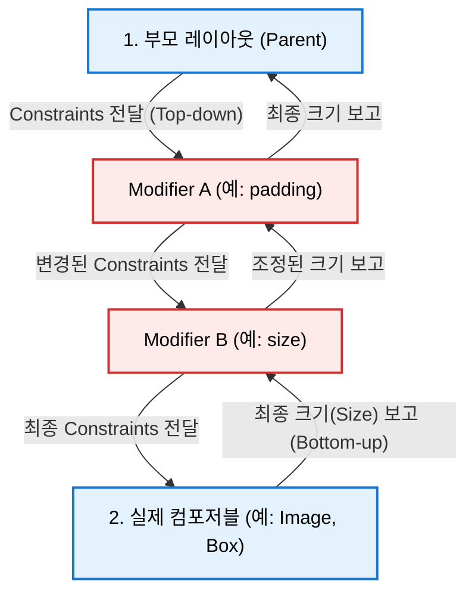

# Jetpack Compose 제약 조건과 Modifier 순서 (Constraints & Modifier Order)

이 문서는 Android Developers 공식 **"Constraints and modifier order - MAD Skills"** 기술 영상 분석을 바탕으로, Jetpack Compose의 제약 조건(Constraints) 시스템과 Modifier 체이닝 순서에 따른 작동 메커니즘을 상세히 정리합니다.

---

## 1. Jetpack Compose 제약 조건 (Constraints) 시스템

Compose 레이아웃 모델의 가장 핵심은 **제약 조건(Constraints)** 입니다. 부모 노드는 자식 노드에게 Constraints를 전달하며, 이 제약 조건은 아래 4개의 값으로 구성됩니다.

* **Min Width (최소 너비)** / **Max Width (최대 너비)**
* **Min Height (최소 높이)** / **Max Height (최대 높이)**

자식 노드는 반드시 이 최소값과 최대값 사이의 범위에서 최종 크기를 스스로 결정해야 합니다.

### 1-1. Constraints의 유형
* **Bounded Constraints (제한적 제약 조건)**: 최대 너비와 높이가 특정한 값(예: `1080px`, `1920px`)으로 지정되어 있는 형태입니다.
* **Unbounded Constraints (무제한 제약 조건)**: 최대 너비나 높이가 `Infinite(무한)`로 설정된 경우입니다. 스크롤이 가능한 `LazyColumn` 내부의 높이 제약이나, `Scrollable` 수정자가 적용된 경우가 이에 해당하며, 이 경우 자식은 자신의 컨텐츠 크기만큼 무제한으로 확장될 수 있습니다.

---

## 2. Modifier 체이닝의 작동 메커니즘 (Mental Model)

Compose의 모든 Modifier는 독립적인 컴포저블이 아니라, **기존 컴포저블 노드를 감싸는 데코레이터 래퍼 노드**를 빌드합니다. 따라서 체이닝 순서에 따라 제약 조건의 전달 방식과 최종 크기 계산 순서가 완전히 달라집니다.



### 2-1. Constraints 전달 (Top-down / Outside-to-Inside)
* 제약 조건은 **Modifier 체인의 첫 번째 요소(가장 바깥쪽)부터 시작해서 마지막 요소(가장 안쪽)를 거쳐 최종 컴포저블**로 흘러 내려갑니다.
* 각 Modifier는 부모로부터 받은 제약 조건을 자신의 역할에 맞게 변경하여 다음 Modifier나 컴포저블에 전달합니다.

### 2-2. 크기 결정 및 보고 (Bottom-up / Inside-to-Outside)
* 제약 조건을 최종 전달받은 실제 컴포저블(예: `Box`, `Text`)이 제약 조건 내에서 자신의 크기를 가장 먼저 결정합니다.
* 결정된 크기는 다시 **역순으로 Modifier 체인을 따라 올라가며(Bottom-up)** 보고됩니다. 각 Modifier는 필요에 따라 이 자식의 크기 보고를 보정하거나 그대로 상위 노드에 보고합니다.

---

## 3. 핵심 Modifier들이 제약 조건을 변경하는 방식

### 3-1. `Modifier.padding`
* **제약 조건 영향**: 다음 체인으로 전달하는 `Max Width`와 `Max Height` 값을 패딩 크기만큼 줄여서 전달합니다.
* **크기 보고 영향**: 안쪽 요소가 보고한 크기에 자신이 적용한 패딩 크기를 더해 상위 노드로 보고합니다.

### 3-2. `Modifier.size` & `Modifier.fillMaxSize` (크기 제약 조건의 상속과 강제)

이들 크기 수정자는 다음 체인으로 전달하는 `Min/Max Width`와 `Min/Max Height`를 특정 범위 혹은 고정 크기로 강제 변환합니다.

> [!IMPORTANT]
> **크기 강제 변환(Coercion) 규칙**: 
> 모든 크기 관련 수정자는 입력받은 Constraints 범위 내에서 작동하도록 강제(`coerceIn`)됩니다.
> * 예: `width = targetWidth.coerceIn(constraints.minWidth, constraints.maxWidth)`

이 규칙으로 인해 **상위(바깥쪽) 크기 수정자가 하위(안쪽) 크기 수정자의 범위를 강제로 제어**하게 됩니다.

#### 1) `Modifier.fillMaxSize()` 아래에 `Modifier.size(50.dp)`가 오는 경우
1. **`fillMaxSize()`** 는 부모로부터 넘어온 최대 제약 조건(예: `width: 0dp ~ 300dp`)을 받아서 `minWidth = maxWidth = 300dp`로 고정하여 전달합니다. 즉, 최소 크기와 최대 크기를 강제로 일치시킵니다.
2. 그 아래에 있는 **`size(50.dp)`** 는 `50.dp`를 요구하지만, 이미 상위에서 넘어온 제약 조건의 최솟값이 `300.dp`이기 때문에 강제 변환 수식(`50.dp.coerceIn(300.dp, 300.dp)`)에 의해 결국 **`300.dp`** 가 됩니다.
3. **결과**: 안쪽의 `size(50.dp)`는 완전히 무시되고 상위의 `fillMaxSize()` 크기를 따라갑니다.

#### 2) `Modifier.size(100.dp)` 아래에 `Modifier.size(50.dp)`가 오는 경우
1. **`size(100.dp)`** 가 다음 체인으로 넘겨주는 제약 조건은 `min = max = 100.dp`로 고정됩니다.
2. 아래에 있는 **`size(50.dp)`** 는 자신의 크기를 설정하려 하지만, 입력 제약 조건의 최소/최대가 `100.dp`이므로 `50.dp.coerceIn(100.dp, 100.dp)`에 의해 **`100.dp`** 로 결정됩니다.
3. **결과**: 이 경우 역시 하위의 작은 크기가 무시되고 상위의 큰 크기(`100.dp`)를 그대로 유지하게 됩니다.

### 3-3. `Modifier.requiredSize` (강제적 크기 해제)
* **제약 조건 영향**: `size`와 달리 부모가 강제한 Constraints 경계 조건(`min`, `max`)을 완전히 무시하고 지정한 크기를 강제로 밀어붙입니다.
* **사용 용도**: 상위 `size` 또는 `fillMaxSize` 체인을 무시하고 자식 고유의 크기를 확보하고 싶을 때 사용합니다.

### 3-4. `Modifier.wrapContentSize` (제약 조건 최소 범위 초기화)
상위 수정자로부터 물려받은 Constraints의 **최소 너비와 높이를 `0`으로 재설정(초기화)** 하여, 안쪽 컴포저블이 상위 고정 크기보다 작아질 수 있도록 허용합니다.

> [!NOTE]
> * **Constraints 변화**: `minWidth = 0`, `minHeight = 0`으로 변경하고, `maxWidth`와 `maxHeight`는 상위에서 넘어온 값을 그대로 전달합니다.
> * **Layout 변화**: 자식이 자신보다 더 작게 측정되는 것을 허용한 뒤, 남는 여분의 공간(상위 최대 크기 공간) 내에서 지정된 Alignment(기본값은 Center)에 따라 자식의 위치를 배치합니다.

#### 💡 [핵심 예시] `fillMaxSize()` $\rightarrow$ `wrapContentSize()` $\rightarrow$ `size(50.dp)` 순서로 체이닝된 경우
1. **`fillMaxSize()`**: 제약 조건을 `minWidth = maxWidth = 300dp`로 고정하여 전달합니다.
2. **`wrapContentSize()`**: 들어온 제약조건(`300dp ~ 300dp`)에서 최소 제약 조건을 초기화하여 **`minWidth = 0dp`, `maxWidth = 300dp`**로 변경하여 다음 체인에 보냅니다.
3. **`size(50.dp)`**: 입력된 범위 `[0dp, 300dp]` 내에 `50.dp`가 정상적으로 포함되므로, 다음 체인에 **`minWidth = maxWidth = 50dp`**의 제약 조건을 안전하게 전달합니다.
4. **결과**: 최종 컴포저블은 `50.dp` 크기로 정상 측정되며, `wrapContentSize()`의 정렬 동작 덕분에 전체 `300.dp` 크기의 상위 영역 한가운데(Center)에 `50.dp` 크기의 자식이 예쁘게 자리잡게 됩니다.


---

## 4. 예제를 통해 보는 Constraints 흐름 분석

다음과 같은 코드의 동작을 단계별로 추적해 보겠습니다.

```kotlin
Box(
    modifier = Modifier
        .size(100.dp)
        .background(Color.Red)
        .padding(10.dp)
        .size(50.dp)
        .background(Color.Blue)
)
```

### 1단계: Constraints 전달 (Top-Down)
1. **`size(100.dp)`**: 부모가 준 임의의 제약 조건을 무시하고, 다음 체인에 너비와 높이를 무조건 **`100.dp` ~ `100.dp`** 범위로 고정하여 전달합니다.
2. **`background(Color.Red)`**: 제약 조건을 변경하지 않고 그대로 전달합니다.
3. **`padding(10.dp)`**: 양쪽 패딩($10.dp \times 2 = 20.dp$)을 계산하여, 다음 체인에 **`80.dp` ~ `80.dp`**의 제약 조건을 전달합니다.
4. **`size(50.dp)`**: 자신은 `50.dp`가 되고 싶어 합니다. 들어온 제약 조건(`80.dp` ~ `80.dp`) 내에 `50.dp`가 포함되므로, 다음 체인으로 **`50.dp` ~ `50.dp`**의 제약 조건을 전달합니다.
5. **`background(Color.Blue)`**: 제약 조건을 변경 없이 그대로 최종 `Box` 컴포저블에 전달합니다.

### 2단계: 크기 결정 및 보고 (Bottom-Up)
1. **`Box`**: 전달받은 최종 제약 조건(`50.dp` ~ `50.dp`)에 맞춰 **`50.dp`** 크기로 자신을 결정하고 상위 노드로 보고합니다.
2. **`background(Color.Blue)`**: `50.dp` 크기의 영역에 파란색 배경을 칠합니다.
3. **`size(50.dp)`**: 자식이 보고한 `50.dp`를 그대로 상위 노드로 전달합니다.
4. **`padding(10.dp)`**: 자식이 보고한 `50.dp`에 자신의 패딩($20.dp$)을 합쳐 **`70.dp`**의 크기를 최종 보고합니다.
5. **`background(Color.Red)`**: `size(100.dp)`가 최종 보고하기 전 단계이므로, 빨간색 배경은 4단계의 `size(100.dp)` 영역에 채워집니다.
6. **`size(100.dp)`**: `padding(10.dp)`으로부터 `70.dp`를 보고받았으나, 자신의 원본 제약 조건(`100.dp`)에 맞추어 상위 노드(부모 `Box`)에는 최종 **`100.dp`**로 크기를 확정하여 보고합니다.

### 최종 렌더링 결과
* 화면에는 **`100.dp` 크기의 빨간색 정사각형 Box**가 배치됩니다.
* 그 내부의 중앙에는 **`50.dp` 크기의 파란색 정사각형 Box**가 그려집니다.
* 두 박스 사이에는 사방으로 **`10.dp`** 만큼의 빨간색 여백(padding 영역)이 남게 됩니다.

---

## 5. 관련 문서

* **고급 레이아웃 시스템 (`Modifier.layout` 등)**: [[jetpack-compose-advanced-layout|compose_advanced_layout.md]]
* **렌더링 파이프라인 개요**: [[jetpack-compose-phases-and-layout-system|compose_phases_and_layout.md]]
