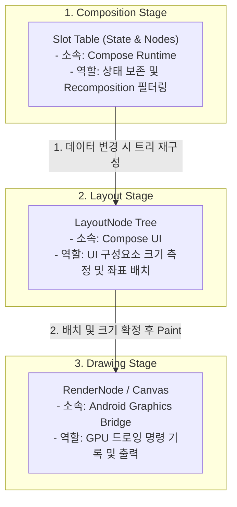
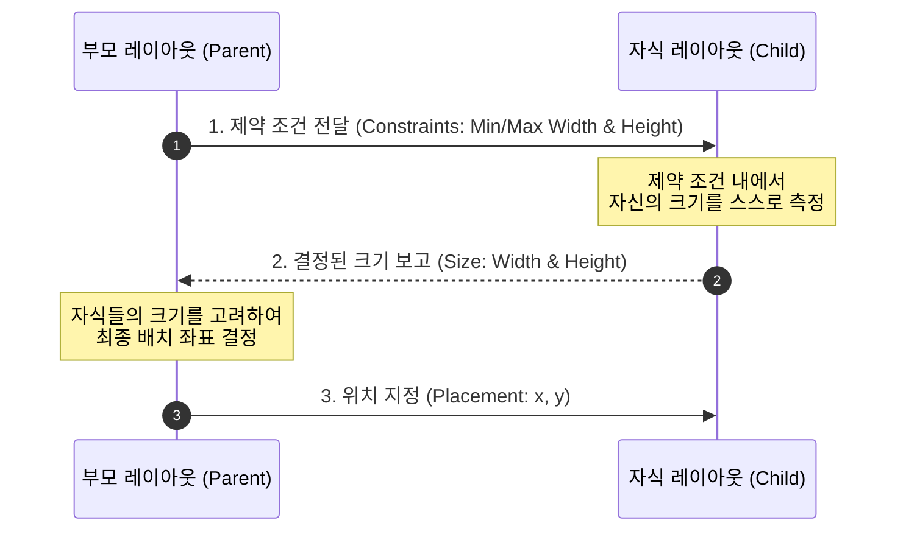

# Jetpack Compose Phases & Layout System (렌더링 파이프라인과 레이아웃)

이 문서는 Jetpack Compose가 선언형 코드를 기반으로 화면에 픽셀을 그리기까지의 3단계 렌더링 파이프라인(Composition, Layout, Drawing), 이를
실질적으로 지원하는 3가지 트리 구조(Slot Table, LayoutNode, RenderNode), 그리고 상호작용하는 레이아웃 모델(Constraints & Size,
Modifier 순서)에 대해 상세히 다룹니다.

---

## 1. 컴포즈의 3단계 렌더링 파이프라인 (Three Phases)

Jetpack Compose는 매 프레임을 렌더링할 때 다음 3단계를 순차적으로 실행하여 화면을 갱신합니다.

```mermaid
graph LR
    classDef step fill: #E3F2FD, stroke: #1976D2, stroke-width: 2px, color: #000000;
    Comp["1. Composition<br/>(무엇을 보여줄 것인가)"] --> Lay["2. Layout<br/>(어디에 보여줄 것인가)"]
    Lay --> Draw["3. Drawing<br/>(어떻게 보여줄 것인가)"]
    class Comp, Lay, Draw step;
```

1. **Composition (구성)**: UI를 설명하는 컴포저블 함수들을 실행하여 메모리에 UI 트리(Slot Table)를 생성하거나 업데이트합니다.
2. **Layout (배치)**: UI 트리 안의 요소를 측정하고 화면 상의 배치 좌표를 설정합니다. 이 단계는 다시 **자식 측정(Measure)** 과 **위치 결정(
   Place)** 의 세부 단계로 나뉩니다.
3. **Drawing (그리기)**: 각 요소가 화면의 Canvas 영역에 실제로 픽셀을 그립니다.

---

## 2. 렌더링을 지원하는 3가지 트리 구조 (Three Trees)

3단계 파이프라인을 효율적으로 처리하기 위해 Compose Runtime과 UI 레이어는 내부적으로 3개의 유기적인 트리를 연동하여 관리합니다. 이는 Flutter의
`Widget -> Element -> RenderObject` 모델과 유사합니다.



* **Slot Table (Composition Tree)**: `@Composable` 함수 호출 사이에 상태값(
  `remember`)을 집어넣는 메모리 백업 테이블입니다. 이를 통해 값이 변경된 Composable 단락만 정확히 찾아가서 다시 실행(Recomposition)할 수
  있습니다.
* **LayoutNode Tree (Layout Tree)
  **: 화면에 실제로 배치할 컴포저블들의 위계 구조를 나타냅니다. 모든 UI 요소는 부모-자식 관계를 가지며 가로/세로 크기 및 위치 정보를 가지고 있습니다.
* **RenderNode Tree (Platform Graphic Layer)**: 안드로이드 OS 수준의 하드웨어 가속 드로잉 노드(
  `android.view.RenderNode` 등)와 연동하여 실제 선, 도형, 이미지, 텍스트 등을 화면에 그리는 GPU 하드웨어 가속 명령을 관리합니다.

---

## 3. 부모-자식 레이아웃 모델 (Layout Constraints & Sizes Flow)

컴포즈의 레이아웃 노드들은 부모와 자식 간에 **Constraints(제약 조건)** 과 **Sizes(결정된 크기)** 를 주고받으며 화면 내 영역을 조율합니다.



1. **Constraints Down**: 부모는 자식에게 허용 가능한 최대/최소 가로/세로 크기 제약 조건(`Constraints`)을 아래로 전달합니다.
2. **Sizes Up**: 자식은 전달받은 제약 범위 내에서 자신이 차지할 크기를 스스로 결정하여 부모에게 보고합니다.
3. **Placement**: 부모는 자식들의 크기를 바탕으로 구체적인 `(x, y)` 좌표를 결정하여 배치(`place`)합니다.

### 단일 패스 측정 원칙 (Single Pass Measurement)

* **Double Taxation의 해결**: 기존 XML 뷰 시스템은 중첩된 레이아웃에서 자식 뷰를 두 번 이상 측정하는 **이중 측정**으로 성능 저하가 발생했습니다.
* **Compose의 강제화
  **: 컴포즈는 **모든 노드를 단 한 번만 측정(Single Pass)**하도록 보장하여 $O(N)$의 선형 복잡도로 렌더링 성능을 극대화합니다. 부모-자식 간의 크기 조율이
  특별히 필요한 경우에 한해
  `Intrinsic measurements(고유 크기 측정)`을 제공합니다.

---

## 4. 성능 최적화: 상태 읽기 지연 (Deferring State Reads)

Compose는 상태(State)가 변경될 때 최소한의 페이즈만 거치도록 똑똑하게 동작할 수 있습니다. 상태 값 읽기를 늦추면 특정 단계를 완전히 스킵할 수 있습니다.

* **Composition 단계에서 상태 읽기 (비권장)**:
  상태 값을 단순하게 읽으면 값 변경 시 Recomposition(1단계)부터 시작하여 전체 파이프라인이 다시 실행됩니다.
* **Layout/Drawing 단계로 상태 읽기 지연 (권장)**:
  람다 형태(`{ state.value }`)로 상태 읽기를 감싸서 Modifier 매개변수로 넘겨주면, 값 변경 시 **Composition(1단계)을 건너뛰고 Layout(
  2단계) 또는 Drawing(3단계)만 바로 재수행**합니다.

```kotlin
// 1. 비효율적 방식: 오프셋이 바뀔 때마다 전체 Recomposition 발생
Box(Modifier.offset(x = offsetXState.value.dp))

// 2. 효율적 방식: 람다를 통해 상태 읽기를 레이아웃 배치 단계로 지연
Box(Modifier.offset { IntOffset(offsetXState.value.roundToInt(), 0) })
```

---

## 5. Modifier 체이닝 순서의 중요성 (Order of Modifiers)

Modifier는 작성된 순서대로 왼쪽에서 오른쪽(Top-to-Bottom)으로 체이닝되어 적용되며, 매 체인마다 이전 레이아웃 노드를 감싸는 새로운 **데코레이터/래퍼 레이아웃
노드**를 빌드합니다.

| 1번 케이스: 패딩 후 배경색 지정                                                                                            | 2번 케이스: 배경색 지정 후 패딩                                                                                         |
|:---------------------------------------------------------------------------------------------------------------|:------------------------------------------------------------------------------------------------------------|
| `Modifier.padding(16.dp).background(Color.Red)`                                                                | `Modifier.background(Color.Red).padding(16.dp)`                                                             |
| 1. 안쪽으로 `16.dp`만큼 제약 조건 범위를 좁힘(여백 생성).<br/>2. 좁혀진 영역 내부에 빨간색 배경을 칠함.<br/>**$\rightarrow$ 빨간색 박스 바깥에 흰 여백이 생김** | 1. 현재 영역 전체에 빨간색 배경을 칠함.<br/>2. 배경이 칠해진 영역 안쪽으로 `16.dp` 여백을 만듦.<br/>**$\rightarrow$ 빨간색 박스 안쪽에 콘텐츠 여백이 생김** |

---

## 6. Arrangement vs Alignment (정렬 메커니즘)

`Row`나 `Column` 같은 표준 레이아웃에서는 자식들을 정렬하기 위해 주축(Main Axis)과 교차축(Cross Axis) 기준을 나누어 제어합니다.

```
[Row 레이아웃의 기준 축]
주축 (Main Axis - 가로): Arrangement로 제어 (SpaceBetween, Center 등)
┌──────────────────────────────────────────────┐
│  (자식 1)  ---- Arrangement ----  (자식 2)   │
└──────────────────────────────────────────────┘
교차축 (Cross Axis - 세로): Alignment로 제어 (CenterVertically, Top 등)
```

* **Arrangement (배치)**: **주축(Main Axis)** 기준 정렬로, 자식 노드들의 간격 분배와 고루 정렬하는 방식을 결정합니다. (`SpaceBetween`,
  `SpaceAround`, `Center`, `End` 등)
* **Alignment (정렬)**: **교차축(Cross Axis)** 기준 정렬로, 주축과 수직을 이루는 축 위에서 개별 자식들의 위치를 조율합니다. (
  `CenterVertically`, `Top`, `Bottom` / `CenterHorizontally`, `Start`, `End`)

---

## 7. 관련 문서

* **제약 조건과 Modifier 순서
  **: [[jetpack-compose-constraints-and-modifier-order|compose_constraints_and_modifiers_order.md]]
* **고급 레이아웃 시스템
  **: [[jetpack-compose-advanced-layout|compose_advanced_layout.md]]
* **안도르이드 학습 자료
  **: [[android-learning-resources|learning_resources.md]]
* **애니메이션 시스템
  **: [[jetpack-compose-animation|compose_animation.md]]


