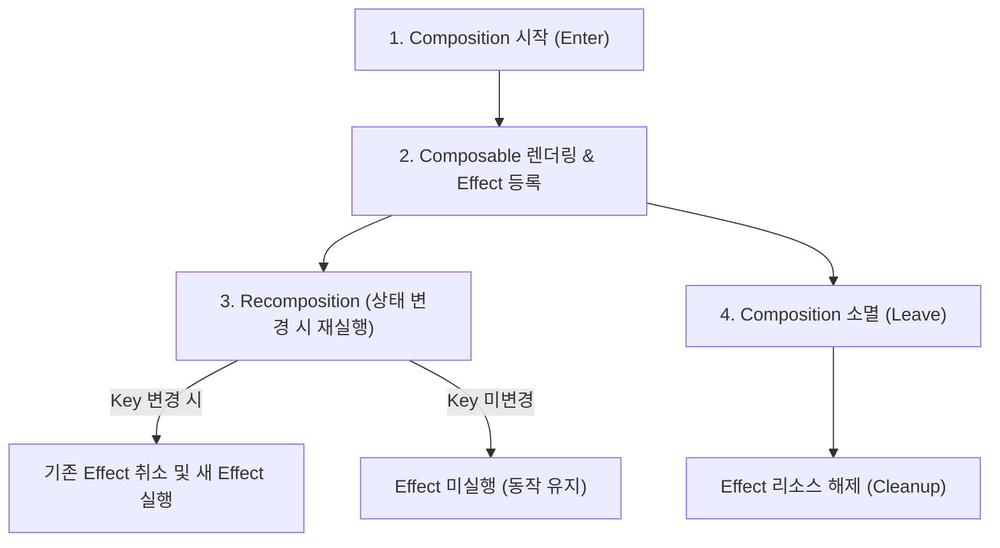

# Jetpack Compose 부작용 및 수명 주기 관리 (Side Effects & Lifecycle)

이 문서는 Jetpack Compose에서 안전하게 비동기 작업을 처리하고, 외부 시스템과 상태를 동기화하며, 컴포저블의 생명주기(Lifecycle)에 맞추어 부작용(Side Effect)을 제어하는 핵심 API와 설계 패턴을 설명합니다.

상태나 작업이 어떤 owner 수명에 묶여야 하는지부터 판단해야 한다면 [[jetpack-compose-state-lifetime-api-selection]]를 먼저 봅니다. 이 문서는 각 effect API의 동작과 사용법에 더 집중합니다.

---

## 1. 부작용(Side Effect)이란?

Compose에서 **부작용(Side Effect)** 이란 **Composable 함수의 실행 범위를 벗어나 앱의 상태를 변경하거나 외부 시스템과 상호작용하는 모든 동작** 을 의미합니다.
* **이유**: Composable 함수는 재구성(Recomposition) 과정에서 매우 자주 실행되고, 언제든 취소되거나 임의의 순서로 실행될 수 있습니다. 따라서 Composable 본문 내부에서 직접 네트워크 요청, 데이터베이스 쓰기, 애니메이션 시작 등의 작업을 수행하면 예측 불가능한 버그가 발생합니다.
* **해결책**: Compose는 컴포저블의 생명주기(Composition 시작, Recomposition, Composition 소멸)와 안전하게 연동될 수 있도록 전용 Effect API들을 제공합니다.



---

## 2. 핵심 Effect API & 올바른 사용법

### 2-1. `LaunchedEffect` (코루틴 기반 비동기 작업)

* **목적**: Composable의 수명 주기에 맞춰 코루틴을 실행합니다.
* **동작**: Composition이 시작될 때 코루틴 블록을 실행하고, 지정된 `key`가 변경되면 기존 코루틴을 취소하고 새로운 코루틴을 실행합니다. 컴포저블이 화면에서 사라지면 코루틴도 자동으로 취소됩니다.
* **주요 사용처**: 화면 진입 시 일회성 데이터 로드, 특정 상태 변경에 따른 스낵바 표시, 화면 네비게이션 이벤트 처리.

```kotlin
@Composable
fun UserProfileScreen(userId: String, snackbarHostState: SnackbarHostState) {
    // userId가 변경될 때마다 기존 로딩 작업을 취소하고 새로운 사용 정보를 로드합니다.
    LaunchedEffect(userId) {
        try {
            val user = repository.getUserProfile(userId)
            // 성공 처리
        } catch (e: Exception) {
            snackbarHostState.showSnackbar("사용자 정보를 가져오는데 실패했습니다.")
        }
    }
}
```

> [!WARNING]
> `LaunchedEffect(Unit)` 또는 `LaunchedEffect(true)`와 같이 고정 상수를 키로 사용하면 Composition 시작 시 단 한 번만 실행됩니다. 하지만 이는 파라미터 변경에 유연하게 대처하지 못하므로, Effect 내부에서 사용하는 모든 동적 변수는 가급적 키로 명시하는 것이 권장됩니다.

---

### 2-2. `rememberCoroutineScope` (이벤트 기반 코루틴 실행)
* **목적**: Composable의 생명주기에 종속된 코루틴 스코프를 가져옵니다.
* **동작**: 코루틴 스코프를 기억(`remember`)하여, 비-composable 콜백(예: 버튼 클릭 이벤트 handler) 내부에서 안전하게 코루틴을 시작할 수 있게 해줍니다.
* **주요 사용처**: 버튼 클릭 시 스크롤 이동, Drawer 열기/닫기, 사용자 액션에 동반되는 가벼운 비동기 처리.

```kotlin
@Composable
fun ScrollToTopButton(lazyListState: LazyListState) {
    // Composable의 Lifecycle에 바인딩된 CoroutineScope 생성
    val scope = rememberCoroutineScope()

    Button(
        onClick = {
            // Composable 외부 콜백이므로 LaunchedEffect 대신 scope.launch 사용
            scope.launch {
                lazyListState.animateScrollToItem(index = 0)
            }
        }
    ) {
        Text("맨 위로 이동")
    }
}
```

#### 💡 수명 주기 안전을 위한 클릭 중복 방지: `dropUnlessResumed` / `dropUnlessStarted`
사용자가 버튼을 아주 빠르게 여러 번 탭하거나(Double-click), 화면 전환 애니메이션 중에 버튼을 다시 누르면 코루틴 작업이 중복 실행되거나 화면이 중복으로 열리는(Multiple Navigation) 문제가 발생할 수 있습니다. 

이를 방지하기 위해 Lifecycle 2.8+ 버전부터 제공되는 `dropUnlessResumed` 또는 `dropUnlessStarted`를 사용하여 콜백을 감싸는 것이 권장됩니다.

* **`dropUnlessResumed`**: 현재 화면의 Lifecycle이 최소 `RESUMED` 상태일 때만 내부 람다식을 실행하고, 그렇지 않을 때는 호출을 무시(Drop)합니다.
* **사용 방법**:
```kotlin
import androidx.lifecycle.compose.dropUnlessResumed

Button(
    onClick = dropUnlessResumed {
        // 화면이 완전히 활성화(Resumed) 상태인 경우에만 1회 실행 보장
        onNavigateToDetail() 
    }
) {
    Text("상세 화면으로 이동")
}
```

> [!IMPORTANT]
> **LaunchedEffect vs rememberCoroutineScope**
> * **`LaunchedEffect`**: 상태 변화나 생명주기 시작과 동시에 자동으로 실행되어야 하는 비동기 작업에 사용합니다.
> * **`rememberCoroutineScope`**: 사용자의 클릭이나 제스처 같은 특정 이벤트 발생 시점에 명시적으로 코루틴을 실행해야 할 때 사용합니다.
> * **중복 방지 연계**: `rememberCoroutineScope` 내부에서 실행되는 사용자 행동(이벤트) 콜백을 작성할 때는 `dropUnlessResumed`와 함께 사용하여 안전성을 보장하십시오.

---

### 2-3. `DisposableEffect` (정리 작업이 필요한 효과)
* **목적**: 컴포저블이 화면에 나타나고 사라질 때(Composition 진입 및 소멸) 자원 등록 및 해제 쌍을 안전하게 관리합니다.
* **동작**: 블록이 실행된 후, 마지막 줄에 반드시 `onDispose` 블록을 정의하여 정리 작업을 작성해야 합니다. `key`가 변경되면 기존 작업을 해제(`onDispose`)하고 새로 다시 등록합니다.
* **주요 사용처**: 리스너(Listener) 등록 및 해제, SDK 초기화 및 정리, 센서 모니터링 시작 및 중단.

```kotlin
@Composable
fun SensorMonitor(sensorManager: SensorManager) {
    DisposableEffect(sensorManager) {
        val listener = SensorEventListener { /* 센서 데이터 처리 */ }
        sensorManager.registerListener(listener, ...)

        // 컴포저블이 화면에서 제거되거나 sensorManager가 바뀔 때 실행
        onDispose {
            sensorManager.unregisterListener(listener)
        }
    }
}
```

---

### 2-4. `SideEffect` (외부 비-Compose 상태와의 동기화)
* **목적**: Compose 재구성이 성공적으로 완료될 때마다 실행할 작업을 정의합니다.
* **동작**: Compose 상태가 성공적으로 스크린에 반영된 직후에 호출되며, 재구성이 취소되면 실행되지 않습니다.
* **주요 사용처**: 외부 모니터링 도구(Google Analytics 등)에 화면 상태 기록, Compose 관리 밖의 블루투스/네이티브 인스턴스에 현재 상태 반영.

```kotlin
@Composable
fun MyScreen(userStatus: String) {
    // Compose 상태를 Compose 관리 영역 밖의 외부 시스템에 공유할 때 사용
    SideEffect {
        NativeAnalyticsTracker.logUserStatus(userStatus)
    }
    
    Text("User: $userStatus")
}
```

---

## 3. 고급 Effect & 상태 최적화 API

### 3-1. `rememberUpdatedState` (값 업데이트 유지)
* **목적**: Effect가 재생성(Re-launch)되는 비용을 피하면서, 비동기 작업 중에도 항상 최신의 변수 값을 참조하도록 보장합니다.
* **동작**: `rememberUpdatedState`로 값을 감싸면, Effect의 `key`를 변경하지 않아도 코루틴 내부에서 항상 최신 상태를 읽어올 수 있습니다.
* **주요 사용처**: 시간 경과 후 실행되는 콜백(예: Timer, Timeout) 등에서, 최신 이벤트 핸들러를 실행하되 이펙트를 처음부터 재시작하고 싶지 않을 때.

```kotlin
@Composable
fun TimeoutHandler(onTimeout: () -> Unit) {
    // onTimeout 람다가 변경되더라도 LaunchedEffect가 재시작되지 않도록 감싸줍니다.
    val currentOnTimeout by rememberUpdatedState(onTimeout)

    LaunchedEffect(Unit) {
        delay(5000L) // 5초 대기
        currentOnTimeout() // 이펙트 재시작 없이 항상 가장 최신의 onTimeout 실행
    }
}
```

---

### 3-2. `derivedStateOf` (파생 상태 최적화)
* **목적**: 자주 변경되는 상태(State)들로부터 특정 조건의 파생 상태를 만들 때, 불필요한 재구성(Recomposition) 횟수를 제한합니다.
* **동작**: 내부 상태가 아무리 많이 변하더라도 계산된 결과 값 자체가 변경될 때만 수신처에 재구성을 유발합니다.
* **주요 사용처**: 스크롤 위치 계산, 리스트 필터링, 조건부 UI 노출 판정.

```kotlin
@Composable
fun ScrollTargetList(lazyListState: LazyListState) {
    // 스크롤 인덱스는 스크롤할 때마다 계속 변경되지만, 
    // derivedStateOf를 쓰면 '5개 이상 스크롤되었는지 여부'가 바뀔 때만 Recomposition이 실행됩니다.
    val showButton by remember {
        derivedStateOf {
            lazyListState.firstVisibleItemIndex > 5
        }
    }

    if (showButton) {
        FloatingActionButton(onClick = { /* ... */ })
    }
}
```

---

### 3-3. `produceState` (비-Compose 소스를 State로 변환)
* **목적**: RxJava, Flow, Callbacks, 외부 Promise 등 Compose가 아닌 비동기 데이터 소스를 Compose가 읽을 수 있는 `State<T>` 형태로 변환합니다.
* **동작**: `LaunchedEffect`와 상태 저장이 합쳐진 형태의 간편 API입니다.

```kotlin
@Composable
fun loadNetworkImage(url: String, imageRepository: ImageRepository): State<ImageState> {
    // url이 바뀔 때마다 실행되며 결과를 Compose State로 노출
    return produceState<ImageState>(initialValue = ImageState.Loading, url) {
        value = try {
            val image = imageRepository.downloadImage(url)
            ImageState.Success(image)
        } catch (e: Exception) {
            ImageState.Error(e)
        }
    }
}
```

---

### 3-4. `snapshotFlow` (Compose State를 Flow로 변환)
* **목적**: Compose State의 변화를 감지하여 Reactive Stream(Flow)으로 변환한 뒤, Flow 연산자(filter, debounce 등)를 적용할 수 있게 해줍니다.

```kotlin
@Composable
fun SearchAnalytics(lazyListState: LazyListState) {
    LaunchedEffect(lazyListState) {
        snapshotFlow { lazyListState.firstVisibleItemIndex }
            .distinctUntilChanged()
            .filter { it > 0 }
            .collect { index ->
                analytics.trackUserReachedIndex(index)
            }
    }
}
```

---

## 4. 실무 안티패턴과 모범 사례 (Anti-Patterns & Best Practices)

### ❌ 안티패턴 1: Composable 영역에서 직접 API 호출
```kotlin
@Composable
fun ProductScreen(productId: String, repository: ProductRepository) {
    // Recomposition이 발생할 때마다 네트워크 요청이 중복 실행됩니다!
    val product = repository.loadProduct(productId) 
    
    ProductDetail(product)
}
```

###  모범 사례 1: ViewModel 상태 수집 및 Action 처리
화면 단위 비즈니스 로직은 `ViewModel` 내부에서 코루틴을 통해 처리하고 UI는 이를 구독만 합니다. UI 수준의 비동기 작업이 꼭 필요하다면 `LaunchedEffect`를 적용하세요.
```kotlin
@Composable
fun ProductRoute(
    viewModel: ProductViewModel,
    productId: String
) {
    val uiState by viewModel.uiState.collectAsStateWithLifecycle()
    
    // productId가 바뀔 때 로드하도록 ViewModel에 명령하거나, LaunchedEffect로 감쌉니다.
    LaunchedEffect(productId) {
        viewModel.loadProduct(productId)
    }
    
    ProductScreen(uiState)
}
```

---

### ❌ 안티패턴 2: 비-코루틴 콜백에서 LaunchedEffect 실행 시도
```kotlin
@Composable
fun BadButton() {
    Button(
        onClick = {
            // Composable 함수 내부가 아닌 onClick 람다 내부이므로 LaunchedEffect를 직접 호출할 수 없어 컴파일 오류 발생!
            LaunchedEffect(Unit) { 
                doSomething()
            }
        }
    ) { Text("Click") }
}
```

###  모범 사례 2: `rememberCoroutineScope` 사용
```kotlin
@Composable
fun GoodButton() {
    val scope = rememberCoroutineScope()
    
    Button(
        onClick = {
            // 이벤트 핸들러 내부에서는 스코프를 활용해 코루틴을 실행합니다.
            scope.launch {
                doSomething()
            }
        }
    ) { Text("Click") }
}
```

---

### ❌ 안티패턴 3: State 업데이트 지연을 방지하고자 Effect를 무분별하게 재생성
```kotlin
@Composable
fun BadTimer(onTick: () -> Unit) {
    // onTick이 바뀔 때마다 LaunchedEffect가 취소되고 처음부터 다시 시작하여 타이머가 정상 동작하지 못합니다!
    LaunchedEffect(onTick) {
        while(true) {
            delay(1000L)
            onTick()
        }
    }
}
```

###  모범 사례 3: `rememberUpdatedState`로 해결
```kotlin
@Composable
fun GoodTimer(onTick: () -> Unit) {
    val currentOnTick by rememberUpdatedState(onTick)
    
    // LaunchedEffect는 Unit으로 최초 1회만 실행하고 변경되지 않지만,
    // currentOnTick은 항상 최신의 onTick을 안전하게 참조합니다.
    LaunchedEffect(Unit) {
        while(true) {
            delay(1000L)
            currentOnTick()
        }
    }
}

---

## 5. State Lifetime Callbacks (`RememberObserver` & `RetainObserver`)

공식 문서 [State Callbacks in Compose](https://developer.android.com/develop/ui/compose/state-callbacks)에 따르면, `remember`로 관리되는 커스텀 객체나 데이터 홀더가 Composition의 시작/종료 또는 Retain(화면 회전 후 유지) 생명주기를 직접 관찰해야 할 때 전용 Observer 인터페이스를 구현할 수 있습니다.

### 5-1. `RememberObserver`: Composition 수명주기 관찰

`remember` 블록 내부에서 기억되는 객체가 `RememberObserver`를 구현하면, Compose Runtime이 해당 객체의 트리 진입/탈출/포기를 감지하여 아래 콜백을 자동으로 호출합니다.

```kotlin
import androidx.compose.runtime.RememberObserver

class MyCustomStateHolder : RememberObserver {
    override fun onRemembered() {
        // Composition 트리에 진입했을 때 호출 (리소스 할당, 리스너 등록 등)
    }

    override fun onForgotten() {
        // Composition 트리에서 빠져나갈 때 호출 (리소스 해제, 센서/스트림 해제)
    }

    override fun onAbandoned() {
        // remember 객체가 생성되었지만 Composition에 정상 포함되지 못하고 버려졌을 때 호출 (메모리 누수 방지 Cleanup)
    }
}

@Composable
fun MyComponent() {
    // remember에 전달된 stateHolder는 RememberObserver 콜백을 받습니다.
    val stateHolder = remember { MyCustomStateHolder() }
}
```

* **`DisposableEffect`와의 차이점**: `DisposableEffect`는 Side Effect 계층에서 람다식 기반으로 정리를 수반하지만, `RememberObserver`는 커스텀 클래스 객체 자체가 생명주기 이벤트를 직접 다루고 캡슐화할 때 유용합니다.

---

### 5-2. `RetainObserver`: Configuration Change & Scope Retain 관찰

Navigation3나 ViewModel과 같이 화면 회전(Configuration Change) 후에도 상태가 유지(Retain)되는 Scope(예: `rememberRetained`)에서 객체가 살아있거나 완전히 소멸되는 시점을 감지할 때는 `RetainObserver`를 활용합니다.

```kotlin
// Navigation / Retain Scope에서 관리되는 커스텀 State Holder
class MyRetainedStateHolder : RetainObserver {
    override fun onRetained() {
        // Retain Scope에 진입하여 객체가 보관될 때 호출
    }

    override fun onForgotten() {
        // Navigation BackStack에서 완전히 제거되거나 Scope가 파괴될 때 최종 Cleanup 호출
    }
}
```

### 요약: 언제 어떤 Observer를 써야 하나?

| Observer | 주 관찰 대상 | 주요 콜백 | 사용 목적 |
|:---|:---|:---|:---|
| **`RememberObserver`** | Composable Composition | `onRemembered`, `onForgotten`, `onAbandoned` | Composable 트리 진입/이탈 시 커스텀 클래스 리소스 자동 정리 |
| **`RetainObserver`** | Navigation / Retained Scope | `onRetained`, `onForgotten` | 화면 회전 후에도 유지되는 커스텀 객체의 최종 소멸 시점 정리 |
