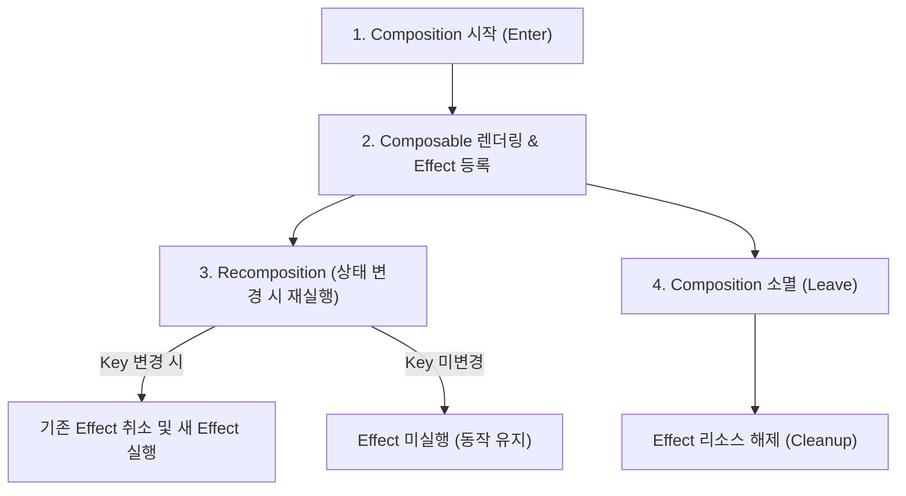

# 부작용(Side Effect)이란?

상위 노트: [[jetpack-compose-side-effects-and-lifecycle]]

Compose에서 **부작용(Side Effect)** 이란 **Composable 함수의 실행 범위를 벗어나 앱의 상태를 변경하거나 외부 시스템과 상호작용하는 모든 동작** 을 의미합니다.
* **이유**: Composable 함수는 재구성(Recomposition) 과정에서 매우 자주 실행되고, 언제든 취소되거나 임의의 순서로 실행될 수 있습니다. 따라서 Composable 본문 내부에서 직접 네트워크 요청, 데이터베이스 쓰기, 애니메이션 시작 등의 작업을 수행하면 예측 불가능한 버그가 발생합니다.
* **해결책**: Compose는 컴포저블의 생명주기(Composition 시작, Recomposition, Composition 소멸)와 안전하게 연동될 수 있도록 전용 Effect API들을 제공합니다.

---
