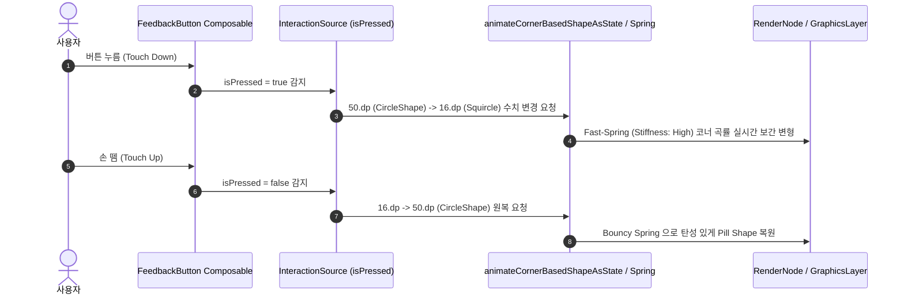

## Material 3 Expressive 는 크기, Shape, 타이포그래피, 패딩 토큰과 Shape Morphing 을 결합한다

구글의 **Material 3 Expressive (M3 Expressive)** 디자인 시스템은 단단하게 고정된 컴포넌트 크기나 정적인 모서리 모양(Shape)을 탈피하고, **[크기 스케일(Size Scale) + 모서리 모양(Shape) + 타이포그래피 + 내측 패딩]** 을 하나의 통합 디자인 토큰 번들로 조율하며, 사용자의 조작 상태(Pressed, Selected 등)에 따라 실시간으로 반응하는 **Shape Morphing(동적 모형 변형)** 으로 인터랙션 감정을 표현하는 현대 컴포저블 디자인 시스템 계약이다.

---

### 1. 개념 및 핵심 명제 (What)

- **M3 Expressive 토큰 결합체 (Bundled Tokens)**:
  - 기존 Material 3 의 단일 컴포넌트 고정 규격과 달리, M3 Expressive 컴포넌트는 크기(Small, Medium, Large 등)에 따라 **높이, 코너 곡률(Shape), 텍스트 스타일(Typography), 내측 패딩(Padding)**이 단일 토큰 세트로 결합되어 함께 연동된다.
- **가변 크기 및 최소 접근성 구속 (`defaultMinSize`)**:
  - 컴포넌트 내부에서 `.size(48.dp)` 와 같이 크기를 하드코딩으로 강제 고정(Hardcoding)하면 외부에서 Large(56dp)나 Extra Large(64dp) 등의 M3 Expressive 대형 규격으로 확장할 때 뷰가 잘리거나 고정되는 결함이 발생한다.
  - 반드시 접근성(Accessibility) 최소 터치 영역인 **`defaultMinSize(minWidth = 48.dp, minHeight = 48.dp)`** 를 기본으로 지정하고, 외부 Modifier 설정을 통해 자유롭게 확장될 수 있도록 유연성을 보장해야 한다.
- **기본 디폴트 Shape (Fully Rounded / Pill Shape / `CornerFull`)**:
  - M3 Expressive 명세상 버튼 및 주요 컴포넌트의 기본 Shape 토큰은 크기(Small ~ Extra Large)에 관계없이 양 끝 모서리가 완전히 둥근 **Fully-Rounded Pill (캡슐 형태 / `CircleShape` / `CornerFull`)** 이 공식 디폴트 사양이다.
- **인터랙티브 Shape Morphing (Interactive Shape Morphing)**:
  - 손으로 누르는 순간(Pressed)이나 선택된 순간(Selected) 컴포넌트의 모서리가 물리적 용수철(Spring Physics) 애니메이션을 타고 **Pill 형태에서 둥근 사각형(Squircle / Compressed Shape)으로 조여들었다가 손을 떼면 원복되는 동적 모형 변형 피드백**을 제공한다.

---

### 2. 왜 M3 Expressive 설계 규칙이 필요한가? (Why)

1. **시각적 계층 구조 및 모바일 터치 접근성 보장**: 48dp 미만 터치 영역은 터치 오작동을 유발한다. `defaultMinSize` 를 통해 최소 48dp 터치 접근성을 하한선으로 가두되, 디자인 요구사항에 따라 56dp(Large), 64dp(Extra Large)로 무제한 확장할 수 있는 유연성을 제공한다.
2. **단일 속성 파편화 방지**: 버튼 크기를 늘렸는데 폰트나 패딩이 구형 Small 상태에 머물러 있으면 시각적 비대칭이 발생한다. 토큰 번들 시스템(`FeedbackButtonSize`)을 통해 크기 변경 시 폰트와 패딩이 한꺼번에 자동으로 튜닝되도록 강제한다.
3. **생동감 있는 터치 피드백**: 평면적인 단순 색상 변경(Ripple)을 넘어 컴포넌트 모서리가 손가락 압력에 반응해 변형되는 Shape Morphing 피드백을 통해 직관적인 물리적 몰입감을 제공한다.

---

### 3. M3 Expressive 버튼 5 단계 규격 스펙 표 (Specification Table)

| 규격 스케일 (`FeedbackButtonSize`) | 최소 높이 (`minHeight`) | 표준 디폴트 Shape | 타이포그래피 | 내측 패딩 (가로, 세로) |
| :--- | :--- | :--- | :--- | :--- |
| **ExtraSmall** | `32.dp` | `CircleShape` (Fully Rounded) | `labelSmall` | `(12.dp, 6.dp)` |
| **Small** | `40.dp` | `CircleShape` (Fully Rounded) | `labelMedium` | `(16.dp, 8.dp)` |
| **Medium (기본 디폴트)** | **`48.dp` (최소 터치)** | `CircleShape` (Fully Rounded) | `labelLarge` | `(24.dp, 12.dp)` |
| **Large** | `56.dp` | `CircleShape` (Fully Rounded) | `titleMedium` | `(28.dp, 16.dp)` |
| **ExtraLarge** | `64.dp` | `CircleShape` (Fully Rounded) | `titleLarge` | `(32.dp, 18.dp)` |

---

### 4. 내부 메커니즘 및 Shape Morphing 동적 변환 (How)



---

### 5. 현대 Jetpack Compose M3 Expressive 올바른 구현 예시

```kotlin
import androidx.compose.animation.core.animateDpAsState
import androidx.compose.animation.core.spring
import androidx.compose.animation.core.Spring
import androidx.compose.foundation.interaction.MutableInteractionSource
import androidx.compose.foundation.interaction.collectIsPressedAsState
import androidx.compose.foundation.layout.*
import androidx.compose.foundation.shape.CornerSize
import androidx.compose.foundation.shape.RoundedCornerShape
import androidx.compose.material3.*
import androidx.compose.runtime.*
import androidx.compose.ui.Modifier
import androidx.compose.ui.graphics.Shape
import androidx.compose.ui.unit.dp

// 1. M3 Expressive 크기 스케일 토큰 정의
enum class FeedbackButtonSize {
    ExtraSmall, Small, Medium, Large, ExtraLarge
}

// 2. M3 Expressive 토큰 번들 세트
object FeedbackButtonDefaults {
    @Composable
    fun cornerRadiusFor(size: FeedbackButtonSize, isPressed: Boolean): Shape {
        // 평소: Fully Rounded (Pill / CircleShape: 50dp 이상)
        // 누름(Pressed): 둥근 사각형 (Shape Morphing: 12dp ~ 20dp)
        val targetRadius = if (isPressed) {
            when (size) {
                FeedbackButtonSize.ExtraSmall -> 8.dp
                FeedbackButtonSize.Small -> 12.dp
                FeedbackButtonSize.Medium -> 14.dp
                FeedbackButtonSize.Large -> 16.dp
                FeedbackButtonSize.ExtraLarge -> 20.dp
            }
        } else {
            50.dp // Fully Rounded Pill
        }

        // Spring 물리 애니메이션 기반 코너 곡률 보간
        val animatedRadius by animateDpAsState(
            targetValue = targetRadius,
            animationSpec = spring(
                dampingRatio = Spring.DampingRatioMediumBouncy,
                stiffness = Spring.StiffnessHigh
            ),
            label = "M3ExpressiveShapeMorphing"
        )
        return RoundedCornerShape(CornerSize(animatedRadius))
    }

    @Composable
    fun minHeightFor(size: FeedbackButtonSize) = when (size) {
        FeedbackButtonSize.ExtraSmall -> 32.dp
        FeedbackButtonSize.Small -> 40.dp
        FeedbackButtonSize.Medium -> 48.dp // 기본 접근성 하한선
        FeedbackButtonSize.Large -> 56.dp
        FeedbackButtonSize.ExtraLarge -> 64.dp
    }
}

// 3. M3 Expressive 가변 크기 + Shape Morphing 구현 컴포넌트
@Composable
fun FeedbackButton(
    onClick: () -> Unit,
    modifier: Modifier = Modifier,
    buttonSize: FeedbackButtonSize = FeedbackButtonSize.Medium,
    interactionSource: MutableInteractionSource = remember { MutableInteractionSource() },
    content: @Composable RowScope.() -> Unit
) {
    val isPressed by interactionSource.collectIsPressedAsState()

    // Interactive Shape Morphing 계산
    val currentShape = FeedbackButtonDefaults.cornerRadiusFor(buttonSize, isPressed)
    val minHeight = FeedbackButtonDefaults.minHeightFor(buttonSize)

    Button(
        onClick = onClick,
        modifier = modifier
            // ⚠️ 핵심: size(48.dp) 강제 고정 대신 defaultMinSize 사용으로 Large/ExtraLarge 확장 보장!
            .defaultMinSize(minWidth = 48.dp, minHeight = minHeight),
        shape = currentShape,
        interactionSource = interactionSource,
        content = content
    )
}
```

---

### 6. 관련 문서 및 참조

상위 문서: [Compose Layout, Animation, Accessibility 지침서](../compose-layout-animation-accessibility.md)

관련 계약 문서:

- [Size modifier는 들어오는 constraints 안에서 요청 크기를 해석한다](./size-modifiers-interpret-requested-size-inside-incoming-constraints.md)
- [Modifier 순서는 레이아웃, 그리기, 입력 래퍼를 바꾼다](./modifier-order-changes-layout-draw-and-input-wrappers.md)
- [HapticFeedbackType은 UX 인터랙션과 안드로이드 플랫폼 햅틱 패턴을 1:1 매핑한다](../../../../04_system_services/device-capabilities/haptics-vibrator/haptic-feedback-types-map-ux-interactions-to-platform-patterns.md)

공식 가이드: [Material Design 3 - Buttons Specs](https://m3.material.io/components/buttons/specs), [Material Design 3 - Shape System Overview](https://m3.material.io/styles/shape/overview)

검증일: 2026-08-05. Material Design 3 Expressive 사양 및 Compose Material 3 Token 시스템 기준 검증 완료.
