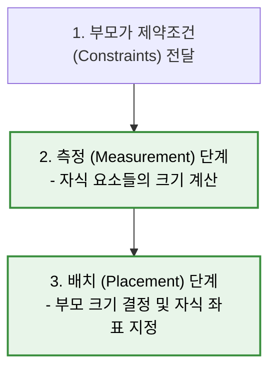

# 커스텀 레이아웃 제작과 레이아웃 단계 (Layout Phase)

기본 제공 레이아웃으로 표현할 수 없는 독창적인 디자인(예: 복잡한 타임라인 그래프, 원형 배치 뷰 등)을 구현할 때는 `Layout` 컴포저블을 사용하여 직접 커스텀 레이아웃을 정의합니다.

### 1-1. 레이아웃 단계의 2가지 핵심 스텝

레이아웃 단계는 모든 컴포저블 노드를 순회하며 다음 두 단계를 거쳐 크기와 위치를 확정합니다.

1. **측정 (Measurement) 단계**:
   * 부모 레이아웃이 자식들에게 제약 조건(Constraints: 최소/최대 너비와 높이)을 전달합니다.
   * 자식 요소들은 전달받은 제약 조건을 준수하며 자신의 크기(`Placeable`)를 측정합니다.
2. **배치 (Placement) 단계**:
   * 측정된 자식들의 크기를 취합하여 부모 레이아웃 스스로의 최종 크기를 결정합니다.
   * 부모 레이아웃은 2D 공간상의 구체적인 `(X, Y)` 좌표를 계산하여 자식들을 배치(`placeable.place()`)합니다.

### 1-2. 단일 패스 측정 원칙 (Single-Pass Measurement)
* **제약**: Compose는 성능 최적화를 위해 **모든 자식 요소를 단 한 번만 측정**할 수 있도록 제한합니다.
* **이유**: 기존 Android XML 뷰 시스템은 중첩된 뷰 그룹 내에서 자식을 여러 번 반복 측정하는 **이중 측정(Double Taxation)** 이 잦아 성능 저하를 유발했습니다. Compose는 $O(N)$의 선형 시간 복잡도로 빠르게 레이아웃을 처리하기 위해 이를 아키텍처 수준에서 금지합니다.

---
