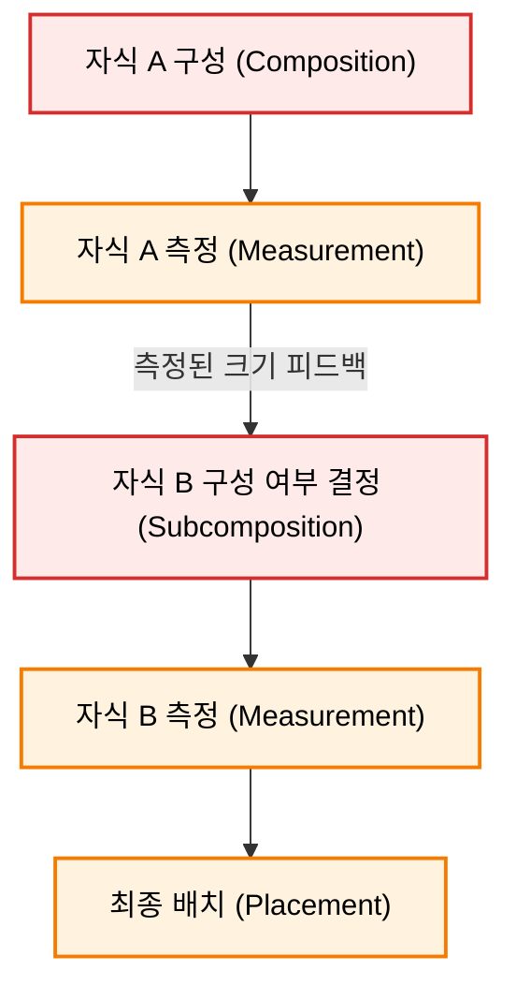

# 조건부 배치를 위한 서브컴포즈 레이아웃 (SubcomposeLayout)

원래 Jetpack Compose는 `Composition(구성) -> Layout(측정/배치) -> Drawing(그리기)`의 단방향 흐름으로 작동합니다. 그러나 **"자식 A의 측정 결과(크기)를 보고 자식 B를 구성(Compose)할지 말지"** 를 결정해야 하는 예외적인 경우에는 이 순서를 조율할 수 있는 `SubcomposeLayout`을 사용합니다.

### 3-1. 동작 원리
1. 특정 자식(Subcomposable)들의 컴포지션 단계를 지연시킵니다.
2. 먼저 활성화된 자식 노드들을 측정하여 구체적인 크기를 알아냅니다.
3. 측정된 크기를 기반으로 동적으로 새로운 자식 노드를 구성(Compose)하고 추가로 측정 및 배치합니다.

### 3-2. 대표적인 활용 사례
* **LazyColumn / LazyRow**: 화면의 전체 높이/너비를 측정한 후, 화면에 실제로 표시되는 영역만큼만 아이템들을 동적으로 그리기(Subcompose) 위해 사용합니다.
* **BoxWithConstraints**: 부모 레이아웃이 주는 최대/최소 제약 조건을 미리 파악한 후, 그 크기에 맞추어 내부 콘텐츠 컴포저블을 다르게 구성하고 싶을 때 사용합니다.

---
